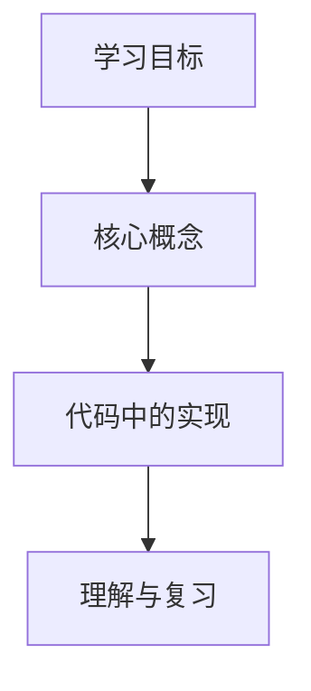

# Generating Study Review Articles

## Overview

Turn one explicitly named `xll_ai` learning directory into one evidence-based Chinese Markdown article for beginner review and Juejin publishing. Explain concepts through the directory's real code, then use Juejin-compatible Mermaid diagrams to make difficult relationships visible.

## Input and boundaries

- Require a directory path inside `xll_ai`. Confirm it exists and reject paths outside that repository.
- Produce the article in the chat only. Do not create an article file, edit learning materials, run project code, install dependencies, or publish to Juejin.
- Read text as UTF-8. Inventory the directory before reading deeply; prioritize `README`/`readme`, Markdown notes, source code, inline comments, and only the configuration files needed to understand the example.
- Skip `.git`, dependency and build directories, lock files, binaries, media, generated datasets, and unrelated large files. Do not expose local file paths in the article.
- Treat the supplied files as the sole source of truth. Do not add web knowledge, unverified best practices, fabricated project behavior, or invented production incidents. If an important relationship cannot be proved from the materials, state it as a follow-up learning question instead.

## Evidence-first workflow

1. Identify the study goal from the notes and README files. Cross-check every candidate topic against code or comments when such evidence exists.
2. Build a private map of: concepts, prerequisite relationships, relevant code evidence, observed inputs/outputs, edge cases, and unresolved gaps.
3. Choose the article scale from the material. For a small syntax or algorithm exercise, focus on one mechanism and its examples. For a multi-file project, also explain module responsibilities and the observable control or data flow.
4. Draft only claims supported by the private map. Keep each concept adjacent to the code that demonstrates it.
5. Add at least one Juejin-compatible Mermaid diagram, then run the final checklist before responding.

## Required article shape

Return one polished Markdown article in Chinese with this order:

1. One recommended title and two accurate alternatives; add 3–5 topic-appropriate Juejin tag suggestions. Keep the promise narrow enough that the article can fulfill it.
2. A 2–3 sentence abstract stating the reader's problem, what the article will explain, and what the reader will be able to do afterward.
3. A short problem-scenario opening grounded in the studied material. If the files do not show a concrete problem, describe the learning goal rather than inventing one.
4. A compact learning map that names the concepts and their dependency order.
5. Core sections arranged as **why it is needed → how it works → how this material implements it → selected code explained → beginner pitfall**. Use this pattern repeatedly so theory immediately lands in practice.
6. For projects, add a focused implementation walkthrough covering only evidenced module responsibilities and flow. For algorithms or small exercises, explain the goal, key steps, boundary cases, and complexity only when supported by the material.
7. A `## 易错点与待补充学习` section that separates proven pitfalls from missing learning evidence.
8. A conclusion stating what was learned, what it can solve, and the next evidence-based learning direction. Do not include practice tasks, quiz questions, self-test questions, answers, interview questions, or comment-bait prompts.

Use a learning-review-plus-tutorial voice: acknowledge the study motivation in the opening and conclusion, but write the teaching sections clearly and objectively. Do not show source paths, private notes, or internal evidence mapping.

## Code selection and explanation

- Prefer the smallest real snippet that proves the current concept. Show complete short examples; for long files, retain only the necessary surrounding context.
- Add a language identifier to every code fence. Explain code in source order and connect each line or block to the concept it demonstrates.
- Do not paste a full file merely for completeness. Do not replace the user's implementation with a different tutorial implementation unless clearly labelled as a non-code explanatory pseudocode example.
- When files disagree, state the observable discrepancy without guessing which intention is correct.

## Juejin quality and trust rules

Use the screenshot's four dimensions as writing goals, not as an invented scoring formula:

- **创作质量**：Keep one central problem, make the reader payoff explicit, explain the mental model before API details, connect claims to working code, include trade-offs or boundaries when evidenced, and remove repeated filler. Prefer a shorter article that teaches one topic completely over a broad list of shallow points.
- **创作影响力**：Use a searchable but accurate title, a concrete opening, descriptive headings, and practical examples. Explain why the topic matters to a reader who has not seen the source directory. Do not use clickbait, exaggerated promises, irrelevant tags, engagement bait, quiz-style prompts, or practice-task prompts.
- **创作行为**：Make the article finishable in one daily study session. When a directory contains unrelated topics, name one main thread and put the rest under “延伸/待补充”, so daily publishing remains focused and consistent.
- **创作违规**：Write original synthesis from the supplied material. Do not copy README prose wholesale, impersonate an official source, fabricate benchmarks, hide uncertainty, or include advertisements and unrelated links. Before quoting code or text, remove real secrets and personal data: redact API keys, tokens, cookies, passwords, private URLs, email addresses, and user identifiers. Never repeat raw account/password pairs, even in tutorial code; describe them as “项目预设的演示凭据” and tell readers to use their own local test values.

Before final output, run a reader-value pass:

1. State the one-sentence promise: “读者看完能解决什么问题”。
2. Remove any section that does not support that promise or label it as an extension.
3. Check that every major claim has a nearby explanation, code example, diagram, or explicitly marked evidence gap.

## Mermaid architecture diagram rule — mandatory

- Every article about a workflow, architecture, data flow, request flow, lifecycle, or comparison MUST contain at least one Mermaid diagram in a fenced `mermaid` block. Juejin renders this syntax natively when pasted into its Markdown editor.
- Place a diagram in the relevant body section when the materials demonstrate a non-trivial sequence, route, data flow, module relationship, lifecycle, state transition, recursion path, or algorithm decision.
- If no body section genuinely needs a diagram, put a flowchart knowledge-overview image in the conclusion. It must connect the article's actual concepts and show the intended learning order; it must not be decorative.
- Prefer these compatible diagram types:
  - `flowchart TD` for workflows, dependencies, data flow, and summary knowledge maps;
  - `sequenceDiagram` for message/request order;
  - `stateDiagram-v2` for evidenced state transitions.
- Put the diagram immediately before the text section that explains it. Follow it with 1–2 sentences describing the key relationship the reader should notice.
- Keep a diagram focused: no more than 10 nodes, or 10 sequence messages. Split larger diagrams into multiple views.
- Use English node IDs and concise Chinese labels of at most 8 characters. For example, use `A["哈希路由"]`, never a Chinese node ID.
- In `flowchart TD`/`flowchart LR`, quote every node label with `A["文本"]`. Quote labels containing `/`, `:`, `→`, `*`, `#`, or other special characters.
- In `sequenceDiagram`, write every participant label as `participant X as "中文标签"`.
- Keep sequence diagrams simple: avoid `loop`, `alt`, deep branching, and more than 10 messages. Convert complex sequences into a flowchart.
- Never use `style` directives, HTML such as ` `, `?` in labels, backslash escapes such as `\:` or `\/`, unquoted special-character labels, or Chinese node IDs. Use separate nodes, commas, quoted labels, or simple shapes instead.
- Treat Mermaid as a learning instrument: the diagram must answer a question posed by the prose (for example, “请求经过哪些模块？” or “未登录时会发生什么？”), not merely restate section headings.

Fallback summary visual:

Replace all labels with facts from the supplied directory; never emit this generic example unchanged.

## Final checklist

- Does the title accurately reflect the material, with two useful alternatives and relevant tags?
- Does the abstract state a concrete reader benefit and match the actual scope?
- Can the article be summarized as one central problem rather than a list of unrelated notes?
- Is every technical claim supported by the directory, and is every gap labelled rather than silently filled?
- Does each important concept lead immediately to a real code explanation?
- Is there at least one fenced `mermaid` diagram using the Juejin compatibility rules, placed in the body or as the required conclusion fallback?
- Do diagrams match their adjacent prose and avoid unproven nodes, paths, or states?
- Are local paths absent, code blocks language-labelled, and the article ready to copy as one Markdown response?
- Are practice tasks, quiz questions, self-test questions, answers, interview questions, and comment-bait prompts absent from the article?
- Have secrets, personal data, clickbait, irrelevant tags, copied prose, and unsupported claims been removed?

## Example request

`根据 xll_ai\\fe\\react\\router 生成一篇初学者可复习、可直接发布到掘金的文章；至少用一张 Mermaid 图解释复杂流程。`
