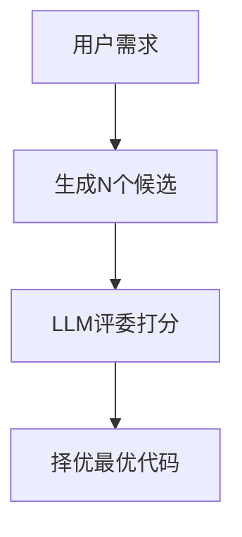
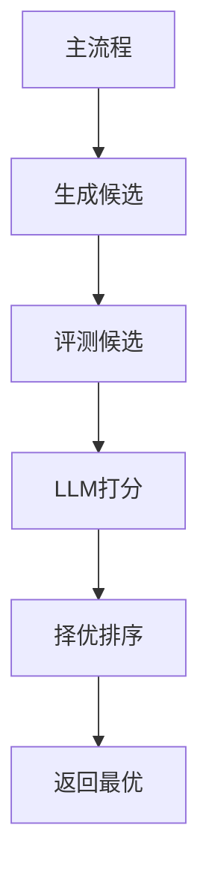

# 用 LLM 当评委、并行采样多个候选：构建一个自动择优的代码生成 Harness

> 备选标题：
> 1. Best of N Sampling 与 LLM as Judge：一个可落地的 Harness 实战
> 2. 让 LLM 自己当评委：用 Harness 流水线生成并筛选最优代码
>
> 掘金标签：`LLM` `AI工程化` `大模型应用` `Prompt`

## 摘要

让大模型直接生成代码，单次结果常常不稳——要么有幻觉、要么质量看运气。本文基于一个真实的 Harness 小工程，讲清楚「并行采样多个候选 + 让 LLM 当评委打分 + 自动择优」这条闭环流水线是怎么从零搭起来的。读完你能照着写出一个自己的 harness：把一次不可控的生成，变成一次次可评测、可筛选、整体更稳的输出。

## 开场：一次生成靠不住，那就一次生成很多次

你让大模型「用 JavaScript 写一个数组去重函数」，它可能一次写对，也可能写出个能跑但边界没处理的版本，甚至直接胡说。问题不在模型能力，而在于「单次采样」把结果质量交给了随机性。

我第一次看到这个 harness 工程时，眼前一亮：它不赌单次运气，而是把这事拆成一条流水线——一次需求，先让模型并行产出 N 个候选，再让另一个模型当评委给每个候选打分，最后挑分数最高的那个输出。README 里把它比喻成「被马具（harness）驾驭的马」：马还是那匹马（LLM），但被套进了解构化的流程，产出就可控多了。这种思路叫 **LLM as Judge + Best of N Sampling** 组合的 harness 模式，目标是用工程化手段缓解幻觉、推动落地。

下面我会先讲清 harness 到底是什么，再拆开三个核心思想，最后用一个「数组去重」的小项目把代码逐行串起来。阅读本文只需两个前置：了解 JavaScript 的 async/await 与 Promise 异步模型，以及知道怎么用 OpenAI 的 `chat.completions` 发起一次对话。

## 一、Harness 是什么：把「生成—评测—择优」解耦成流水线

harness 这个词本意是「马具、挽具」。在 AI 工程里，它指一种**流水线编排框架**：把「让 LLM 生成」「让 LLM 评测」「从候选里择优」这三件事拆开、解耦，再串成一条可重复执行的闭环。

README 点出了它要解决的痛点：大模型的幻觉问题和落地难。单次生成不可控，但工程化之后——

- **生成**不再是「问一次」，而是「问 N 次拿到 N 个候选」；
- **评测**不再靠人工，而是让一个 LLM 当自动化评分器；
- **择优**不再靠肉眼，而是按分数自动挑最好的。

三阶段彼此独立，各自可替换、可优化。这就是 harness「抽象」的价值：你改评分标准，不影响生成逻辑；你换更强的模型生成，不影响评测逻辑。

## 二、三阶段架构总览

先把整条链画出来，后面讲代码时你就知道每段落在哪里：



一条很直的流水线：`用户需求` 进来，先 `生成N个候选`，再 `LLM评委打分`，最后 `择优最优代码` 输出。README 把这套称为「闭环框架」，但当前这个小工程（`q1/`）实现的是**单次执行**——跑一遍就返回最优结果。真正的闭环（把择优结果反馈回生成、反复迭代直到质量达标）是它的设计目标，文中第八章会讲怎么扩。

## 三、从一次调用到并行采样 N 个候选

流水线的第一环是「生成」。它分两层看才清楚：**最底层的单次调用**，和**上层的并行采样**。

先是最底层 `askLLM`，它封装了一次普通的对话请求：

```javascript
const askLLM = async (prompt) => {
  const res = await client.chat.completions.create({
    model: process.env.MODEL_NAME,
    messages: [{ role: 'user', content: prompt }],
  });
  return res.choices[0].message.content;
}
```

这里 `client` 是前面用 `new OpenAI({...})` 初始化的客户端，`process.env.MODEL_NAME` 是从环境变量读到的模型名。`chat.completions.create` 是 OpenAI SDK 发起对话的核心方法，返回结果里 `choices[0].message.content` 就是模型回复的文本内容。`askLLM` 把它包成 `async` 函数，调用方 `await` 一下就能拿到字符串。注意它只负责「问一次、拿回文本」，完全不关心问的是什么。

真正的「采样 N 次」在 `generateCandidates`：

```javascript
const generateCandidates = (prompt, n = 3) => {
  const tasks = Array.from({ length: n }, () => askLLM(prompt));
  return Promise.all(tasks);
}
```

这段是 Best of N Sampling 的关键，我拆开讲：

- `Array.from({ length: n }, () => askLLM(prompt))` 造出一个长度为 `n` 的数组，数组里每一项都是一次 `askLLM(prompt)` 调用。**重点在这里**：`askLLM` 是 `async` 函数，调用它不会立刻跑完，而是立刻返回一个 `Promise`（代表「将来某个时刻的结果」）。所以 `tasks` 其实是一组「正在进行的请求」，不是一串结果。
- `Promise.all(tasks)` 等这 `n` 个 Promise **全部完成**，再把它们的返回值按顺序收集成数组返回。因为大模型推理有随机性，这 N 次调用大概率会产出 N 个略有不同的候选——这正是「用随机性覆盖更多可能性」的落地方式。
- `n = 3` 是默认参数，调用时不传就用 3，传了就用你给的数。

一句话：这一层把「问一次」升级成了「同时问 N 次、一起等结果」。

## 四、judge：让 LLM 当评委，但分数要先「救」一下

第二环是「评测」。`evaluateAll` 负责遍历候选、逐个打分：

```javascript
async function evaluateAll(candidates) {
  const results = [];
  for (const code of candidates) {
    const score = await judge(code);
    results.push({ code, score });
  }
  return results;
}
```

它做的事很直白：拿每个候选 `code`，交给 `judge` 算出分数，把 `{ code, score }` 推进 `results`，最后整体返回。这样下游就能同时拿到「代码」和「它的分数」。

`judge` 才是评委本身：

```javascript
async function judge(code) {
  const prompt = `
  你是一个严格的代码评审， 请判断下面代码是否正确实现"数组去重函数"
  要求：
  - 只返回一个数字评分(0-10)
  - 不要解释
  代码：
  ${code}
  `;
  const res = await askLLM(prompt);
  const score = parseFloat(res);
  return isNaN(score) ? 0 : score;
}
```

这里有几处值得停下来讲：

- **评委也是 LLM**。它复用了底层的 `askLLM`，只是换了一套 prompt：把自己伪装成「严格的代码评审」，要求「只返回一个 0–10 的数字、不要解释」。这就把「评测」也变成了一次普通的对话调用，整个 harness 只需要一个 `askLLM` 入口。
- **分数要从文本里抠出来**。`askLLM` 返回的是字符串，比如 `"8"` 或 `"7.5"`。所以这里用 `parseFloat(res)` 把字符串转成数字。这步不是顺手为之——它是「让 LLM 输出可被程序消费」的关键转换。
- **必须兜底 NaN**（这是我实际踩过的坑）：评委 LLM 并不总是守规矩，它可能返回 `"8分，逻辑基本正确"` 这种带解释的文字，或者干脆返回空。`parseFloat("8分...")` 会拿到 `8`，但 `parseFloat("这个不行")` 会得到 `NaN`。如果不处理，`NaN` 混进分数池，后面排序就乱了。所以 `isNaN(score) ? 0 : score` 把任何解析失败的情况压成 `0` 分——宁可判低，也不能让脏数据破坏择优。

## 五、pickBest：按分数排个序，取头名

第三环是「择优」，逻辑最短也最容易被写错：

```javascript
function pickBest(results) {
  return results.sort((a, b) => b.score - a.score)[0];
}
```

一句讲清：

- `results.sort((a, b) => b.score - a.score)` 按 `score` **降序**排列（大的在前）。注意 `sort` 是**原地排序**，会直接改 `results` 本身，返回的是排好序的同一个数组。
- `[0]` 取排第一的那个，也就是分数最高的候选。
- 这里隐含一个前提：分数已经过第四章的 `NaN→0` 兜底，所以不会出现 `NaN` 比大小这种脏情况。三阶段是咬合的——评测环节的健壮性，直接决定了择优环节的正确性。

## 六、harness 主函数：把三段拼成一条流水线

前面三块是零件，`harness` 主函数负责把它们按顺序接起来，形成真正的流水线：

```javascript
async function harness(prompt) {
  console.log('生成多个候选者....\n');
  const candidates = await generateCandidates(prompt, 3);
  console.log('候选结果:');
  candidates.forEach((c, i) => {
    console.log(`\n---- Candidate ${i + 1} ----\n ${c}`)
  });

  console.log(`\n Evaluate Candidates...\n`);
  const evaluated = await evaluateAll(candidates);
  console.log('打分结果:');
  evaluated.forEach((c, i) => {
    console.log(`\n---- Candidate ${i + 1} ----\n ${c.code} \n      -> ${c.score}`)
  });

  const best = pickBest(evaluated);
  console.log(best, '//////////????');   // 源码里残留的调试日志
  return best.code;
}
```

我把执行顺序理一遍：

1. `await generateCandidates(prompt, 3)` —— 等 N 个候选全部生成完，拿到 `candidates` 数组（对应第二章图的「生成N个候选」）。
2. `await evaluateAll(candidates)` —— 等每个候选都被 `judge` 打完分，拿到带分数的 `evaluated` 数组（对应「LLM评委打分」）。
3. `pickBest(evaluated)` —— 排序取头名，得到 `best`（对应「择优最优代码」）。
4. `return best.code` —— 把最优候选的**代码文本**返回给调用方。

我发现这条主函数读起来就像搭积木：`candidates → evaluated → best` 三个变量依次传递，每一环只干一件事。源码里那行 `console.log(best, '//////////????')` 是作者调试时留的，正好说明这是边跑边看真值的写法，不是一次写对的成品。



这张图是第六章主函数的真实调用链：从 `harness` 主流程出发，调 `生成候选`（即 `generateCandidates`），再进 `评测候选`（`evaluateAll`），里面逐次 `LLM打分`（`judge`），打完回到 `择优排序`（`pickBest`），最后 `返回最优`。注意它和第二章的「概念总览」是同一件事的两个粒度——上面那张是设计视角，这张是代码视角。

## 七、项目结构与怎么跑起来

这个工程很小，`harness/` 下真正干活的文件就几个：

- `readme0811.md`：概念与设计思想（也就是第一、二节那些）。
- `package.json`：只声明了两个依赖——`openai`（调模型）和 `dotenv`（读配置）：
  ```json
  {
    "dependencies": {
      "dotenv": "^17.4.2",
      "openai": "^7.4.0"
    }
  }
  ```
- `q1/index.mjs`：全部流水线逻辑（第三到六节讲的都在这里）。
- `q1/.env`：存放密钥与模型配置，通过 `dotenv` 加载。代码开头 `config()` 就是干这个——它把 `.env` 里的 `OPENAI_API_KEY`、`OPENAI_BASE_URL`、`MODEL_NAME` 读进 `process.env`，后面 `new OpenAI({...})` 和 `askLLM` 才能拿到。

入口在 `index.mjs` 末尾，直接调用了一次：

```javascript
const bestCode = await harness("请使用javascript 实现一个数组去重函数");
console.log(bestCode);
```

也就是说，整个程序启动后，会并行生成 3 个去重函数候选，让评委打分，挑最好的那个打印出来。要跑它，需要先在 `q1/.env` 里填好你自己的密钥和模型名（**密钥是私人的，别写进文章或提交到仓库**，用 `dotenv` 本地加载即可），再 `node q1/index.mjs`。

## 八、这套模式为什么有效，以及能往哪改

回到 README 的初衷：它要缓解的是「幻觉」和「落地难」。Best of N 用随机性摊薄了单次翻车的概率——哪怕某次生成抽风，还有其他候选兜底；LLM as Judge 把「人肉看代码」变成了可批量跑的自动评分，让流水线能自己转起来。两者合在一起，单次不可控的生成，就被改造成了「多份候选 + 客观打分 + 自动挑选」的更稳输出。

但当前 `q1/` 只是最小可用版，有几个明显的演进方向（也是后续可学的点）：

- **评委一致性**：现在评委和生成者都是同一个模型，可能「自己评自己」偏高。可以换更强的模型当评委，或让评委输出评分理由再解析。
- **真闭环**：现在是跑一遍就停。可以在外层加 `while`（质量分未达阈值就再采样），把第二章说的「闭环」真正落地。
- **成本与延迟**：N 越大越稳，但 API 调用次数和耗时线性上升，`n` 是个要权衡的旋钮。
- **解析健壮性**：除了 `NaN→0`，还可以用正则从评委回复里抠第一个数字，更抗「带解释」的回复。

## 小结

| 概念 | 一句话解释 | 关键代码 |
|---|---|---|
| Harness | 把生成/评测/择优解耦成流水线的编排框架 | 生成→评测→择优 |
| Best of N Sampling | 并行生成 N 个候选覆盖随机性 | `Promise.all(Array.from({length:n}, ...))` |
| askLLM | 封装一次对话调用，返回文本 | `client.chat.completions.create` |
| LLM as Judge | 让 LLM 当评分器输出 0–10 分 | `judge(code)` 复用 askLLM |
| 分数解析兜底 | 把评委文本转数字，解析失败压成 0 | `isNaN(score) ? 0 : score` |
| pickBest | 按分数降序取头名 | `results.sort((a,b)=>b.score-a.score)[0]` |
| dotenv | 从 .env 加载密钥与配置到环境变量 | `config()` |

## 易错点与待补充学习

**已证实的易错点**

- **评委分数可能是脏数据**：`judge` 里 `parseFloat(res)` 遇到非纯数字回复会得到 `NaN`，必须 `isNaN(score) ? 0 : score` 兜底，否则 `pickBest` 排序失真。项目代码已做此处理。
- **`sort` 是原地排序**：`pickBest` 里 `results.sort(...)` 会直接改动原数组并返回它，不是返回新数组；降序写法是 `b.score - a.score`，顺序写反会取到最差而非最优。
- **`Promise.all` 要等全部**：`generateCandidates` 返回的是 Promise 数组，必须 `await Promise.all(...)` 才能拿到真正的结果数组，否则拿到的是一堆未完成的 Promise。
- **密钥不能硬编码**：模型名与密钥来自 `.env` 经 `dotenv` 加载，真实密钥不会出现在源码里。

**待补充学习**

- 评委与生成者用不同模型，提升评分客观性。
- 外层 `while` 闭环：按质量阈值反复采样直到达标。
- 用正则从评委回复中更稳健地抽取分数。
- `n`（候选数）对成本、延迟、质量影响的量化权衡。

## 结尾

我最大的收获是：harness 不是又一种 prompt 技巧，而是把「不确定的生成」变成「可控的工程」的思路。它把一个我们习惯「问一次碰运气」的动作，重构成「多采样、自动评、智能选」的流水线——而代码层面，其实就是 `askLLM` 这个最小原子，被 `generateCandidates`、`judge`、`pickBest`、`harness` 四层依次包起来。

下一步建议从两处动手：把评委换成更强的模型，再给 `harness` 套一层 `while` 闭环，让它从「跑一遍」进化成「不达质量不罢休」。

## 自测清单

- 能说出 harness 把哪三件事解耦成了流水线，以及它想解决什么痛点
- 能解释 `generateCandidates` 为何用 `Array.from` + `Promise.all` 实现并行采样
- 能讲清 `judge` 里 `parseFloat` 与 `isNaN` 兜底分别解决什么问题
- 能说明 `pickBest` 的排序写法是降序，以及为什么必须依赖前一步的分数兜底
- 能照着 `harness` 主函数画出「生成→评测→择优」的调用链
- 能在自己机器上用 `dotenv` 配置密钥并跑通这个最小 harness 示例
