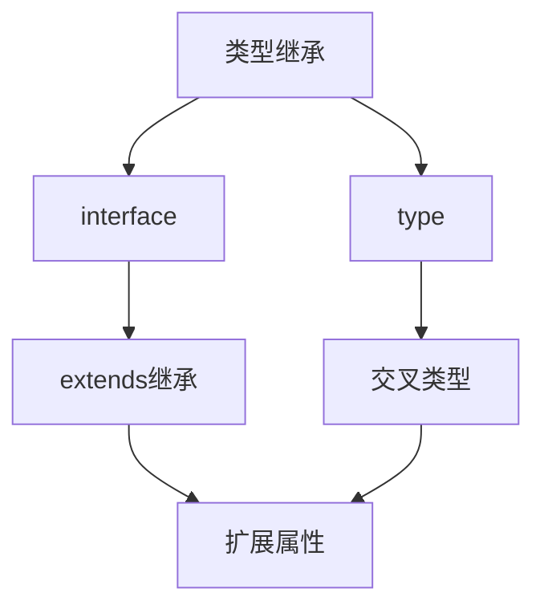
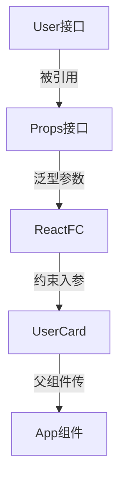

# TypeScript 中 type 和 interface 有什么区别？从 React 项目实践说起

> 备选标题：
> 1. React 组件 Props 类型定义：该用 interface 还是 type？
> 2. 用继承、声明合并与联合类型看懂 TypeScript 的类型声明
>
> 掘金标签：`TypeScript` `React` `类型系统` `前端工程化`

## 摘要

TypeScript 里 `type` 和 `interface` 都能描述数据的形状，但写法看似等价、行为却有差异。本文基于一个 React + TypeScript 实战小项目，从两者共同点出发，逐一拆解继承方式、声明合并、非对象类型、函数类型四处关键差异，最后落到 React 组件 Props 的真实用法。读完你能根据场景在二者之间做出明确的取舍，而不是凭感觉随手选一个。

## 开场：一个真实的开发场景

你在写一个 React 用户卡片组件，需要描述「用户」这个数据结构。键盘敲下去，可以写：

```typescript
interface User {
  name: string;
  age: number;
  avatarUrl: string;
}
```

也可以写：

```typescript
type UserType = {
  name: string;
  age: number;
  avatarUrl: string;
}
```

两段都编译通过，运行时也毫无差别。我当时学 TypeScript 时也卡在这个问题上——既然效果一样，为什么要分两套？后来把一个 React 项目从头写到尾才明白，差异不在「能不能用」，而在「某些事只有其中一个能做」。TypeScript 是给 JavaScript 加静态类型检查的工具，在代码运行前就拦住类型错误；`type` 和 `interface` 是它最基础的两套类型声明方式，理解它们的边界，直接决定你写的类型好不好扩展、好不好维护。

下面我会从共同点讲起，依次拆解继承方式、声明合并、非对象类型、函数类型四个差异，最后用一个 React 组件的 Props 类型把链条串起来。阅读本文只需了解两点前置：React 函数组件的基本写法，以及 TypeScript 里 `string`/`number` 这类基础类型标注。

## 一、先看清它们的共同点

很多人觉得 `type` 和 `interface` 没区别，这个印象其实来自它们的重合区。两者都能描述对象的属性结构，也都能当作变量、函数参数、返回值的类型约束。

下面这两段来自项目里的练习文件，定义的是完全一致的对象：

```typescript
// interface 写法
interface User {
  name: string;
  age: number;
  avatarUrl: string;
}

// type 写法
type UserType = {
  name: string;
  age: number;
  avatarUrl: string;
}
```

用它们约束变量时，检查行为完全相同：

```typescript
const u1: User = { name: 'a', age: 18, avatarUrl: 'https://example.com/a.jpg' }
const u2: UserType = { name: 'b', age: 20, avatarUrl: 'https://example.com/b.jpg' }
```

少一个属性、多一个属性，编译器都会报错。`u1` 和 `u2` 在类型层面是同一种约束。所以「看起来一样」是真的，但差异藏在四个更靠后的地方——接下来逐个看。

## 二、继承：extends 与交叉类型的殊途同归

类型很少从零开始。项目里 `1.tsx` 写了这样一个场景：你先有个描述「有名字的人」的 `Person`，又需要「有名字且有工作」的 `Employee`。两种声明方式给出的扩展语法不一样。

```typescript
// interface 用 extends 继承
interface Person { name: string }
interface Employee extends Person { job: string }

// type 用交叉类型 &
type PersonType = { name: string }
type EmployeeType = PersonType & { job: string }
```

`interface Employee extends Person` 的意思是：先继承 `Person` 的全部属性（`name`），再追加自己的 `job`。`extends` 是面向对象里经典的关键字，语义很直白。换到 `type` 这边，`&` 是**交叉类型**（Intersection Type），把左右两个类型合并成一个，结果类型同时拥有 `name` 和 `job`。

我一开始以为这两个写法只是语法糖的差异，直到在编辑器里把两段都实例化：

```typescript
const e1: Employee = { name: '谢哥', job: '字节' }
const e2: EmployeeType = { name: '谢哥真的帅', job: '腾讯' }
```

`e1` 和 `e2` 都必须同时带着 `name` 和 `job`，否则编译报错。也就是说，虽然入口语法不同，终点完全一致：都是「在已有类型上长出新属性」。



这张图想让你注意到：两种路径指向同一个结果 `F[扩展属性]`，区别只在中间那一步用什么关键字。

## 三、声明合并：interface 独有的能力

这是两者第一个硬差异，也是最容易让人踩坑的地方。

`interface` 允许同名声明多次，TypeScript 会把它们的成员自动合并；`type` 做不到，重复声明会直接报 `Duplicate identifier`。项目 `2.tsx` 演示了合并：

```typescript
interface Animal {
  name: string;
}

interface Animal {
  age: number;
}

// 合并后等价于 { name: string; age: number }
const dog: Animal = { name: '吴老狗', age: 1 }
```

声明两次 `Animal`，第一次只有 `name`，第二次只有 `age`，编译器把它们拼成同时含两个属性的接口，所以 `dog` 必须两个都给。

我当时试着用 `type` 复制同样的操作，把注释里的两行打开：

```typescript
// type AnimalType = { age: number; }
// type AnimalType = { name: string; }  // 报错：Duplicate identifier 'AnimalType'
```

取消注释的瞬间编译器就红了——`type` 的名字全局唯一，不能二次定义。这个报错本身就是一个很有用的信号：当你看到「同名还能追加属性」的需求时，基本只能选 `interface`。

声明合并最实用的场景是扩展第三方库的类型。比如某 UI 库的 `Button` Props 是用 `interface` 定义的，你想悄悄加一个自定义属性，重新声明同名 `interface` 即可合并进去，不必改源码。

## 四、非对象类型：type 的专属领地

第四个差异反过来——某些类型只有 `type` 能表达。`interface` 的语法 `interface X { ... }` 大括号里只能放属性签名，注定它只能描述「对象」。而 `type` 是给任意类型起别名，项目 `3.tsx` 里的联合类型和元组类型就是典型：

```typescript
// 联合类型：ID 既可以是 string 也可以 number
type ID = string | number

// 元组类型：固定长度为 2 的数组，且每个位置都是 number
type Point = [number, number]

// 下面这句如果放开会语法报错，interface 表达不了
// interface ID = string | number
```

**联合类型**用 `|` 表示「这个值可以是几种类型里的任意一种」。`ID = string | number` 在处理跨数据源的 ID 时很自然——数据库自增主键是数字，UUID 是字符串，二者都归到 `ID` 名下。**元组类型**则是一种被钉死长度和位置的数组，`Point = [number, number]` 表示恰好两个数字（比如坐标 `[3, 5]`），而普通 `number[]` 不约束长度。`interface` 在这两类面前无能为力。

## 五、函数类型：两种写法，效果相同

函数类型两种声明都能写，只是语法长得不一样。项目 `4.tsx` 给出了对照：

```typescript
// interface 用调用签名
interface AddFn {
  (a: number, b: number): number;
}
const add1: AddFn = (a, b) => a + b
add1(1, 2)

// type 用箭头函数形状
type AddType = (a: number, b: number) => number;
const add2: AddType = (a, b) => a + b
add2(1, 2)
```

`interface AddFn` 把调用签名包在大括号里写；`type AddType` 直接用 `(a, b) => number` 这个箭头形状描述，跟 JavaScript 箭头函数长得像，读起来更顺。`add1` 和 `add2` 调用方式、约束结果完全一样。所以在「描述函数」这件事上，更多是口味问题——`type` 的箭头写法通常更省事。

## 六、落到 React：用 interface 定义组件 Props

差异在真实项目里才有重量。`UserCard.tsx` 是项目里的实战组件，它用 `interface` 定义了两层类型：

```typescript
interface User {
  name: string;
  age: number;
  avatarUrl: string;
}

interface UserCardProps {
  user: User;
  onEdit: (id: number) => void;
}

const UserCard: React.FC<UserCardProps> = ({ user, onEdit }) => {
  void user; void onEdit;
  return (
    <div>
      <h1>User Card</h1>
    </div>
  )
}
export default UserCard
```

逐行看：`User` 描述数据结构；`UserCardProps` 描述组件接收什么——一个 `user`（类型是上面的 `User`）和一个 `onEdit` 回调（接收 `number`、无返回值）。这里有个值得注意的点：接口的属性可以引用另一个接口，类型就这样嵌套起来。

`React.FC<UserCardProps>` 中的 `React.FC` 是 React 提供的**泛型类型**（Generic Type）。泛型可以理解成「类型层面的参数」——`React.FC` 接收一个类型参数 `UserCardProps`，返回一个「Props 类型被锁定为 `UserCardProps` 的函数组件」类型。把它标在 `UserCard` 上，TS 就知道这个组件该收什么 Props。`void user; void onEdit;` 里的 `void` 是运算符，作用是「执行表达式但丢弃结果」，这里告诉编译器「我晓得这两个变量存在，只是暂时没在 UI 里用」。

项目注释里还留了一句思考：`interface` 是传统 OOP 的核心概念，父子组件通过 Props 传递数据，本质上就是一种「面向接口的编程」——父组件按约定给数据，子组件按约定收。

## 七、类型的传递链路：从定义一路约束到使用

光看单个组件还不够，真正的价值在类型怎么「流」起来。`App.tsx` 里这样用 `UserCard`：

```tsx
import UserCard from './components/UserCard'

function App() {
  return (
    <section id="center">
      <UserCard user={{
        name: 'xll',
        age: 18,
        avatarUrl: 'http://example.com/avatar.jpg',
      }} onEdit={() => { }} />
    </section>
  )
}
```

类型约束的链路是这样的：`User` 定义数据结构 → `UserCardProps` 引用 `User` 作为 `user` 属性的类型 → `React.FC<UserCardProps>` 把 Props 类型绑到组件 → `App.tsx` 传入符合约定的数据。任意一环对不上，编译就报错。



顺着箭头看：如果 `App` 传入的 `user` 少了 `avatarUrl`，错误会沿着这条链回溯到 `User` 接口的定义处。`onEdit` 这里有个细节——声明是 `(id: number) => void`，但 `App` 传的是 `() => {}` 空函数，这合法：传入的函数可以比声明「少」参数（函数参数的逆变特性），但不能多。

## 八、什么时候选哪个

把这个 React 项目里出现的差异摊开，选择其实有章法：

| 场景 | 推荐 | 原因 |
|---|---|---|
| React 组件 Props | `interface` | 可声明合并，方便扩展第三方类型 |
| 普通对象结构 | `interface` | `extends` 语义清晰、可读性好 |
| 联合类型 / 元组 | `type` | `interface` 语法表达不了 |
| 函数类型 | `type` | 箭头写法更简洁直观 |
| 需要向已有类型追加成员 | `interface` | 声明合并是独有能力 |

我自己现在的习惯是：能用 `interface` 描述对象就用 `interface`，一旦碰到联合、元组或单纯想写个函数签名，就切到 `type`。这条线基本覆盖了日常 90% 的取舍。

## 小结

| 概念 | 一句话解释 | 关键代码 |
|---|---|---|
| interface | 描述对象结构的类型声明，支持继承与声明合并 | `interface User { name: string }` |
| type | 给任意类型起别名，含联合类型与元组 | `type ID = string \| number` |
| extends | interface 的继承关键字 | `interface Employee extends Person` |
| 交叉类型 | type 的「合并多个类型」写法 | `type E = Person & { job: string }` |
| 声明合并 | 同名 interface 自动合并成员 | 两次 `interface Animal` 会合并 |
| 联合类型 | 值可属于多种类型之一 | `type ID = string \| number` |
| 元组类型 | 固定长度与元素类型的数组 | `type Point = [number, number]` |
| React.FC | React 函数组件的泛型类型，绑定 Props | `React.FC<UserCardProps>` |

## 易错点与待补充学习

**已证实的易错点**

- `type` 同名不能重复声明：写两次会报 `Duplicate identifier`，`interface` 则会合并。项目 `2.tsx` 把重复的 `type` 注释掉正是这个原因。
- `interface` 表达不了联合/元组：`interface ID = string | number` 是语法错误，必须用 `type`。
- 函数类型语法两套不互通：`interface` 用调用签名 `(a, b): number`，`type` 用箭头 `(a, b) => number`，写法不能混用。
- `React.FC` 必须带泛型参数：单独写 `React.FC` 没有约束意义，要 `React.FC<PropsType>` 才锁定 Props。

**待补充学习**

- 声明合并的真实案例：项目只演示了语法，没展示扩展第三方库类型定义的完整例子。
- `React.FC` 对 `children`、`defaultProps` 的影响：项目只用了基础写法。
- 自定义泛型：项目用了 `React.FC<UserCardProps>`，但没讲怎么自己写泛型函数或泛型接口。
- 函数参数逆变：`onEdit` 声明 `(id: number) => void` 却传入 `() => {}`，涉及逆变概念，值得单开一篇。

## 结尾

从「看起来没区别」到「某些事只有一个能做」，是我在写这个 React 项目时真正建立的认知：`type` 和 `interface` 在描述对象时重叠，但在继承语法、声明合并、非对象类型三处彻底分叉，函数类型则是口味问题。把它们落到 `UserCard` 的 Props 上，再顺着 `User → UserCardProps → React.FC → UserCard → App` 这条链看，类型系统就从「一堆声明」变成了「贯穿组件的约束力」。

下一步建议深入泛型——自己写泛型函数和泛型接口，顺带把声明合并用到扩展第三方库类型的真实场景里。

## 自测清单

- 能说出 `type` 和 `interface` 在描述对象时的共同点，并指出三处行为分叉
- 能用 `extends` 和交叉类型 `&` 两种方式分别实现类型继承
- 能解释声明合并是什么，以及为什么 `type` 重复声明会报错
- 能用 `type` 定义联合类型与元组类型，并说明 `interface` 为何不行
- 能分别用 `interface` 调用签名和 `type` 箭头函数描述同一个函数类型
- 能在 React 组件里用 `interface` 定义 Props，并通过 `React.FC` 把类型约束绑到组件上
