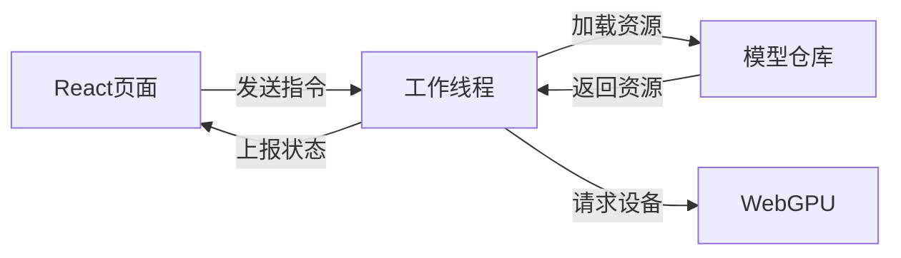
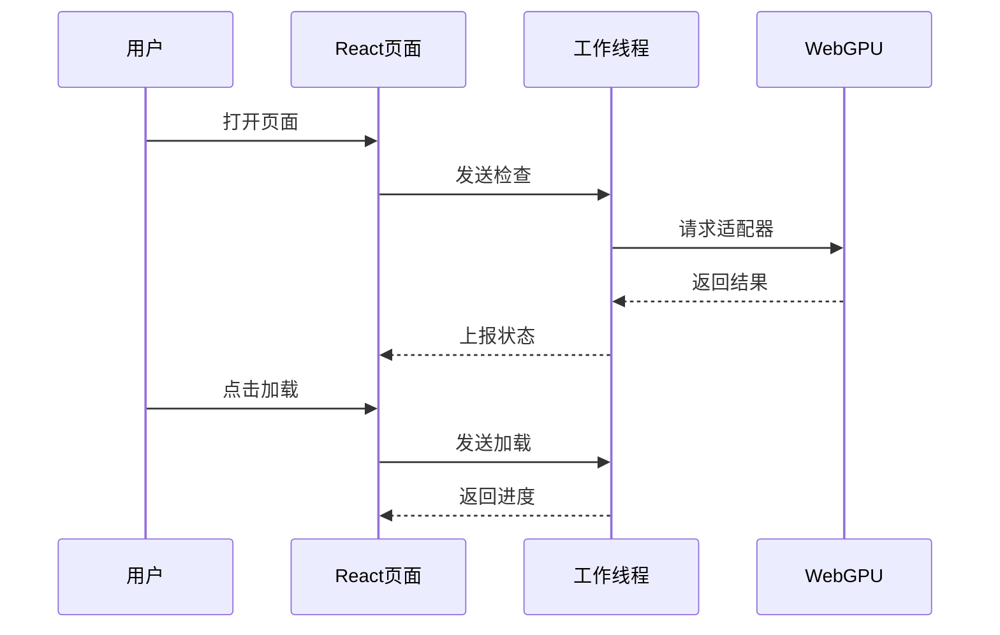
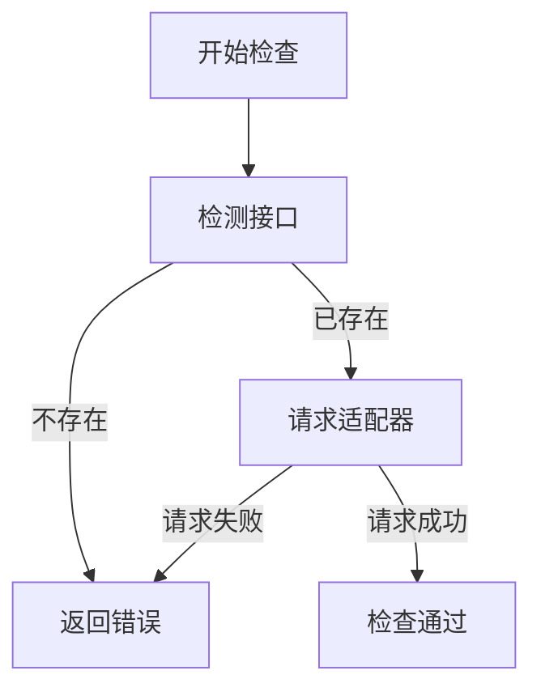
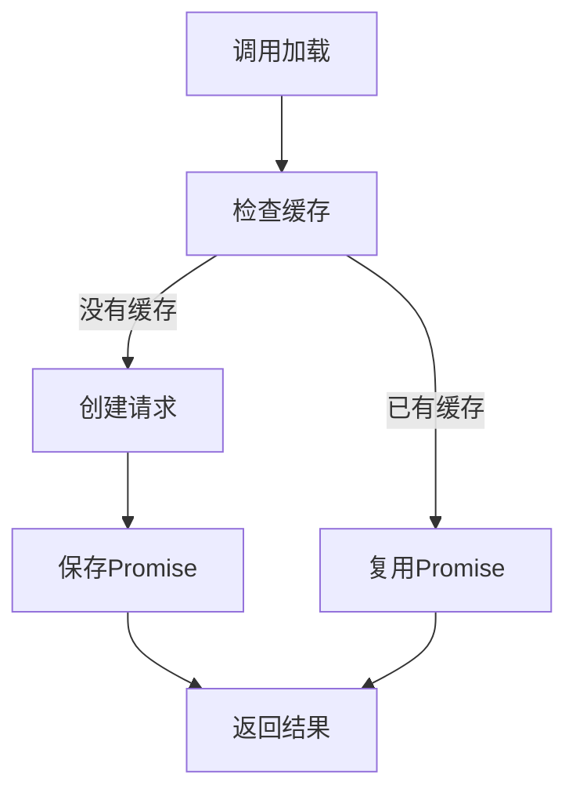
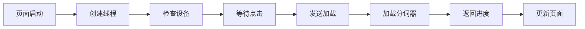
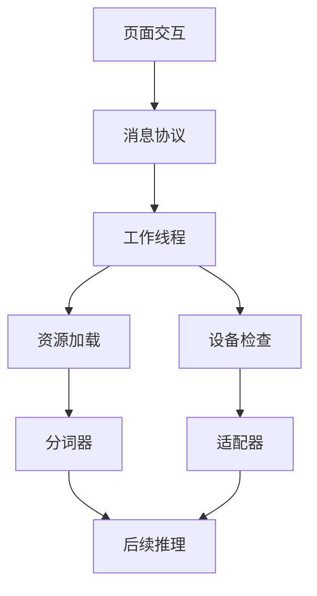

# 从 Web Worker 到 WebGPU：拆解浏览器端 DeepSeek 的模型加载流程

> 备选标题：
>
> 1. 浏览器如何加载 AI 模型：从 React、Worker 到 WebGPU
> 2. WebGPU 入门复习：读懂一个浏览器端 DeepSeek 项目的代码结构

推荐标签：WebGPU、React、Web Worker、Transformers.js、人工智能

## 摘要

浏览器能不能直接运行 AI 模型，而不把用户输入发送给后端服务器？

这次学习的 `webgpu-deepseek` 项目正在尝试完成这件事：React 负责页面展示和状态管理，Web Worker 负责执行耗时任务，Transformers.js 负责读取模型资源，WebGPU 负责提供浏览器端的 GPU 计算能力。

不过，阅读源码之后可以发现，当前项目还没有实现完整的 DeepSeek 文本生成流程。它目前完成的主要工作是：

- 检查浏览器能否获取 WebGPU 适配器；
- 在 React 页面中创建 Web Worker；
- 从主线程向 Worker 发送检查和加载指令；
- 通过 Transformers.js 加载 DeepSeek 模型对应的 Tokenizer；
- 将加载状态从 Worker 返回给 React 页面；
- 使用单例式缓存，避免重复创建 Tokenizer。

下面将从“浏览器加载 AI 模型时，各部分代码分别负责什么”这个问题出发，拆解整个项目。

## 一、为什么不能把模型加载全部写在 React 组件里

如果把模型下载、初始化和推理全部放在 React 组件中执行，会遇到一个很直接的问题：这些任务可能占用主线程。

浏览器主线程不仅要执行 JavaScript，还要处理页面渲染、按钮点击和状态更新。如果耗时任务长时间占用主线程，页面就可能出现卡顿，甚至暂时无法响应用户操作。

因此，这个项目把职责拆成了三个部分。



React 页面负责交互，Web Worker 负责执行模型相关任务，WebGPU 则为浏览器端计算提供设备能力。这样划分之后，页面逻辑和耗时逻辑之间有了清晰的边界。

这里需要先明确一个容易混淆的概念：

> Web Worker 和 WebGPU 不是同一种技术，它们解决的是两个不同的问题。

- Web Worker 解决 JavaScript 任务放在哪里执行的问题；
- WebGPU 解决计算任务使用什么硬件能力执行的问题。

Web Worker 可以让任务离开主线程，但它本身不会自动使用 GPU。WebGPU 可以访问 GPU 能力，但它也不会自动帮我们管理 React 页面状态。

## 二、项目中的依赖分别负责什么

从 `package.json` 可以看到，项目的核心依赖包括：

```json
{
  "@huggingface/transformers": "3.7.1",
  "marked": "^15.0.5",
  "react": "^19.2.6",
  "react-dom": "^19.2.6"
}
```

开发依赖中还包含：

```json
{
  "@webgpu/types": "^0.1.71"
}
```

这些依赖承担的职责并不相同。

| 依赖 | 当前项目中的作用 |
|---|---|
| `react` | 创建页面组件和管理界面状态 |
| `react-dom` | 将 React 组件渲染到浏览器页面 |
| `@huggingface/transformers` | 加载 Tokenizer 等模型相关资源 |
| `marked` | 可以把 Markdown 文本转换成 HTML |
| `@webgpu/types` | 为 TypeScript 提供 WebGPU 类型声明 |

需要特别注意：安装依赖不代表项目已经使用了依赖提供的所有能力。

例如，项目安装了 `marked`，README 中也提到了它可以处理模型返回的 Markdown 内容，但从当前核心代码来看，还没有看到实际调用 `marked` 的文本渲染流程。

因此，更准确的描述是：

> 项目已经为 Markdown 格式的模型输出准备了依赖，但当前代码还没有完成对应的渲染功能。

同样，项目安装了 Transformers.js，也不能直接说明完整的模型推理已经实现。是否真正完成推理，仍然要看 Worker 中具体加载了什么类、调用了什么方法。

## 三、为什么 TypeScript 需要额外的 WebGPU 类型

项目的 `tsconfig.app.json` 中存在下面的配置：

```json
{
  "compilerOptions": {
    "types": ["vite/client", "@webgpu/types"]
  }
}
```

React 组件中通过下面的代码判断 `navigator.gpu` 是否存在：

```ts
const IS_WEBGPU_AVAILABLE = !!navigator.gpu;
```

这里的 `!!` 是 JavaScript 中常见的布尔值转换方式。

- 如果 `navigator.gpu` 存在，结果为 `true`；
- 如果 `navigator.gpu` 不存在，结果为 `false`。

虽然浏览器运行时可能已经支持 `navigator.gpu`，但 TypeScript 使用的是类型声明系统。如果当前 TypeScript 环境没有对应的 WebGPU 类型，编辑器可能无法识别 `navigator.gpu`，并提示属性不存在。

`@webgpu/types` 的作用，就是告诉 TypeScript：WebGPU 中有哪些接口、属性、参数和返回值。

它解决的是开发阶段的类型检查问题，而不是浏览器运行时的兼容性问题。

也就是说：

- 添加 `@webgpu/types`，不会让原本不支持 WebGPU 的浏览器突然支持 WebGPU；
- 没有正确的类型声明，也不一定意味着浏览器运行时完全不能调用 WebGPU；
- 类型支持和运行时支持是两个不同层面。

## 四、React 页面如何创建 Web Worker

在 `App.tsx` 中，Worker 实例通过 `useRef` 保存：

```tsx
const worker = useRef(null);
```

接着，组件在 `useEffect` 中创建 Worker：

```tsx
useEffect(() => {
  worker.current = new Worker(new URL("./worker.js", import.meta.url), {
    type: "module",
  });

  worker.current.postMessage({ type: "check" });
}, []);
```

这里有三个需要理解的重点。

### 1. 为什么使用 `useRef`

如果把 Worker 实例直接写成普通变量，那么 React 组件每次重新渲染时，都可能重新执行变量初始化。

`useRef` 可以在多次渲染之间保留同一个引用，并且修改 `worker.current` 时不会主动触发组件重新渲染。

这非常适合保存：

- Worker 实例；
- DOM 元素；
- 定时器编号；
- 不需要直接展示在页面上的可变对象。

在这个项目中，Worker 是一个需要长期存在、但不需要直接参与页面渲染的对象，所以使用 `useRef` 是合理的。

### 2. 为什么使用 `new URL`

代码没有直接写：

```ts
new Worker("./worker.js");
```

而是写成：

```ts
new Worker(new URL("./worker.js", import.meta.url), {
  type: "module",
});
```

`new URL("./worker.js", import.meta.url)` 会以当前模块地址为基准定位 `worker.js`。在 Vite 等构建工具中，这种写法能够让构建工具识别 Worker 文件，并参与资源路径处理。

### 3. 为什么设置 `type: "module"`

Worker 文件中使用了 ES Module 的 `import` 语法：

```js
import { AutoTokenizer } from "@huggingface/transformers";
```

因此，创建 Worker 时需要声明：

```ts
{
  type: "module"
}
```

否则浏览器可能把 Worker 当成传统脚本处理，无法正确解析模块导入。

## 五、主线程和 Worker 如何通信

React 主线程和 Worker 不会直接调用彼此内部的函数，它们通过消息进行通信。



主线程使用 `postMessage` 发送消息，Worker 使用 `self.postMessage` 返回消息。这种通信方式把页面代码和模型代码隔离开来，也让双方可以通过统一的消息结构扩展功能。

页面初始化之后，会立即发送一条检查消息：

```tsx
worker.current.postMessage({ type: "check" });
```

用户点击加载按钮时，会发送另一条消息：

```tsx
worker.current.postMessage({ type: "load" });
setStatus("loading");
```

可以看到，消息都包含一个 `type` 字段：

```ts
{ type: "check" }
{ type: "load" }
```

Worker 可以根据 `type` 判断要执行哪项操作。这种设计可以理解为一个很小的“消息协议”。

| 消息类型 | 含义 | 当前状态 |
|---|---|---|
| `check` | 检查 WebGPU 适配器 | 已实现 |
| `load` | 加载 Tokenizer | 已实现 |
| `generate` | 执行文本生成 | 只有分支，尚未实现 |
| `interrupt` | 中断任务 | 只有分支，尚未实现 |
| `reset` | 重置状态 | 只有分支，尚未实现 |

这里最值得学习的地方不是消息名称本身，而是这种扩展方式：

> 主线程不需要知道 Worker 内部如何加载模型，只需要按照约定发送消息；Worker 完成任务后，再按照约定返回状态。

## 六、Worker 如何检查 WebGPU

Worker 中的检查逻辑调用了：

```js
const adapter = await navigator.gpu.requestAdapter();
```

`requestAdapter()` 用于请求一个 GPU 适配器。

这里的“适配器”可以先理解成浏览器为当前环境找到的一个 GPU 入口。当前项目拿到适配器之后，没有继续请求 GPU Device，也没有执行计算管线，而是把这个步骤作为 WebGPU 能力检查的一部分。

当无法获取适配器，或者检查过程中出现异常时，Worker 会向主线程发送错误：

```js
self.postMessage({
  status: "error",
  data: e.toString(),
});
```

React 页面注册了 Worker 的消息监听器，因此可以根据返回的 `status` 更新页面。

这个检查比单纯判断下面的代码更进一步：

```ts
!!navigator.gpu
```

两者的含义并不完全相同。

- `navigator.gpu` 存在：说明当前环境暴露了 WebGPU API；
- `requestAdapter()` 返回适配器：说明当前调用环境成功获取到了可用适配器。

因此，可以把检查过程理解成两个层次。



第一步检查 API 是否存在，第二步尝试获得实际适配器。只有接口名称存在，并不等于后续所有 WebGPU 操作一定能够成功。

## 七、模型加载代码实际加载了什么

Worker 中定义了一个名为 `TextGenerationPipeline` 的类：

```js
class TextGenerationPipeline {
  static model_id =
    "onnx-community/DeepSeek-R1-Distill-Qwen-1.5B-ONNX";

  static async getInstance(progress_callback = null) {
    this.tokenizer ??= AutoTokenizer.from_pretrained(this.model_id, {
      progress_callback,
    });

    return Promise.all([this.tokenizer]);
  }
}
```

从类名来看，它似乎是一个“文本生成管线”。但是阅读代码时不能只看命名，还要看实际导入和调用。

当前 Worker 只导入了：

```js
import { AutoTokenizer } from "@huggingface/transformers";
```

并在 `getInstance()` 中调用：

```js
AutoTokenizer.from_pretrained(...)
```

所以，当前代码实际加载的是 Tokenizer，而不是完整的文本生成模型。

### Tokenizer 是什么

模型不能直接理解普通字符串。Tokenizer 的职责是把文本转换成模型可以处理的 Token 编号，也可以把模型输出的 Token 编号还原成文本。

可以把它简单理解为：

```text
自然语言文本
    ↓
Tokenizer 编码
    ↓
Token 编号
    ↓
模型计算
    ↓
输出 Token
    ↓
Tokenizer 解码
    ↓
自然语言文本
```

当前项目只实现了其中的 Tokenizer 加载部分，还没有在源码中看到完整的模型加载、输入编码、模型推理和输出解码流程。

因此，不应该根据类名直接得出“浏览器已经完成 DeepSeek 文本生成”的结论。

更准确的项目状态是：

> 当前代码搭建了浏览器端模型应用的基本通信结构，并完成了 Tokenizer 的加载入口，但完整推理链路仍然缺失。

## 八、`??=` 如何实现单例式缓存

`getInstance()` 中最值得复习的一行代码是：

```js
this.tokenizer ??= AutoTokenizer.from_pretrained(this.model_id, {
  progress_callback,
});
```

`??=` 是空值赋值运算符。

它的基本规则是：

- 左边为 `null` 或 `undefined` 时，执行右边表达式并赋值；
- 左边已经有值时，保留原来的值，不再执行右边表达式。

可以把它近似理解成：

```js
if (this.tokenizer === null || this.tokenizer === undefined) {
  this.tokenizer = AutoTokenizer.from_pretrained(this.model_id, {
    progress_callback,
  });
}
```

这里缓存的并不一定是最终的 Tokenizer 对象。

因为 `AutoTokenizer.from_pretrained()` 是异步调用，所以它会返回一个 Promise。代码会先把这个 Promise 保存到 `this.tokenizer` 中。



第一次调用时创建加载请求并缓存 Promise，后续调用直接复用同一个 Promise。即使第一次加载还没有完成，后续调用也不会再次启动一份完全相同的加载任务。

这与项目中 `singleton/index.html` 展示的单例思想相似：

```js
class Popup {
  static ins;

  static getInstance() {
    if (!Popup.ins) {
      Popup.ins = new Popup();
    }

    return Popup.ins;
  }
}
```

调用两次：

```js
const a = Popup.getInstance();
const b = Popup.getInstance();

console.log(a === b);
```

`a === b` 为 `true`，说明两次调用获得的是同一个实例。

模型加载代码虽然没有直接保存一个传统的类实例，但核心思想一致：第一次调用负责创建，后续调用负责复用。

缓存 Promise 还有一个额外价值：它可以避免并发调用造成重复初始化。

如果两个地方几乎同时调用 `getInstance()`：

1. 第一个调用创建 Promise；
2. Promise 立即被保存；
3. 第二个调用发现缓存已经存在；
4. 两个调用等待同一个 Promise。

这比“等待加载完成后才保存最终对象”更适合处理异步初始化。

## 九、加载进度如何返回到页面

Worker 中的 `load()` 首先发送加载状态：

```js
self.postMessage({
  status: "loading",
  data: "Loading model...",
});
```

然后调用：

```js
TextGenerationPipeline.getInstance((x) => {
  self.postMessage(x);
});
```

这里把一个回调函数传给 `getInstance()`，再继续传入：

```js
AutoTokenizer.from_pretrained(this.model_id, {
  progress_callback,
});
```

当 Transformers.js 产生加载进度时，回调会将状态继续发送给 React 页面。

整个进度传递方向可以概括为：

```text
Transformers.js
    ↓ progress_callback
Worker
    ↓ self.postMessage
React 消息监听器
    ↓ setState
页面状态
```

React 组件中已经为多种状态预留了分支：

```tsx
switch (e.data.status) {
  case "loading":
    setStatus("loading");
    setLoadingMessage(e.data.data);
    break;

  case "error":
    setStatus("error");
    setError(e.data.data);
    break;

  case "initiate":
  case "progress":
  case "done":
  case "ready":
  case "start":
  case "update":
  case "complete":
    break;
}
```

当前只有 `loading` 和 `error` 分支包含实际的状态更新逻辑，其他分支目前是空的。

这说明项目已经预留了更完整的生命周期状态，但页面还没有把这些状态真正展示出来。

因此，不能仅仅因为存在 `progress`、`ready` 或 `complete` 分支，就认为这些状态已经形成完整可用的界面逻辑。

## 十、当前项目已经实现到哪一步

把前面的代码串起来，当前流程可以概括为：



当前项目已经具备“页面、Worker、WebGPU 检查和 Tokenizer 加载”的基本骨架，但流程停在 Tokenizer 加载附近，还没有进入真正的文本生成阶段。

从代码证据来看，已经实现的内容包括：

- 页面启动时创建模块 Worker；
- React 和 Worker 之间的双向消息通信；
- 检查 `navigator.gpu`；
- 调用 `requestAdapter()` 请求 WebGPU 适配器；
- 根据模型 ID 加载 Tokenizer；
- 通过回调转发资源加载状态；
- 使用缓存 Promise 避免重复加载；
- 在页面中处理加载和错误状态。

当前没有完成或没有在代码中体现的内容包括：

- 完整模型类的导入和初始化；
- 文本输入区域；
- Tokenizer 编码调用；
- 模型推理调用；
- Token 流式生成；
- Tokenizer 解码；
- 生成结果展示；
- Markdown 内容渲染；
- 中断生成逻辑；
- 重置会话逻辑。

这一点非常重要：学习项目时，要把“设计目标”“界面文案”和“当前源码已经实现的行为”分开。

README 和页面文案可以描述项目准备实现什么，但判断功能是否真正存在，最终仍然要回到具体代码。

## 十一、为什么 Worker 中预留了空消息分支

Worker 的消息处理中已经出现了这些类型：

```js
case "generate":
case "interrupt":
case "reset":
```

但这些分支目前没有实际处理代码。

这种写法可以看作项目对后续功能的提前规划：

- `generate`：可能用于接收用户输入并启动生成；
- `interrupt`：可能用于停止正在进行的生成；
- `reset`：可能用于清理当前生成状态。

不过，“可能用于”只是根据消息名称作出的结构性理解，不能把它写成已经存在的功能。

在阅读半成品项目时，可以使用下面的判断方式：

| 代码情况 | 可以得出的结论 |
|---|---|
| 只有变量名或函数名 | 只能知道作者的命名意图 |
| 有分支但分支为空 | 功能入口被预留，但尚未实现 |
| 有函数调用和状态更新 | 可以确认部分逻辑已经实现 |
| 有完整输入和输出链路 | 才能确认功能形成闭环 |

这也是阅读源码时非常实用的原则：

> 名称描述意图，执行代码证明行为。

## 十二、为什么模型逻辑适合放进 Worker

把模型相关逻辑放进 Worker，除了避免主线程直接承担耗时任务，还能让代码职责更加明确。

React 页面只需要关心：

- 用户是否点击按钮；
- 当前状态是什么；
- 是否需要展示错误；
- 加载进度如何显示。

Worker 只需要关心：

- 收到了什么消息；
- 是否能够获取 WebGPU 适配器；
- 应该加载什么资源；
- 如何把进度和错误返回页面。

这种拆分还有一个好处：以后即使模型加载逻辑发生变化，React 页面也不一定需要同步修改大量代码。

例如，只要主线程和 Worker 继续遵守类似的消息格式：

```js
{
  type: "load"
}
```

以及：

```js
{
  status: "loading",
  data: "..."
}
```

那么 Worker 内部究竟使用什么模型加载方式，可以被相对独立地调整。

不过，这种设计也会带来新的要求：消息协议必须保持一致。

如果主线程发送：

```js
{
  type: "load"
}
```

Worker 却判断：

```js
if (message.type === "loading") {
  // ...
}
```

那么消息就无法进入正确分支。

因此，随着消息类型增加，最好统一管理消息名称和数据结构。当前项目规模还比较小，但已经能看到这种通信设计的雏形。

## 十三、易错点与待补充学习

### 1. 检测到 `navigator.gpu` 不代表完整功能可用

下面的判断只能说明 API 属性是否存在：

```ts
const IS_WEBGPU_AVAILABLE = !!navigator.gpu;
```

真正使用 WebGPU 时，还需要继续请求适配器，并处理请求失败的情况。

当前项目已经调用了：

```js
await navigator.gpu.requestAdapter();
```

但还没有展示后续设备申请和计算流程。

### 2. Web Worker 不等于多线程共享内存

Worker 有独立的执行环境。主线程和 Worker 主要通过消息传递数据，而不是直接访问对方的普通变量。

因此，React 组件不能直接调用 Worker 内部的 `load()`，Worker 也不能直接调用 React 的 `setStatus()`。

双方需要通过 `postMessage(...)` 和消息监听器完成通信。

### 3. 类名不能证明功能已经完成

`TextGenerationPipeline` 这个名字包含“文本生成”，但当前代码只导入并加载了 `AutoTokenizer`。

判断项目能力时，应以真实调用为准，不能只依据命名。

### 4. Tokenizer 不是完整模型

Tokenizer 负责文本和 Token 之间的转换，它不是执行文本生成的完整模型。

加载 Tokenizer 成功，只能证明文本预处理相关资源得到了初始化，不能证明 DeepSeek 已经能够返回回答。

### 5. `??=` 和 `||=` 的判断规则不同

项目使用的是：

```js
this.tokenizer ??= ...
```

它只会在左侧为 `null` 或 `undefined` 时赋值。

而 `||=` 会在左侧为任意假值时赋值，例如：

- `false`
- `0`
- `""`
- `null`
- `undefined`

对于缓存对象或 Promise 来说，`??=` 的含义通常更准确：只有“尚未初始化”时才创建。

### 6. 当前 React 代码缺少 Worker 清理逻辑

当前 `useEffect` 创建了 Worker，也注册了消息和错误监听器，但从现有代码来看，没有看到组件卸载时的清理返回函数。

通常需要关注：

- 是否移除消息监听器；
- 是否移除错误监听器；
- 是否调用 `worker.terminate()`；
- 开发环境下重复挂载是否会产生额外 Worker。

这里只能确认当前代码没有展示清理流程，不能仅凭这一点判断实际运行时一定发生资源泄漏，但它是后续完善时需要重点检查的位置。

### 7. 空状态分支不会自动产生功能

React 中虽然存在：

```tsx
case "progress":
case "ready":
case "complete":
```

但如果分支中没有更新状态的代码，页面就不会因为这些分支自动显示对应内容。

同样，Worker 中的：

```js
case "generate":
case "interrupt":
case "reset":
```

也只是预留入口。

### 8. 已安装 `marked` 不代表已经渲染 Markdown

`marked` 可以用于解析 Markdown，但当前核心代码中没有展示它的实际调用。

在完整的模型输出流程出现之前，暂时不能确认模型回答会以 Markdown 形式正确渲染到页面。

## 十四、这次学习应该形成的整体认识

通过这个项目，可以把浏览器端 AI 应用理解成几个相互连接、但职责不同的部分：



页面负责接收用户操作，消息协议负责连接主线程和 Worker，Worker 负责组织资源加载和设备检查。Tokenizer 和 WebGPU 适配器只是后续推理所需的基础组成部分，当前项目还没有把它们连接成完整的生成链路。

这次最值得巩固的并不是“浏览器已经成功运行了 DeepSeek”，而是下面几层知识之间的关系：

1. React 使用状态驱动页面展示；
2. `useRef` 保存跨渲染周期的 Worker 引用；
3. `useEffect` 在组件挂载后创建 Worker；
4. 主线程和 Worker 通过消息协议通信；
5. Worker 检查 WebGPU 并加载模型相关资源；
6. Transformers.js 提供 Tokenizer 加载能力；
7. `??=` 缓存异步初始化 Promise；
8. 当前源码还没有形成完整的文本生成闭环。

## 总结

这个项目已经搭建了一个浏览器端 AI 应用的基础骨架：React 负责页面，Web Worker 隔离模型任务，WebGPU 提供 GPU 访问入口，Transformers.js 负责读取模型相关资源。

但源码阅读告诉我们，当前实现仍然处于基础阶段。它已经能够检查 WebGPU 适配器并加载 DeepSeek 模型对应的 Tokenizer，却还没有加载完整的文本生成模型，也没有实现输入、推理、解码和结果展示。

这次学习还体现了一个非常重要的源码阅读习惯：

> 不根据项目名称、类名或界面文案判断功能，而是沿着输入、调用、状态和输出逐步确认代码真正完成了什么。

接下来继续学习这个项目时，可以重点关注完整推理链路中的几个缺口：模型类如何加载、文本如何编码、推理如何启动、生成结果如何流式返回，以及 React 如何把模型输出安全地展示出来。只有这些环节连接完成之后，浏览器端 DeepSeek 应用才真正形成从用户输入到模型回答的闭环。
