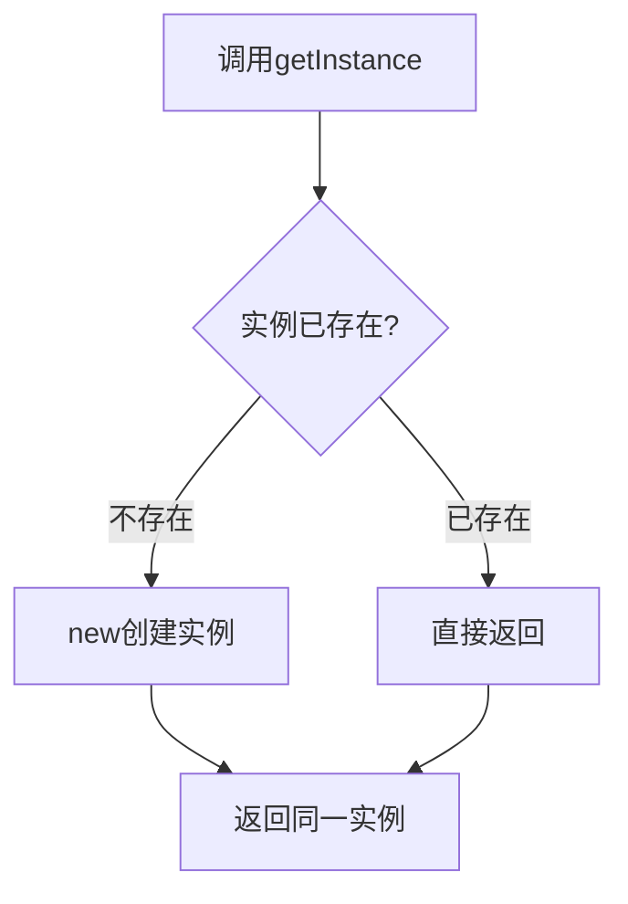

# 用单例模式管理弹窗：从一段原生 JS 理解 Singleton

**备选标题**
- JavaScript 单例模式实战：为什么全局只需要一个 Popup 实例
- 从 window.open 弹窗说起，搞懂 Singleton 单例模式

**推荐标签**：JavaScript · 设计模式 · 单例模式 · 前端基础

## 摘要

当一个页面里多处都能打开弹窗时，最怕的是每次都 `new` 出一个互不相干的对象——你想"记录所有弹窗、一键全关"就办不到。本文用一段 30 行的原生 JS 弹窗代码，拆解单例模式的三步模板、懒加载，以及"静态方法 / 实例方法"这个初学者最容易混的点。读完你能自己写出一个全局唯一的 Popup 管理器。

## 开场：一个会"管不住"的弹窗

你在做一个网页，页面上有一个"打开新网页"按钮，点一下用 `window.open` 新开一个标签页。功能很简单，但当弹窗多了，问题来了：如果每一处打开逻辑都各自 `new` 一个对象，它们之间互不相通，你想统一管理就办不到。

我刚开始学设计模式时也卡在这里。单例（Singleton）是面向对象里最基础、也是企业级项目里最常用的模式之一——它保证一个类在系统里只被实例化一次。理解它，不只是为了少写一行 `new`，更是理解"全局共享同一份状态"这种思维方式。本文会先跑一遍这段弹窗代码看效果，再拆解单例的三步模板，然后讲清懒加载和"静态方法 / 实例方法"的区别，最后把它接到 DOM 按钮上。阅读本文只需要知道 JS 的 `class` 和基本的 DOM 事件。

## 先跑一遍：两次 getInstance，拿到的是同一个对象

```js
const a = Popup.getInstance();
const b = Popup.getInstance();
console.log(a === b); // true
```

`a` 和 `b` 是同一个引用，所以 `a === b` 为 `true`。这正是单例存在的意义——**全局只有这一个 Popup 对象**，任何地方拿到它都是在操作同一份数据。比如你往实例里记一个弹窗列表，别处就能读到它、就能"一键全关"，因为它们根本就是同一个对象。

## 单例模板三步走：存实例 → 判断有无 → 统一入口

```js
class Popup {
  static ins; // 单例实例，静态属性
  static getInstance() {
    if (!Popup.ins) {
      Popup.ins = new Popup();
    }
    return Popup.ins;
  }
  // ...
}
```

单例的模板可以拆成三步：

1. **存实例**：用 `static ins` 这个静态属性把唯一实例挂在类上，而不是存在一个外部变量里。
2. **判断有无**：`if (!Popup.ins)` 检查实例还在不在。
3. **统一入口**：永远通过 `getInstance()` 拿对象，不要直接 `new`。

`getInstance()` 内部的控制流长这样——第一次进来 `ins` 是空的，于是 `new` 一个并保存；之后再进来发现已经有了，直接返回：



## 懒加载：第一次调才 new，不用手动 new

注意 `if (!Popup.ins) { Popup.ins = new Popup(); }` 这一行：实例**不是在类定义时就创建的，而是第一次调用 `getInstance()` 时才 `new`**，之后全部复用。这叫**懒加载（lazy initialization）**——用到才建，避免一开始就占用资源。所以你永远不需要手动 `new Popup()`，第一次调 `getInstance()` 会自动帮你创建。

## 静态方法 vs 实例方法：为什么 getInstance 能直接"类名调用"

```js
const a = Popup.getInstance();        // 静态方法，直接 Popup.xxx
a.open("https://www.baidu.com");       // 实例方法，必须先拿到实例 a
```

这里的区别是初学者最容易混的：`getInstance` 前面有 `static`，是挂在类上的**静态方法**，所以能不 `new` 就 `Popup.getInstance()` 直接调；而 `open()` 没有 `static`，是**实例方法**，必须拿到具体实例 `a` 才能 `a.open()`。一句话记住——静态方法用"类名."调，实例方法用"实例."调。

## 接到 DOM：getElementById 与事件绑定

```js
const openBtn = document.getElementById("openBtn");
openBtn.addEventListener("click", () => {
  a.open("https://www.baidu.com");
});
```

`getElementById("openBtn")` 是按 `id` 在页面里找那个 `<button id="openBtn">` 元素；`addEventListener` 给它绑一个点击事件；点下去就调 `a.open()`。注意这里用的是单例 `a`，所以无论页面哪里触发，走的都是同一个 Popup 实例。

## open 里面那行 window.open(url, '_blank')

```js
open(url) {
  window.open(url, '_blank');
}
```

`window.open` 用于打开新窗口 / 标签页；第二个参数 `'_blank'` 表示在**新标签页**打开（而不是替换当前页，也不是在某个指定名字的 frame 里打开）。这里把"打开哪个 url"作为参数传进来，由外部调用时决定。

## 为什么用单例管弹窗，而不是每次 new

真实项目里，弹窗常常需要"记录全部、统一关闭"。单例让所有打开逻辑共享同一个实例，弹窗列表天然集中在一处。我第一次写这类功能时图省事直接 `new Popup()` 点了两次，结果两个按钮各自持有不同实例，关闭逻辑互相找不到对方——这就是没用单例的坑。换成单例后，任何入口拿到的都是同一个对象，集中管理一下子就通了。

## 小结

| 概念 | 一句话解释 | 关键代码 |
|---|---|---|
| Singleton 单例 | 全局只实例化一次，多处共享 | `static ins` + `getInstance()` |
| 懒加载 | 第一次调用才 `new` | `if (!Popup.ins) Popup.ins = new Popup()` |
| 静态方法 | 挂在类上，类名直接调 | `static getInstance()` |
| 实例方法 | 需先拿实例才能调 | `a.open(url)` |
| window.open `_blank` | 在新标签页打开 | `window.open(url, '_blank')` |
| getElementById | 按 id 取 DOM 元素 | `document.getElementById('openBtn')` |

## 易错点与待补充学习

- **易错**：把 `open` 也写成 `static` 会调不了实例上的状态；混淆 `static` 与实例方法是初学者的高频错误。
- **真实项目注意**：全局唯一的单例在单元测试时不太容易替换（耦合全局状态），大型项目常配合依赖注入或模块级单例来弱化这一点。
- **待补充**：用闭包 / 模块模式实现单例、TypeScript 下的写法、以及"什么时候其实不该用单例"（多实例场景）。

## 结语

学完这篇，单例不再是一个抽象名词——它就是"用一个静态属性锁住唯一实例 + 一个统一入口取它"。在弹窗管理这种需要全局共享状态的场景里，它比到处 `new` 要干净得多。下一步可以看模块级单例和 TypeScript 下的写法，把这套思维用进更大的项目里。

- 能说出单例"三步模板"并写出一个最小实现
- 能解释为什么 `a === b` 为 `true`
- 能区分 `static` 方法和实例方法的调用方式
- 能解释懒加载为什么省资源
- 能说出 `window.open` 第二个参数 `_blank` 的含义
- 能举一个"用单例比每次 new 更合适"的真实场景
