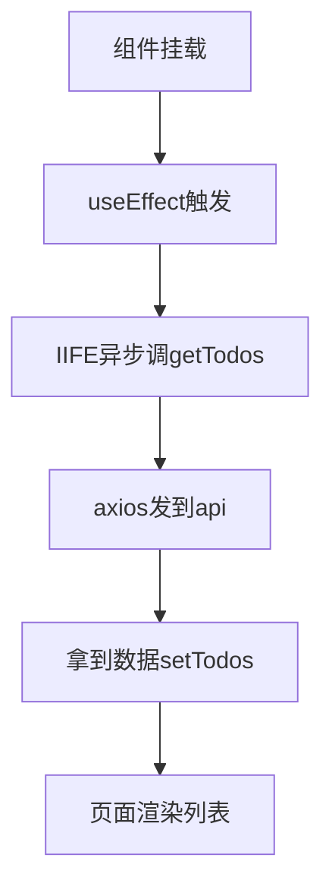
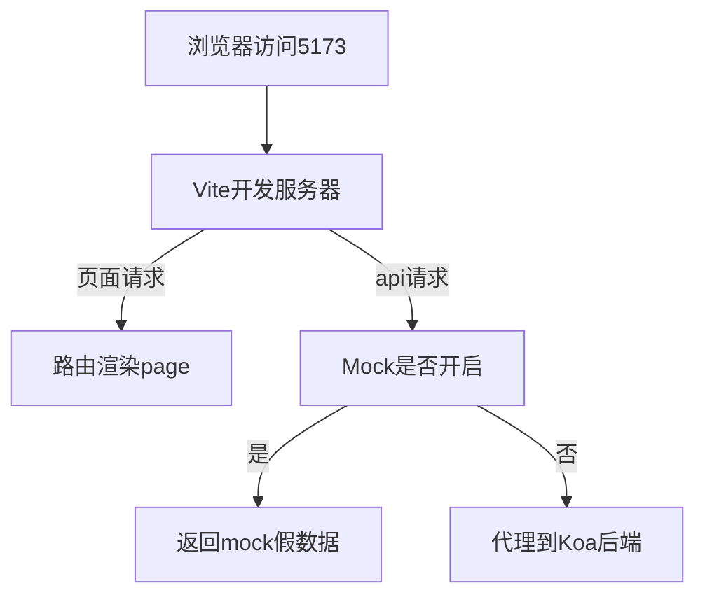

# 从零搭全栈 Todos 前端：路由、api 层与 Mock 一次讲清

**备选标题**
- React + Vite 全栈入门：前端如何不依赖后端独立跑通
- 前端接口工程实战：/api 前缀、axios 与 vite-plugin-mock

**推荐标签**：React · Vite · 前端工程化 · 全栈 · Mock

## 摘要

前后端分离的项目里，最尴尬的不是写不出页面，而是后端接口还没好、前端只能干等。本文用这个 Todos 全栈示例的前端部分，把"页面路由怎么组织、数据请求怎么集中管理、没后端时如何用 Mock 先跑通、请求最后到底打到了哪个端口"一次讲清。读完你能独立搭出一个不依赖后端就能跑的前端应用骨架。

## 开场：后端没写好，前端怎么先动起来

你接手一个全栈 Todos 项目：后端用 Node + Koa 提供 `/api/todos` 接口，前端用 React 渲染。问题是后端进度慢，你不可能干等。我第一次搭这类项目时就卡在这——难道没后端就一行代码都写不了？

其实现代前端可以"自己先跑通"。这个项目的前后端只靠 `/api` 这一个接口约定耦合，前端只要在约定好的前提下，用假数据先把界面和交互做完，等后端真正写好再把请求转过去。本文会先拆项目骨架（组件 / 路由 / 状态管理），再看数据怎么来（api 目录 + axios），然后讲没后端时怎么办（Mock + /api 前缀 + IIFE），最后弄清请求到底打到了 5173 还是 3000。阅读本文需要 React 基础和一点 JS 异步知识。

## 1. 项目骨架：组件 + 路由 + 状态管理"三驾马车"

笔记里把前端独立开发的三驾马车写得很清楚：

> react + react-router + zustand（状态管理）
> 组件（响应式）+ 路由 + 状态管理（银行）

**zustand 是什么？** 它是一个轻量的状态管理库，相比 Redux 最大的优点是少写一堆样板代码（不用写 action、reducer、provider 层层包裹），而且原生就支持 async。简单说，它像一个全局的"银行"，组件把共享数据存进去，别的组件随时来取。

不过要诚实说一句：当前这个示例的 `Todos.jsx` 为了聚焦"路由 + 请求"这条主线，直接用了 React 自带的 `useState` 装数据，并没有真正引入 zustand 的 store。等状态需要在多个页面共享时，再把"装数据的那部分"换成 zustand 即可——依赖里已经装好了 `zustand`，随时能接。

## 2. pages 目录：一个 URL 一个整页组件

`src/pages/` 下放的是"整页组件"，一个 URL 对应一个文件：

```jsx
// src/pages/Home.jsx
function Home() { return <div><h1>Home</h1></div>; }
export default Home
```

```jsx
// src/pages/Todos.jsx
function Todos() { return <>Todos</>; }
export default Todos
```

`App.jsx` 里用路由把它们和 URL 绑定起来：

```jsx
<Route path="/" element={<Home />} />
<Route path="/todos" element={<Todos />} />
```

**pages 目录干嘛的？** 它放的是路由级别的页面，和普通 `components`（按钮、卡片这类复用小部件）分开，遵循"一个 URL 一个文件"的约定。

## 3. 路由怎么把 URL 映射到页面，Nav 为什么一直都在

`App.jsx` 的入口长这样：

```jsx
<Router>
  <Nav />
  <Routes>
    <Route path="/" element={<Home />} />
    <Route path="/todos" element={<Todos />} />
  </Routes>
</Router>
```

**文件关联与点击流程**是：**Router 匹配 URL → 渲染对应的 page**。`<Nav />` 被放在 `<Routes>` 外面，所以它不参与路由切换，无论你跳到 `/` 还是 `/todos`，导航栏都一直留在原地不消失。

导航栏本身用 `Link` 做跳转：

```jsx
import { Link } from 'react-router-dom';
<Link to="/">Home页面</Link>
<Link to="/todos">Todos页面</Link>
```

**Link 作用是什么？** 它就是**替代原生 `<a>` 标签**：切换页面时不会让浏览器整页刷新，而是交给 react-router 在内部换组件，体验更顺滑。

## 4. api/ 目录：把所有后端请求集中管理

项目里有个 `src/api/` 目录，职责是"提供数据接口"。组件不直接和 axios 打交道，而是只调这里导出的函数：

```js
// src/api/todos.js
import axios from './config';
export const getTodos = async () => {
  const res = await axios.get('/todos');
  return res.data;
};
```

在 `Todos.jsx` 里，组件只做一件事——导入并调用：

```js
import { getTodos } from '../api/todos';
// ...
const data = await getTodos();
```

**为什么要有 api/ 目录？** 因为后端接口往往不能及时提供，把所有请求集中到 `api/` 下统一管理，组件就只管"调函数拿数据"，完全不碰 axios 和具体地址。将来接口地址变了、或要加拦截器，只改 `api/` 一处，组件零改动。

## 5. axios 是什么：fetch 的加强版

`src/api/config.js` 里把 axios 实例化并统一配置：

```js
import axios from 'axios';
const instance = axios.create({
  baseURL: '/api',   // dev 阶段指向 mock
  timeout: 5000,
});
```

**axios 是什么？** 可以理解成 `fetch` 的加强版：它自动把响应 JSON 解析好（你拿到的 `res.data` 已经是对象，不用再 `res.json()`），内置超时设置（`timeout: 5000` 表示 5 秒没响应就放弃），还支持拦截器在请求/响应前后统一加工。笔记里也写了"fetch 缺点是功能小……fetch 升级为 axios"，说的就是这层封装价值。

## 6. 为什么加 /api 前缀

注意上面 `baseURL: '/api'`，而页面请求是 `/` 和 `/todos`。**为什么数据请求要加 /api 前缀？** 为了把"页面请求"和"API 请求"区分开：

- 页面请求（`/`、`/todos`）由 react-router 处理，渲染对应 page；
- API 请求（`/api/todos`）不是 react-router 管的范围，它属于"前端接口路由"。

有了这个前缀，Vite 才能识别"这是要发往后端的请求"，从而决定拦截它返回 Mock，还是代理转发给真正的 Koa 后端。这是前后端之间唯一的耦合点，但也是解耦的关键约定。

## 7. 没后端怎么办：伪造数据 + vite-plugin-mock

**什么是伪造数据？** 就是后端没写好时，前端先用假数据把界面跑通，等后端真正提供接口再切过去。这个项目的做法是 `vite-plugin-mock`：

```js
// vite.config.js
import { viteMockServe } from 'vite-plugin-mock';
export default defineConfig({
  plugins: [react(), viteMockServe({ mockPath: 'mock', localEnabled: true })],
});
```

`mock/todos.js` 里放的就是假数据：

```js
export default [{
  url: '/api/todos', method: 'get', timeout: 2000,
  response: () => ({ code: 0, todos: [
    { id: 1, title: '123', completed: true },
    { id: 2, title: 'abc', completed: false },
  ] }),
}];
```

**vite-plugin-mock 是干嘛的？** 它在 Vite 这一层拦截对 `/api/todos` 的请求，直接返回上面的假数据，前端业务代码（`api/todos.js`、`Todos.jsx`）完全不用改——零侵入。

**没了后端怎么办？** 就一行配置：`localEnabled: true` 打开 Mock，后端好了把它改成 `false` 即可切换回真实接口；同时把 `config.js` 里的 `baseURL` 从 `'/api'` 改成 `'http://localhost:3000'`（注释里已经留好了这一行）。两套地址一键互换。

## 8. 组件里怎么拿数据：IIFE 绕开 useEffect 不能 async

`Todos.jsx` 真正发请求的地方长这样：

```jsx
useEffect(() => {
  // IIFE 立即执行函数
  (async () => {
    const data = await getTodos();
    setTodos(data);
  })();
}, []);
```

**立即执行函数是什么？** 就是"定义完当场就调用"的函数 `(async () => { ... })()`。为什么要多包这一层？因为 `useEffect` 的回调本身不能是 `async` 函数（React 不允许 effect 返回一个 Promise，会报警告）。所以常见写法是：用一个 IIFE 把异步逻辑包起来，定义的同时立刻执行，既满足了"挂载时发请求"，又不破坏 useEffect 的签名。我一开始直接把回调写成 `async () => {...}`，结果控制台一堆警告，才学会这个套路。

数据从组件到页面的流向是：



## 9. 请求到底打到了哪：为什么还是 5173

最后回答一个最常被问到的问题：**接口地址写的是 `/api/todos`，浏览器为什么还在请求 5173（Vite 端口），而不是 3000（Koa 后端）？**

因为浏览器只认识当前页面的来源——也就是 Vite 开发服务器 `http://localhost:5173`。所有请求（页面和 `/api`  alike）都先打到 Vite。Vite 内部再判断：如果是 `/api` 且 Mock 开着，就由 `vite-plugin-mock` 拦截返回假数据；如果 Mock 关了，就代理转发给 `http://localhost:3000` 的 Koa。所以 5173 是"前台收银员"，3000 是"后台仓库"，前端代码自始至终只跟 5173 打交道。



## 小结

| 概念 | 一句话解释 | 关键代码 / 配置 |
|---|---|---|
| zustand | 轻量状态管理，比 Redux 少样板、原生支持 async | `zustand` 依赖 |
| pages 目录 | 一个 URL 一个整页组件 | `<Route path="/todos" element={<Todos/>} />` |
| Link | 替代 `<a>`，切换页面不刷新 | `<Link to="/todos">` |
| api/ 目录 | 所有后端请求集中管理 | `export const getTodos` |
| axios | fetch 加强版：自动 JSON、超时、拦截器 | `axios.create({ timeout: 5000 })` |
| /api 前缀 | 区分页面请求与 API 请求 | `baseURL: '/api'` |
| vite-plugin-mock | Vite 层拦截请求返回假数据 | `viteMockServe({ localEnabled: true })` |
| IIFE | 定义当场调用，绕开 useEffect 不能 async | `(async () => {...})()` |
| 5173 vs 3000 | 浏览器只认 Vite，内部再分发 | dev server 端口 5173 |

## 易错点与待补充学习

- **真不一致的地方**：mock 返回的是 `{ code: 0, todos: [...] }` 这种带包裹的结构，而 `Todos.jsx` 里 `setTodos(data)` 存的是整个响应对象。真要渲染列表，得取 `data.todos`，否则会把 `code` 也当列表项——这是示例里没接完的一处。
- **状态管理**：当前页用 `useState`，等要做"跨页面共享 todos"时才引入 zustand 的 store，注意两者用法不同。
- **待补充**：Vite 的 `server.proxy` 配置（如何把 `/api` 显式代理到 3000）、zustand 的 store 写法、以及后端 Koa 真正实现 `/api/todos` 的写法。

## 结语

搭一个不依赖后端的全栈前端，核心就四件事：用 `pages` + 路由组织页面，用 `api/` 把请求集中起来，用 `/api` 前缀 + `vite-plugin-mock` 让前端自己先跑通，用 IIFE 在 `useEffect` 里安全地发异步请求。等哪天后端好了，改一行 `localEnabled` 和 `baseURL` 就接上了。下一步可以补上 Vite 代理配置和真正的 Koa 接口，把这条链路彻底打通。

- 能说出前端独立开发"三驾马车"分别是什么
- 能解释 pages 目录和 components 目录的职责区别
- 能说清 Router 匹配 URL 渲染 page、Nav 为什么不消失
- 能解释 Link 和 `<a>` 的区别
- 能说出 api/ 目录存在的理由，以及组件为什么不直接调 axios
- 能解释 /api 前缀的作用和 vite-plugin-mock 的零侵入
- 能写出 IIFE 并说清它为什么用来包 async
- 能讲清 5173 和 3000 各自的角色、请求最终打到了哪
