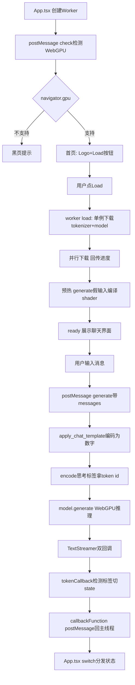
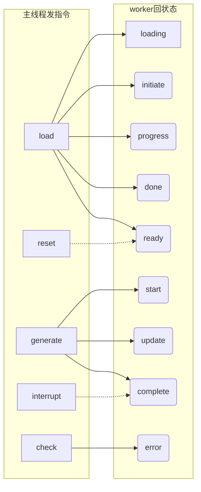
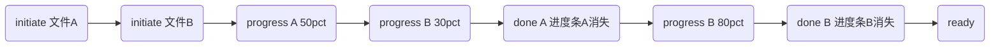
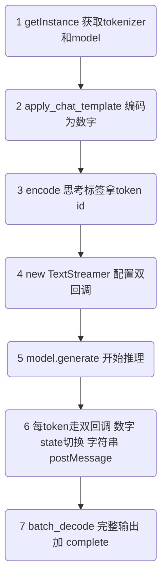
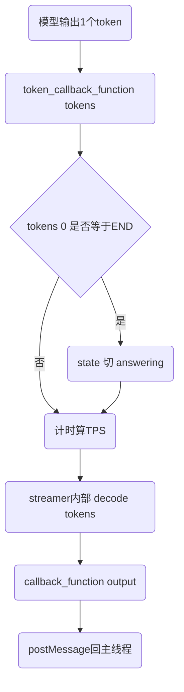
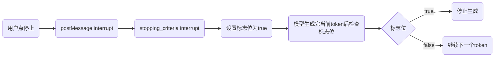
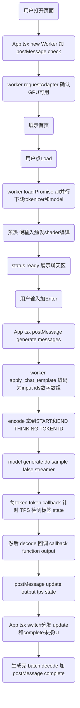

# DeepSeek-R1 浏览器本地推理实战：WebGPU 全链路拆解

> **摘要**：拆解一个让 DeepSeek-R1 在浏览器里本地推理的 demo——不依赖任何后端服务器，模型走 WebGPU 在本地 GPU 上跑，下载后断网也能用。本文聚焦**已实现的核心链路**，仅涵盖 `worker.js`（推理引擎）和 `App.tsx`（主线程编排与 UI）两个文件。每个关键函数配流程图和具体输入输出例子。
>
> 一句话主旨：**在 Worker 里，文本编码成数字给模型；模型输出数字，再解码变回文本；利用 R1 输出的思考标签 token id，实现区分思考/回答的前端 UI。**

---

## 总览



## 一、App.tsx：主线程做了什么

### 1.1 入口与 WebGPU 兜底

```tsx
// App.tsx 第6行
const IS_WEBGPU_AVAILABLE = !!navigator.gpu;
```

`!!` 把对象转布尔值——有 `gpu` 属性就是 `true`。不支持时渲染全屏黑底白字：

```tsx
// App.tsx 第264-269行
<div className="fixed w-screen h-screen bg-black z-10 bg-opacity-[92%] ...">
  WebGPU is not supported by this browser :&#40;
</div>
```

`:&#40;` 是 `(` 的 HTML 实体（防被当标签解析）。这是第一道防御；第二道在 worker 里用 `requestAdapter()` 做实际 GPU 适配器检测。

### 1.2 Worker 创建与消息监听

```tsx
// App.tsx 第42-50行
useEffect(() => {
  if (!worker.current) {
    worker.current = new Worker(new URL("./worker.js", import.meta.url), {
      type: "module",
    });
    worker.current.postMessage({ type: "check" });
  }
  // ...
}, [])
```

三个关键点：

- **`new URL("./worker.js", import.meta.url)`** —— Vite 动态 import 写法，构建时把 worker 打包成独立 chunk
- **`type: "module"`** —— worker 里用了 `import` 语法，必须声明 ESM 模式
- **`if (!worker.current)`** —— 防止 React 严格模式重复创建 Worker

消息监听用 `switch` 分发 9 种状态：



分发逻辑（`onMessageReceived`）：

```tsx
case "loading":   setStatus("loading"); setLoadingMessage(e.data.data); break;
case "initiate":  setProgressItems(prev => [...prev, e.data]); break;       // 新文件开始下
case "progress":  setProgressItems(prev => prev.map(                        // 更新进度
                     item => item.file === e.data.file ? {...item, ...e.data} : item)); break;
case "done":      setProgressItems(prev => prev.filter(                     // 文件下完移除
                     item => item.file !== e.data.file)); break;
case "ready":     setStatus("ready"); break;
case "start":     break;                                                     // 当前未接逻辑
case "update":    break;                                                     // 当前未接逻辑
case "complete":  break;                                                     // 当前未接逻辑
case "error":     setError(e.data.data); break;
```

注意 `update` / `complete` / `start` 三个 case **当前是空的**——worker 已经在发这些数据，但 App.tsx 还没把它们接到 UI 上。这是留给后续文章补全的部分。

### 1.3 自动触发生成

```tsx
// App.tsx 第113-123行
useEffect(() => {
  // 没有用户消息 → 不做
  if (messages.filter(x => x.role === "user").length === 0) return;
  // 最后一条已是 assistant → 不重复触发
  if (messages.at(-1).role === "assistant") return;
  // 有新用户消息 → 发给 worker
  worker.current.postMessage({ type: "generate", data: messages });
}, [messages])
```

这个 `useEffect` 监听 `messages` 变化。当用户按 Enter 发送消息后，`setMessages` 触发重渲染 → 这个 effect 执行 → 自动把完整对话历史发给 worker。`at(-1)` 取数组最后一个元素，判断是否需要生成。

### 1.4 三种页面状态

App.tsx 用 `status` 变量驱动三种页面形态：

| status 值 | 渲染内容 | 用户能做什么 |
|---|---|---|
| `null` | 首页（Logo + 标题 + Load 按钮） | 点 Load 加载模型 |
| `"loading"` | 进度条列表（每条一个文件名+百分比+大小） | 等 |
| `"ready"` | 聊天区域（当前为空 div）+ 输入框 | 输入消息、发送 |

输入框的交互逻辑：

```tsx
<textarea
  value={input}
  disabled={status !== "ready"}       // 非 ready 状态禁用
  onKeyDown={(e) => {
    if (input.length > 0 && !isRunning && e.key === "Enter" && !e.shiftKey) {
      e.preventDefault();
      onEnter(input);                // 加入 messages → 触发上面 useEffect → postMessage
    }
  }}
/>
```

四个条件同时满足才发送：有内容 + 未在运行 + 按 Enter + 未按 Shift（Shift+Enter 换行）。发送按钮根据状态显示不同图标和颜色：

```tsx
{isRunning ? (
  <StopIcon />                       // 运行中：停止图标（红色调）
) : input.length > 0 ? (
  <ArrowRightIcon className="bg-gray-800 text-white rounded-md" />  // 可发送：深色箭头
) : (
  <ArrowRightIcon className="bg-gray-200 text-gray-50" />           // 不可发：浅色箭头
)}
```

## 二、worker.js：推理引擎全拆解

### 2.1 单例流水线：模型只加载一次

```js
// worker.js 第14-38行
class TextGenerationPipeline {
  static model_id = "onnx-community/DeepSeek-R1-Distill-Qwen-1.5B-ONNX";

  static async getInstance(progress_callback = null) {
    this.tokenizer ??= AutoTokenizer.from_pretrained(this.model_id, { progress_callback });
    this.model ??= AutoModelForCausalLM.from_pretrained(this.model_id, {
      dtype: "q4f16",      // 4比特权重 + 16比特浮点激活
      device: "webgpu",    // 放到 GPU 上跑
      progress_callback,
    });
    return Promise.all([this.tokenizer, this.model]);
  }
}
```

**为什么单例？** 模型文件几百兆，加载要下载 + GPU 编译 shader，很慢。单例保证只初始化一次。

`??=` （空赋值）是精髓——已赋值就跳过：

```
第一次调用: tokenizer=undefined → 执行 from_pretrained → 赋值
            model=undefined     → 执行 from_pretrained → 赋值
第二次调用: tokenizer 已有值    → 跳过
            model 已有值        → 跳过
```

**`Promise.all` 并行下载**：分词器和模型互不依赖，同时下载：

```
串行: |--tokenizer 800ms--|--model 1200ms--| = 2000ms
并行: |--tokenizer 800ms----------|
      |--model 1200ms--------| = 1200ms（取较慢）
```

### 2.2 check()：WebGPU 两层防御

```js
// worker.js 第127-146行
async function check() {
  try {
    const adapter = await navigator.gpu.requestAdapter();
    if (!adapter) throw new Error("WebGPU is not supported (no adapter found)");
  } catch (e) {
    self.postMessage({ status: "error", data: e.toString() });
  }
}
```

两层防御对比：

| 层 | 位置 | 检测方式 | 挡住什么 |
|---|---|---|---|
| 第一层 | App.tsx | `!!navigator.gpu` | 完全没有 WebGPU API 的旧浏览器 |
| 第二层 | worker.js | `requestAdapter()` | API 有但驱动/硬件不支持 |

worker 里没有 `window`/`document`（没有 DOM），但有 `navigator`——`navigator.gpu` 在 worker 上下文可用。

### 2.3 load()：下载 + 预热

```js
// worker.js 第148-172行
async function load() {
  self.postMessage({ status: "loading", data: "Loading model..." });

  const [tokenizer, model] = await TextGenerationPipeline.getInstance((x) => {
    self.postMessage(x);  // 进度事件原样转发给主线程
  });

  self.postMessage({ status: "loading", data: "Compiling shaders and warming up..." });
  const inputs = tokenizer("a");                          // 最小假输入
  await model.generate({ ...inputs, max_new_tokens: 1 }); // 只生成1个token
  self.postMessage({ status: "ready" });
}
```

**预热不能省**。WebGPU 的 shader 是**首次执行时才编译**的：

```
不预热: 用户首次提问 → 第一次执行算子 → 现场编译shader → 卡5-10秒 → 以为死机
预热后: Load阶段     → 假输入触发所有算子 → shader编译完 → 首次提问秒出
```

进度事件的时间线：



每个文件下完就从进度列表里删掉（`filter`），全部消失 = ready。

### 2.4 generate()：核心链路

这是整个 demo 最关键的函数，串联了从收到消息到流式输出的全部步骤：

```js
// worker.js 第45-124行
async function generate(messages) {
  const [tokenizer, model] = await TextGenerationPipeline.getInstance();

  // 步骤1: 把 messages 编码成模型认识的数字格式
  const inputs = tokenizer.apply_chat_template(messages, {
    add_generation_prompt: true,
    return_dict: true,
  });

  // 步骤2: 拿到思考标签的 token id（用于流式阶段检测）
  const [START_THINKING_TOKEN_ID, END_THINKING_TOKEN_ID] =
    tokenizer.encode("...", { add_special_tokens: false });

  // 步骤3-6: 流式输出（下面详讲）
  // ...
  
  // 步骤7: 生成完毕，解码完整输出
  const decoded = tokenizer.batch_decode(sequences, { skip_special_tokens: true });
  self.postMessage({ status: "complete", output: decoded });
}
```

七步走：



#### 步骤1详解：apply_chat_template 为什么必须用

DeepSeek-R1 训练时用的对话格式长这样：

```
<|im_start|>user
你好<|im_end|>
<|im_start|>assistant
```

`<|im_start|>` 和 `<|im_end|>` 是特殊标记。模型训练时见的是这种格式，推理时也必须喂同样的格式，否则会乱输出。

`apply_chat_template` 就是干这个的——把 `[{role:"user", content:"你好"}]` 自动拼成上面的格式，再 encode 成数字 `input_ids`。

两个参数：

- **`add_generation_prompt: true`** —— 末尾自动加 `<|im_start|>assistant\n`，告诉模型"该你续写了"
- **`return_dict: true`** —— 返回 `{input_ids, attention_mask}` 字典，可直接 `...inputs` 展开

`attention_mask` 和 `input_ids` 一一对应，全是 `1`（本 demo 无 padding），代表每个位置都是有效 token。

#### 步骤2详解：思考标签的 token id

```js
const [START_THINKING_TOKEN_ID, END_THINKING_TOKEN_ID] =
  tokenizer.encode("...", { add_special_tokens: false });
```

把字符串 `"...` 编码成数字 token id 数组。为什么要用 id 而不是字符串检测？

```
字符串检测（不可靠）:
  token1: "<"     → 累积: "<"
  token2: "/thin" → 累积: "</thin"
  token3: "king>" → 累积: "</thinking>"
  → 标签分3次到达，每次都不完整 → 漏检

token id检测（可靠）:
  token: 1771 (END_THINKING_TOKEN_ID)
  → 1771 == 1771 ✓ 一次命中
```

token 是原子的，不会被切断。而且后面 `skip_special_tokens:true` 会把特殊标签从解码结果里过滤掉，字符串里压根没有 `...`，只能在数字阶段抓。

#### 步骤3-5详解：TextStreamer 双回调

```js
let state = "thinking";  // 当前状态: thinking 或 answering
let startTime;           // 计时起点
let numTokens = 0;       // 已处理 token 数
let tps;                 // tokens per second

const token_callback_function = (tokens) => {
  startTime ??= performance.now();          // 首次调用记录时间
  if (numTokens++ > 0) {                    // 跳过第1个token（prompt触发的）
    tps = (numTokens / (performance.now() - startTime)) * 1000;
  }
  if (tokens[0] == END_THINKING_TOKEN_ID) {
    state = "answering";                   // 命中结束标签 → 切换状态
  }
};

const callback_function = (output) => {
  self.postMessage({
    status: "update",
    output,     // 本次新生成的文本片段
    tps,        // 当前速度
    numTokens,  // 总 token 数
    state,      // thinking 或 answering
  });
};

const streamer = new TextStreamer(tokenizer, {
  skip_prompt: true,           // 不回显用户输入
  skip_special_tokens: true,   // 过滤特殊标签
  callback_function,           // 字符串回调
  token_callback_function,     // 数字回调
});
```

**执行顺序是关键**——每次生成一个 token：



**先数字回调 → 内部 decode → 再字符串回调**。`state` 是闭包共享变量，数字回调先改好，字符串回调读到的是最新值——前端收到的文本和 state 同步对齐。

四个参数的作用：

| 参数 | 效果 | 例子 |
|---|---|---|
| `skip_prompt: true` | 不回显用户输入 | 问"你好"→只收到"我是AI"，不含"你好" |
| `skip_special_tokens: true` | 解码时过滤特殊标签 | 输出看不到 `<\|im_start\|>` 和 `...` |
| `token_callback_function` | 拿原始数字 token | 用于计时、TPS、检测标签切 state |
| `callback_function` | 拿解码后字符串 | 用于 `postMessage` 发给前端渲染 |

#### 步骤6详解：model.generate

```js
self.postMessage({ status: "start" });  // 通知主线程: 开始了

const { past_key_values, sequences } = await model.generate({
  ...inputs,                        // input_ids + attention_mask
  do_sample: false,                 // 贪心解码（稳定可复现）
  max_new_tokens: 2048,             // 最多生成2048个token
  streamer,                         // 流式输出
  stopping_criteria,                // 可中断
  return_dict_in_generate: true,    // 返回含KV缓存的字典
});
past_key_values_cache = past_key_values;  // 存起来（当前未复用）
```

- **`do_sample: false`** —— 贪心解码，每步选概率最高的 token。同一个问题每次回答相同（关掉了随机性）
- **`max_new_tokens: 2048`** —— R1 思考过程可能很长，2048 是安全上限
- **`stopping_criteria`** —— `InterruptableStoppingCriteria` 实例，支持外部中断

中断机制：



最多多生成一个 token 就停，响应很快。

### 2.5 消息事件总入口

```js
// worker.js 第174-203行
self.addEventListener("message", async (e) => {
  const { type, data } = e.data;
  switch (type) {
    case "check":    check();    break;
    case "load":     load();     break;
    case "generate":
      stopping_criteria.reset();  // 生成前清掉上次的中断标志
      generate(data);
      break;
    case "interrupt":
      stopping_criteria.interrupt(); // 设置中断标志
      break;
    case "reset":
      past_key_values_cache = null;  // 清KV缓存
      stopping_criteria.reset();
      break;
  }
});
```

`generate` 前先 `reset()` —— 防止上次中断残留影响这次。`reset` 还顺手清了 KV 缓存（虽然当前没复用，但语义上是"重置对话历史"）。

## 小结

整条链路再串一遍：



**核心数据变换**：

```
用户输入: [{role:"user", content:"1+1="}]
    ↓ apply_chat_template
模板字符串: "<|im_start|>user\n1+1=<|im_end|>\n<|im_start|>assistant\n"
    ↓ encode
数字数组: [101, 2345, 5678, 102, 303]
    ↓ model.generate (WebGPU)
输出数字: [894, 9258, 15, 2]
    ↓ decode
文本: "2"
    ↓ postMessage
前端收到: {status:"update", output:"2", state:"answering", tps:38.5}
```

## 易错点与待补充学习

**已实现但容易踩的坑：**

- **`apply_chat_template` 不能省**。直接拼字符串喂给模型，格式不对会乱输出。必须对齐训练时的 `<|im_start|>/<|im_end|>` 格式
- **思考标签必须用 token id 检测**。流式场景字符串会被切断；且 `skip_special_tokens:true` 后解码结果里根本没有 `...`
- **`do_sample: false` 关掉随机性**。想要稳定可复现的结果就关采样；想要多样性就开（默认 `true`）
- **预热不能省**。不预热的话首次提问会卡 5-10 秒（现场编译 shader），用户会以为死机
- **Worker 里没有 DOM**。不能用 `window`/`document`/`getElementById`，但有 `navigator`
- **`Promise.all` 并行下载**。tokenizer 和 model 同时下，总耗时取较慢的那个而非两者之和

**当前未实现（留给后续文章）：**

- `App.tsx` 的 `update`/`complete`/`start` 三个 case 为空——worker 已在发数据，但前端还没接到 UI 上
- `ready` 状态下的聊天区域是空 div——`Chat.jsx` 组件写好了但还没挂进去
- `past_key_values_cache` 存了但 `generate` 里那行被注释掉——多轮 KV 缓存复用未启用
- `onInterrupt()` 函数体为空——停止按钮点了没反应
- `BrainIcon.jsx` 导出名是 `BotIcon`（导出函数名叫 `BotIcon` 但文件名是 `BrainIcon.jsx`）

## 自测清单

- [ ] 能画出 App.tsx ↔ worker.js 的完整消息协议图吗？（5种指令、9种状态）
- [ ] `??=` 空赋值的含义是什么？它如何实现单例？
- [ ] `Promise.all` 在这里起什么作用？省了多少时间？
- [ ] 为什么要预热？不预热会发生什么？
- [ ] `apply_chat_template` 干了什么？两个参数各是什么意思？
- [ ] 为什么思考标签要用 token id 检测而不用字符串？
- [ ] TextStreamer 四个参数分别控制什么？
- [ ] `token_callback_function` 和 `callback_function` 的执行顺序是什么？为什么？
- [ ] `state` 变量怎么跨回调共享？这是什么 JS 特性？
- [ ] `do_sample: false` 的效果是什么？什么时候该开？
- [ ] 中断机制的响应流程是怎样的？最多延迟几个 token？
- [ ] `batch_decode` 和 streamer 里的 `decode` 有什么区别？
