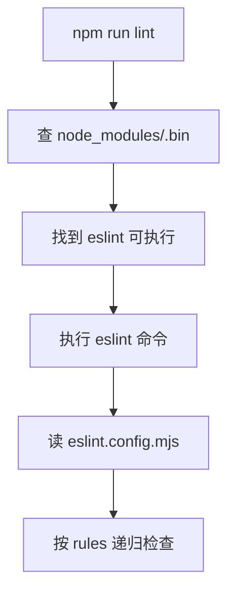
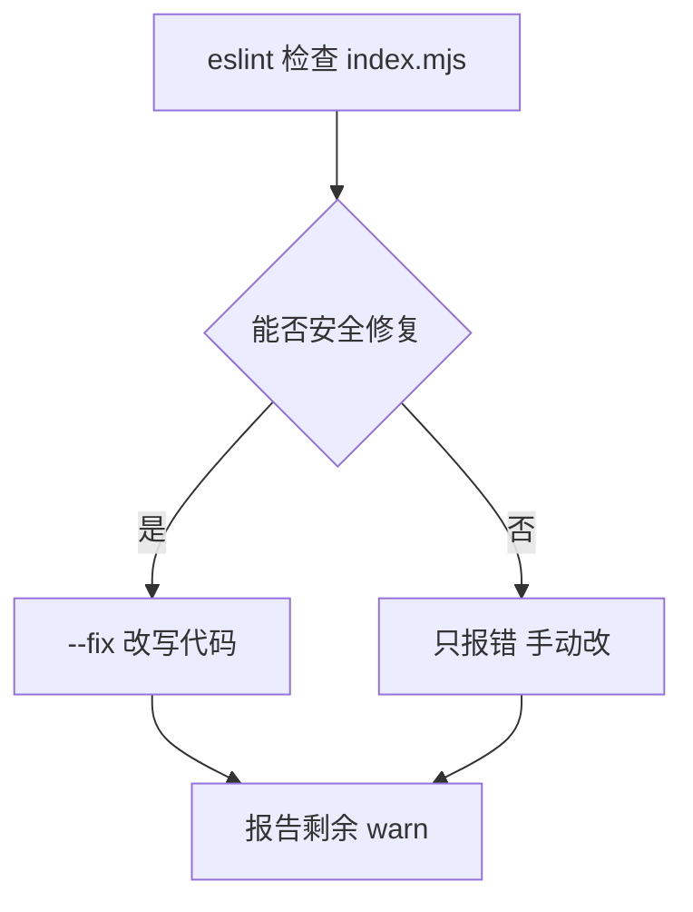

> 发布信息（填完掘金表单后可整段删除）
> 标题：ESLint 入门：从 npm run lint 到 --fix 与规则级别一次讲清
> 标签：ESLint, 前端工程化, JavaScript, 代码规范, 静态检查
> 摘要：用 eslint-demo 一个最小项目，讲清 npm run lint 怎么跑、eslint . 查什么文件、--fix 能自动修哪些、以及规则级别与值的两种写法。

# ESLint 入门：从 npm run lint 到 --fix 与规则级别一次讲清

## 开场：为什么你该搞懂 ESLint 这条命令

我刚接触 ESLint 时，最困惑的不是规则本身，而是「为什么别人项目里敲一句 `npm run lint:fix` 代码就自动变整齐了，而我自己的项目要么满屏报错、要么什么都没发生」。后来才明白，ESLint 真正要理解的只有三件事：命令怎么被 npm 找到、`.` 到底检查了谁、以及 `--fix` 为什么「挑肥拣瘦」只修一部分。

`eslint-demo` 这个仓库刚好把这三件事浓缩到了三个文件里：`package.json`（scripts）、`eslint.config.mjs`（flat config 规则）、`index.mjs`（被检查的代码）。本文就沿着这三个文件和它们的真实配置，把 scripts、`eslint .`、`--fix`、规则级别、规则值的两种写法、以及五条具体规则一次讲清。阅读前你只需要知道 npm 是什么、JS 里 `var`/`let`/`const` 和模板字符串的基本概念。

## 一、package.json 的 scripts 字段

scripts 不是 ESLint 的功能，而是 npm 的「命令别名表」。

```json
{
  "scripts": {
    "lint": "eslint .",
    "lint:fix": "eslint . --fix"
  }
}
```

它的作用就一句话：把一长串命令起个短名字，**统一管理、方便复用**。你不用每次都敲 `npx eslint .`，只要 `npm run lint` 就行。

关键点在于 npm 怎么找可执行文件。当你敲 `npm run lint`，npm 会去项目里的 `node_modules/.bin` 目录找名为 `eslint` 的可执行文件——eslint 作为 devDependency 安装时，npm 自动在 `.bin` 里放了它的软链接。所以 `"lint": "eslint ."` 实际等价于 `./node_modules/.bin/eslint .`，不用你写全路径。这也是为什么 eslint 一定要装进 devDependencies，命令才能跑起来。

> 提示：`lint:fix` 这种「脚本名:子名」的写法只是命名约定（冒号分隔），npm 本身不特殊处理，纯粹为了可读。

整个解析过程是这样的：



## 二、eslint . 命令到底查了什么

拆开看 `eslint .` 两部分：

| 部分 | 含义 |
| --- | --- |
| `eslint` | 静态代码检查工具，找语法错误、风格问题、潜在 bug |
| `.` | 目标路径 = 当前目录，递归检查所有它认识的源码文件 |
| （隐含） | 默认忽略 `node_modules` |
| （隐含） | 检查依据来自配置文件（新版 flat config：`eslint.config.js` / `eslint.config.mjs`） |

「静态」的意思是它不运行你的代码，只读取源码文本做分析。`.` 让 ESLint 从当前目录往下递归，但会跳过 `node_modules`（这是默认忽略，不用你配）。它「认识」的文件类型由 `eslint.config.mjs` 里的 `files` 决定——本例是 `["**/*.{js,mjs,cjs}"]`，所以 `index.mjs` 会被检查，而 `.md`、`.json` 不会。

配置从哪来？eslint-demo 用的是新版 flat config（`eslint.config.mjs`）：

```javascript
import js from "@eslint/js";
import globals from "globals";
import { defineConfig } from "eslint/config";

export default defineConfig([
  {
    files: ["**/*.{js,mjs,cjs}"],
    plugins: { js },
    extends: ["js/recommended"],
    languageOptions: { globals: globals.browser },
    rules: { /* ... */ }
  },
]);
```

`defineConfig([...])` 接收一个配置对象数组；`files` 指定作用范围，`extends: ["js/recommended"]` 先继承一套推荐规则，`rules` 再在它之上覆盖你想要的几条。`languageOptions.globals: globals.browser` 这一行容易被忽略，但它很关键：它把浏览器内置对象（`console`、`window` 等）声明为「已知全局」，否则 `no-undef` 规则会对 `console.log` 报「未定义变量」。这也是为什么下面 `no-console` 只是 warn 而不是 `no-undef` 报错——两者管的是不同的事。

## 三、--fix 参数（核心）：机器管格式，人管语义

这是新手最容易误解的地方。`eslint .` 和 `eslint . --fix` 的区别只有一条：

- `eslint .` = 只检查、只报告，绝不碰你的代码。
- `eslint . --fix` = 检查 + 自动修复「能安全修复」的问题。

所谓「能安全修复」，指 ESLint 有 100% 把握不会改代码含义的格式化类问题。对照 eslint-demo 的规则：

| 类型 | 举例 | --fix |
| --- | --- | --- |
| ✅ 可自动修复 | 引号、分号、缩进、no-var 转 let/const | 直接改好 |
| ❌ 无法自动修复 | no-console、未使用变量、逻辑 bug | 只报错，需手动改 |

设计理念一句话：**机器管格式，人管语义**。引号用单还是双、有没有分号、缩进几格——这些不影响程序行为，机器放心替你改；而「该不该打 console」「这段逻辑对不对」，机器不敢替你做主，只能报错让你定。

为了直观看到差异，下面是一段**故意写成违规风格**的代码（注意：这不是 eslint-demo 的真实文件，仅作演示）：

```javascript
// 修复前（违规演示，非项目真实文件）
var msg = '你好'
function Hi() {
console.log("hi")
}
```

对它跑 `eslint . --fix` 后，ESLint 会改成：

```javascript
// 修复后：--fix 自动处理
let msg = "你好";
function Hi() {
  console.log("hi");
}
```

`var` → `let`、单引号 → 双引号、补上分号、缩进收成 2 格——全是格式类，机器 safe 地改完。但 `console.log` 仍会留在原地并报警，因为它属于「语义类」，--fix 不碰。



> 真实发现：我拿 eslint-demo 的 `index.mjs` 跑 `npm run lint:fix`，结果**什么都没改**。原因就在代码本身：`let name = "吴老狗";` 已经是 `let` + 双引号 + 分号 + 2 空格缩进，规则全满足，--fix 无事可做；唯一触发的是 `console.log` 引起的 `no-console` 警告，而这条 --fix 修不了。换句话说，养成规范写法时，--fix 更多是「兜底」，不是「主力」。

```javascript
// index.mjs 真实内容（已符合所有可修复规则，仅 no-console 触发 warn）
let name = "吴老狗";
function Hello() {
  console.log("你好，" + name);
}
Hello();
```

## 四、规则级别（severity）：2/1/0 是什么

每条规则都有一个级别，决定它「犯规」时多严重：

| 数字 | 等价写法 | 含义 |
| --- | --- | --- |
| 2 | "error" | 报错，违规会导致检查失败 |
| 1 | "warn" | 警告，只提醒不阻断 |
| 0 | "off" | 关闭规则 |

`eslint.config.mjs` 里那行注释 `// 级别 2=error 1=warn 0=off` 就是提醒你这点。注意数字和字符串等价：`2` 与 `"error"` 完全一样。这直接关系到 CI：如果某条规则是 `error`，它报错时 `eslint` 进程返回非 0 退出码，流水线就失败；`warn` 则只打印，不阻断。

## 五、规则值的两种写法

这是最容易被看懵的语法点。rules 里每条规则的值，要么是「一个级别」，要么是「[级别, 配置项...]」数组：

```javascript
"no-var": 2,                  // 简写：只写级别
"no-var": "error",            // 完全等价
"quotes": ["error", "double"] // 数组：级别 + 配置项
```

- 只写级别（数字或字符串）时，规则用默认行为。
- 写成数组时，第一项是级别，后面是这条规则自己的配置项。

一句话记忆：**rules 里每条规则的值，要么是「一个级别」，要么是「[级别, 配置项...]」数组；配置项是字符串还是数字、代表什么，取决于具体规则**。比如 `indent` 的配置项是数字（缩进空格数），`quotes` 的配置项是字符串（"double"/"single"）。

## 六、具体规则逐条对照

把五条规则摊开看，级别、配置项、可否 --fix 一目了然：

| 规则 | 级别 | 配置项 | 作用 | 可否 --fix |
| --- | --- | --- | --- | --- |
| no-var | error | — | 禁止 var，用 let/const | ✅ |
| no-console | warn | — | 提醒有 console 语句 | ❌ |
| quotes | error | "double" | 字符串用双引号 | ✅ |
| semi | error | "always" | 语句末尾必须有分号 | ✅ |
| indent | error | 2 | 缩进 2 空格 | ✅ |

回到 `eslint.config.mjs` 的真实写法：

```javascript
rules: {
  "no-var": 2,
  "no-console": 1,
  "quotes": ["error", "double"],
  "semi": ["error", "always"],
  "indent": ["error", 2]
}
```

这里 `"no-var": 2` 和 `"no-console": 1` 是简写级别；后三条是数组形式带配置项。

注意源文件第 14 行 `"no-console": 1` 后面紧跟着注释 `// 开发时用，上线不用`——这正是它设为 warn 而非 error 的**真实意图**：开发阶段保留 `console` 方便调试，发布前再关掉，所以报错级别只到 warn、不阻断流水线。这条内联注释比任何教程都直白，学源码时值得多看一眼。

`quotes` 的配置项取值是 `"double"`（双引号）/ `"single"`（单引号）/ `"backtick"`（反引号）。**一个新手常踩的盲区**：`quotes` 只管「普通字符串字面量」的引号风格，模板字符串 `` `...${x}` `` **不受 quotes 约束**——因为模板字符串有自己的用途（字符串插值），ESLint 不会因为它长得像「反引号字符串」就强行改成双引号。所以在 eslint-demo 里，即使你写 `const tip = \`级别=${level}\``，quotes: "double" 也不会报错。误以为 quotes 能统一所有字符串引号，是初学者最常见的误解。

## 小结

| 概念 | 一句话解释 | 关键代码 |
| --- | --- | --- |
| scripts | npm 命令别名，从 .bin 找可执行 | `"lint": "eslint ."` |
| eslint . | 递归检查当前目录，默认忽略 node_modules | `files: ["**/*.{js,mjs,cjs}"]` |
| --fix | 只自动修格式类，不动语义类 | `eslint . --fix` |
| severity | 2=error 1=warn 0=off | `"no-console": 1` |
| 规则值 | 级别 或 [级别, 配置项] | `"quotes": ["error","double"]` |
| quotes 盲区 | 模板字符串不受 quotes 管 | `` `a${x}` `` |

## 易错点与待补充学习

- **易错**：以为 `npm run lint` 会去全局找 eslint——其实它只在 `node_modules/.bin`，所以 eslint 必须在 devDependencies。
- **易错**：以为 `--fix` 能修所有问题——console、未用变量、逻辑 bug 它都不碰，只报。
- **易错（已讲）**：以为 `quotes` 能统一所有字符串引号，模板字符串 `` `...` `` 例外。
- **待补充**：flat config 里 `extends`、`plugins`、`languageOptions.globals` 的完整含义（本例只用到 `js/recommended` 和 `globals.browser`）；以及 `.eslintignore` 与 `files` 的排除写法。

## 自测清单
- 能解释 `npm run lint` 为什么能直接找到 eslint，而不用写全路径
- 能说出 `eslint .` 里 `.` 和默认忽略 node_modules 的含义
- 能区分 `--fix` 能修和不能修的问题，并说出「机器管格式、人管语义」
- 能默写 2/1/0 三个级别分别对应 error/warn/off
- 能写出 `"no-var": 2` 与 `"quotes": ["error","double"]` 两种规则值写法
- 能指出 quotes 规则管不到模板字符串这个盲区
