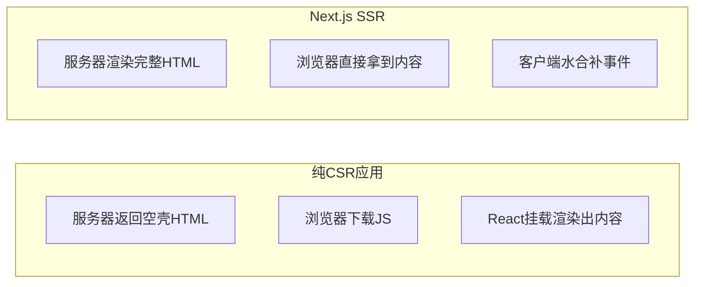
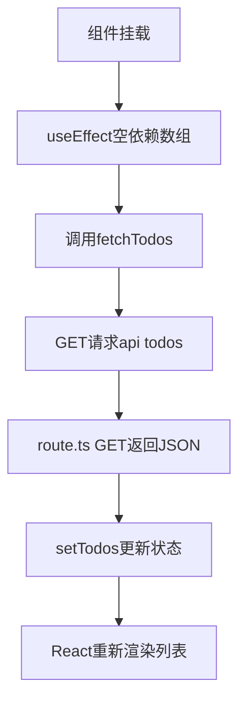
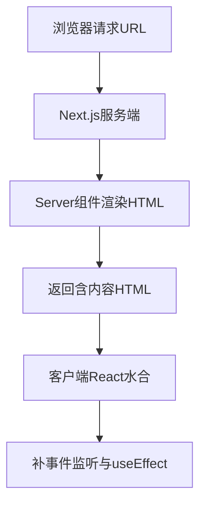
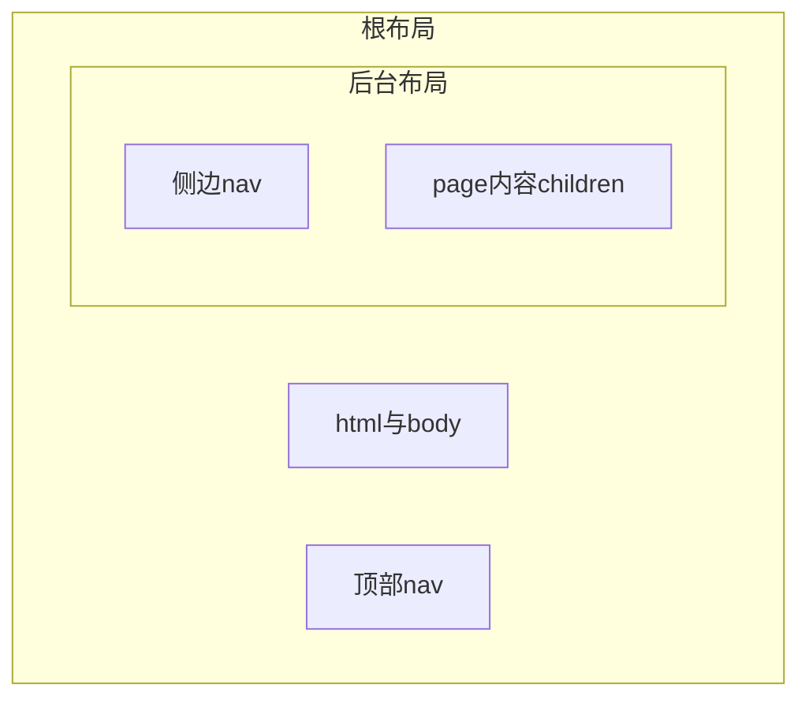
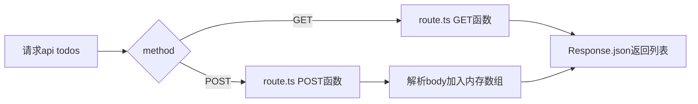

> 发布信息（填完掘金表单后可整段删除）
> 标题：Next.js 里 SSR、CSR 和水合到底差在哪？从一段待办代码说起
> 标签：Next.js, SSR, React, 前端工程化, 服务端渲染
> 摘要：用一段 Next.js 待办 demo 讲清 SPA/CSR/SSR 与 hydration 的差别：搞懂 server 与 client 的分工、SEO 原理，以及 route.ts 后端接口怎么写。

# Next.js 里 SSR、CSR 和水合到底差在哪？从一段待办代码说起

> 摘要：很多同学学 Next.js 时卡在「SSR 到底渲染了什么、客户端又干了什么」这一层。本文用 `next-demo` 这个最小可运行的 Next.js App Router 项目（首页、关于、后台布局、待办列表、一个 `/api/todos` 接口）作为唯一证据，把 SPA/CSR 的取舍、useEffect 为什么拿不到「服务端列表」、挂载与水合的本质、SSR 对 SEO 的意义，以及 `layout/children`、`route.ts`、内存数据这些文件结构问题一次讲清。读完你能用自己的话解释「为什么服务端返回的 HTML 里没有待办项」，并能在掘金上发一篇不踩渲染坑的入门文。

## 开场：一个让人困惑的对照

我第一次跑起 `next-demo` 时，注意到一件怪事：`app/page.tsx`（首页）和 `app/about/page.tsx` 里完全没有 `'use client'`，但它们照样能在浏览器里看到内容；而 `app/todos/page.tsx` 顶部偏偏写着 `'use client'`，而且里面的待办列表**必须等页面加载完才会出现**。同样是 React 组件，差别这么大，到底谁在「渲染」？

这正是 Next.js 最核心、也最容易劝退新手的一层：**它把「服务端渲染」和「客户端渲染」混在同一个项目里，用一段 `'use client'` 当分界**。理解这层，你就能回答一连串看似独立的问题——SPA 为什么 SEO 差、`useEffect` 请求的数据为什么「服务端没有」、水合到底水的是什么、以及 `route.ts` 这种文件是干嘛的。

本文就沿着 `next-demo` 的真实代码，按五条线索展开：SPA/CSR 基础 → useEffect 与数据请求 → 挂载点与水合 → SEO/GEO → 文件结构与后端接口。阅读前你需要了解 React 组件和 `props/state` 的基本概念，以及 HTTP 里 GET/POST 是什么意思——这两点够了，剩下的我们边看代码边补。

## 一、SPA / CSR 基础

### 「SPA 好处」到底是什么意思

SPA 是 Single Page Application（单页应用）的缩写。它的卖点不是「只有一个页面」，而是**切换内容时不用整页刷新**。传统多页应用点一个链接，浏览器要向服务器要一整个新 HTML、重新解析、整页重绘；SPA 则靠前端路由（Next.js 里的 `next/link`）只替换页面里「变化的部分」，体验更接近原生 App——点导航不闪白、不丢失当前状态。

`next-demo` 的 `app/layout.tsx` 里就有这样的导航：

```tsx
<nav>
  <ul>
    <li><Link href="/">首页</Link></li>
    <li><Link href="/about">关于我们</Link></li>
    <li><Link href="/dashboard">后台管理系统</Link></li>
  </ul>
</nav>
```

`Link` 不是普通 `<a>`，它拦截点击、在客户端完成跳转，所以切换路由时不会整页刷新。这就是 SPA「流畅」的来源。

### SPA 的短板：首屏、SEO、能力边界

好处之外，纯 CSR（Client-Side Rendering，客户端渲染）的 SPA 有三个硬伤：

1. **首屏白屏**：服务器最初返回的 HTML 几乎是空的（只有一个挂载点），必须等 JS 下载、执行、React 挂载后才有内容。网络慢时用户先看到空白。
2. **SEO 差**：搜索引擎爬虫早期只抓 HTML 文本。如果首屏 HTML 是空的，爬虫就「看不到」正文，排名自然上不去。
3. **能力边界**：纯网页拿不到原生 App 的推送、离线缓存、系统级能力；WebView（App 内嵌网页）夹在原生 App 和纯网页之间，体验比纯网页好、但不如原生。

这正是 Next.js 要解决的——它让「首屏就有内容、爬虫能抓到内容」成为可能，同时保留 SPA 的流畅交互。

### page 是每个要渲染部分的 HTML 格式吗

在 Next.js App Router 里，**不是手写 HTML，而是写 React 组件（`.tsx`）**。URL 路径映射到 `app` 目录里的 `page.tsx`：

- `app/page.tsx` → 访问 `/`
- `app/about/page.tsx` → 访问 `/about`
- `app/dashboard/page.tsx` → 访问 `/dashboard`

你写的是 JSX，Next.js 在**请求时把它渲染成 HTML 片段**再返回。所以「每个路由对应一块要渲染的内容」这个理解是对的，只是格式是组件、不是裸 HTML 文件。

### CSR 架构里 Server 和 Client 各自做什么

把 `next-demo` 里两类文件对照看就很清楚：

- **Server（服务端）**：提供 HTML 外壳 + JS 包，以及数据接口。例如 `app/layout.tsx` 在服务端渲染出 `<html><body>` 和导航；`app/api/todos/route.ts` 在后端提供数据。
- **Client（客户端）**：下载 JS 后，React 接管页面，负责 UI 渲染、事件监听、`useEffect` 发请求。例如 `app/todos/page.tsx` 标了 `'use client'`，列表就完全在浏览器里跑出来。

一句话：**服务端给「壳」和「数据」，客户端给「交互」**。



左半边是纯 CSR SPA：内容是在浏览器里「长」出来的；右半边是 Next.js 的做法：内容服务端就给好了，浏览器只补交互。下一节我们从一段真实代码看「内容在浏览器里长出来」到底长什么样。

## 二、useEffect 与数据请求

### 「useEffect 请求数据」是怎么工作的

`app/todos/page.tsx` 是 `next-demo` 里唯一带 `'use client'` 的页面，它的数据请求长这样：

```tsx
const [todos, setTodos] = useState<Todo[]>([]);

const fetchTodos = async () => {
  const res = await fetch("/api/todos");
  const data: Todo[] = await res.json();
  setTodos(data);
};

useEffect(() => {
  fetchTodos();
}, []);
```

机制分三步：组件挂载后，`useEffect` 的依赖数组是 `[]`，意思是「只在首次挂载时执行一次」，于是调用 `fetchTodos`；它用 `fetch` 去请求 `/api/todos`，等服务器返回 JSON；拿到后调用 `setTodos(data)` 把数据写进 state。`useEffect` 在这里扮演「组件就绪后自动触发一次副作用（发请求）」的角色。

### 拿到数据以后不还是要渲染吗（重新渲染 ≠ 刷新页面）

对，但关键是**这是 React 的重新渲染（re-render），不是浏览器整页刷新（F5）**。`setTodos(data)` 改了 state，React 发现「这个组件依赖的数据变了」，就只重新计算并局部更新这块 UI——列表 `<li>` 被加进去。整个过程没有重新请求 HTML、没有整页白屏，用户无感。这正是 SPA 体验好的底层原因：数据变了，界面「就地」更新。

### 为什么列表「服务端没有」

这是新手最容易绕出来的一个点，我用代码实锤。`app/todos/page.tsx` 里列表的初始值是：

```tsx
const [todos, setTodos] = useState<Todo[]>([]);
```

初始是**空数组**。服务端渲染这个组件（更准确说，是产出它的初始 HTML）时，`todos` 还是空的，所以服务端返回的 HTML 里**根本没有待办项**，只有一个输入框和空 `<ul>`。真正的列表要等浏览器下载 JS、`useEffect` 跑起来、向 `/api/todos` 要到数据、`setTodos` 之后才出现。

所以我前面说「服务端没有列表」——不是服务端忘了给，而是**列表数据本就是在客户端才产生的**。这恰好是 CSR 的标志：内容由客户端请求 + 渲染。反过来，下一节你会看到，SSR 正是要把这部分内容提前到服务端生成。



这张图把「挂载 → 发请求 → 拿 JSON → 改状态 → 重渲染」串成一条线，注意最后一步是「重新渲染」不是「刷新页面」。

## 三、挂载点 / 渲染 / 水合

这一节问题最多，我按「先搞清 CSR 的挂载，再理解 SSR 的水合」的顺序讲。

### SPA 挂载点的意义

纯 CSR（比如用 Vite 搭的 React）通常需要一个真实 DOM 节点当根：`createRoot(document.getElementById('root')).render(<App/>)`。那个 `<div id="root">` 就是**挂载点**——React 把整棵组件树「挂」进这个空节点里。服务器最初给的 HTML 里，这个节点是空的。

### React 接管页面、SSR 为什么变了

纯 CSR 里，HTML 只有一个空挂载点，JS 下载后 React 才「从零挂载」。SSR（Server-Side Rendering）改了这一步：**服务器先把组件渲染成完整 HTML 字符串返回**，浏览器拿到的已经是有内容的页面。于是客户端 React 不需要「从零挂载」，而是做一件更轻的事——**水合（hydrate）**：复用已有的 DOM，只把事件监听和交互逻辑接上去。

`next-demo` 的 `app/page.tsx` 注释把这件事点得很直白：

```tsx
// 服务器端组件
// 在服务器端 react node 方式运行
// jsx -> html
export default function Home() {
  return (<div><h1>Hello World</h1></div>);
}
```

「jsx -> html」说的就是：这个组件在服务端就把 JSX 变成了 HTML。

### 「后端先全部渲染，再像 SPA 一样挂载」这个说法准吗

不准确，差在一个字：**SSR 是「后端先渲染出 HTML」，客户端是「水合」而不是「重新挂载」**。重新挂载意味着 React 又生成一遍 DOM；水合是 React 拿到服务端 HTML 后，**不重画 DOM，只把事件和状态逻辑接上去**。所以更准确的说法是「后端先渲染，客户端再水合（接管已有 DOM）」。

### Next.js 是「后端先渲染，客户端再水合挂载」吗

是。`next-demo` 里两类组件正好对应两步：

- **Server Component**（没有 `'use client'` 的，如 `page.tsx`、`layout.tsx`、`about/page.tsx`）→ 服务端渲染成 HTML。
- **Client Component**（有 `'use client'` 的，如 `todos/page.tsx`）→ 服务端也会先渲染一次它的初始 HTML，但随后在客户端**水合**，把 `useState/useEffect/onClick` 这些浏览器能力接上。

### 服务器端和客户端分别负责什么

- **服务端**：路由解析、SSR 出 HTML、`metadata`（标题/描述，给 SEO）、以及 `/api/*` 数据接口的请求处理。
- **客户端**：UI 交互、事件监听、`useEffect`、调用接口拿数据。

对应到 `next-demo`：`layout.tsx` 在服务端产出 `<html><body>` 和导航；`route.ts` 在服务端处理请求；`todos/page.tsx` 在客户端负责输入框、按钮、列表渲染。

### 「客户端负责 UI 渲染、服务端处理请求」对吗

大体对，但要补一句：**UI 的「初始 HTML」其实服务端也渲染了**（SSR），客户端负责的是「渲染之后的交互与后续更新」。所以不是「服务端完全不渲染 UI」，而是「服务端渲染首屏结构，客户端接管后续交互」。

### Next.js 渲染的只有 HTML，事件监听和 useEffect 在客户端完成吗

是的。服务端产出的是 **HTML 结构**；事件监听、`useEffect`、`useState` 这些依赖浏览器环境的逻辑**只在前端执行**——所以它们必须写在 `'use client'` 组件里（比如 `todos/page.tsx`）。服务端返回的 HTML 里不会有真正的 `onClick`，那是水合阶段才「接」上的。

### SSR 组件不是「渲染」而是「水合」？水合的是服务端返回的 HTML 吗

这里要把两个概念拆开：

- **Server Component 在服务端是「渲染」**：jsx -> HTML 字符串。
- **Client Component 在客户端是「水合」**：React 拿到服务端返回的 HTML，按相同组件树把事件和状态「接」上去，不重画 DOM。

所以「水合的是服务端返回的 HTML 字符串对应的 DOM」——这句话是对的。

### 后端会先渲染事件监听吗？还是只渲染 DOM

**只渲染 DOM / 结构**。事件监听是浏览器才有的能力，服务端（Node 环境）不执行 `onClick`、不绑定监听器。服务端给的是「长什么样的 HTML」，客户端水合时才补「点了会怎样」。用一句话记住：**服务端只取结构，客户端补行为**。

### `'use client'` 的意义就是「声明」吗

可以这么理解，但它是**带后果的声明**。它声明「这个组件及其子树要在客户端运行」，于是就可以合法使用 `useState`、`useEffect`、事件、`fetch` 这些浏览器/客户端 API。没写 `'use client'` 的就是 Server Component，跑在服务端、只能产出 HTML。

`app/todos/page.tsx` 顶部这段注释把边界说得很清楚：

```tsx
// react 可以在后端运行
'use client';
// 组件在前端渲染的标记
// 添加事件，useEffect, 调用后端·接口 csr next.js 也支持
```

我一开始学的时候，以为 SSR 组件到了浏览器还要「重新挂载」一次，直到把 `layout.tsx` 的 `<html><body>` 和 `todos/page.tsx` 的 `'use client'` 对照看，才明白：**水合是「接管已有 DOM」，不是「重画一遍」**。这个对照是我这次复习里最关键的一个发现。



整条链路：请求进来 → 服务端出 HTML → 浏览器拿到就能看 → 客户端水合补交互。注意第 5 步是在「已有 HTML」上补东西，不是再生成一遍。

## 四、SEO / GEO

### SEO 是什么

SEO（Search Engine Optimization，搜索引擎优化）是让百度、谷歌这类搜索引擎能**抓到、读懂、并愿意把你的页面排在前面**的一套做法。对内容站、博客、文档站尤其重要。

### SEO 怎么根据 DOM 搜索

爬虫的工作方式本质是：抓取页面的 HTML（也就是 DOM 文本），解析标题、正文、链接、结构，再建索引。如果首屏 HTML 是空的（纯 CSR），爬虫抓到的正文就是空白——它不会等你的 JS 慢慢跑完再读，于是你的内容「不存在」于索引里，排名自然差。

### Next.js 的功能是什么、有什么用

Next.js 的核心卖点之一，就是**用 SSR / RSC 让首屏 HTML 直接带内容**，爬虫一来就有正文可读。此外，App Router 支持从组件里导出 `metadata` 来设置标题和描述——`next-demo` 的 `app/layout.tsx` 就是例子：

```tsx
export const metadata: Metadata = {
  title: "Create Next App",
  description: "Generated by create next app",
};
```

这段 `metadata` 会被 Next.js 注入到 `<head>` 的 `<title>` 和 `<meta name="description">`，爬虫和社交分享卡片都能拿到。

### Next.js 就是「让爬虫有内容获取、在百度谷歌有内容返回」吗

对，这正是它相对纯 CSR（Vite / CRA 那种 SPA）的最大优势：**首屏就有可读 HTML，SEO 友好**。顺带提一句 **GEO（Generative Engine Optimization，生成式引擎优化）**——针对的是 ChatGPT 联网、Perplexity 这类「AI 搜索引擎」。它们的抓取逻辑类似：也要读到结构化、可读的正文。所以 Next.js 的 SSR 同样让 AI 爬虫能拿到内容，只是 GEO 更强调内容是否「能被大模型准确引用」，这部分偏概念延伸，不属于本 demo 代码能证明的范围。

## 五、Next.js 文件结构与后端接口

### route.ts 是干嘛的

`app/api/todos/route.ts` 是后端接口文件。App Router 的约定是：放在 `app/api/...` 下的 `route.ts` 导出 `GET`、`POST` 等函数，**每个函数对应一种 HTTP 方法，返回的是 JSON 而不是 HTML**。`next-demo` 里这段注释点明了区别：

```tsx
// route.ts 返回的是json数据 page返回的是html
```

也就是说：同一套 App Router 约定下，`page.tsx` 渲染 HTML 页面，`route.ts` 提供数据接口。

### let todos: Todo[] = [...] 在做什么（内存数据）

`route.ts` 顶部有一行：

```tsx
let todos: Todo[] = [
  { id: 1, content: '学习App Router', completed: true },
  { id: 2, content: '学习Next.js', completed: false },
];
```

它把数据存在一个**模块作用域的数组**里，相当于一个「内存数据库」，进程常驻期间一直有效。但要注意：这是演示用的内存数据——**服务一重启，数组就回到初始两条；多实例之间也不共享**。真实项目要换成真正的数据库（如 Postgres、SQLite）。这是本 demo 一个明确的「仅演示」边界，别当成生产写法。

### 返回 JSON 的 NextResponse 是怎么实现的

代码里实际用的是标准 Web 的 `Response`：

```tsx
export async function GET() {
  return Response.json(todos);
}
```

`Response.json(todos)` 把数组序列化成 JSON 并设置正确的 `Content-Type: application/json`，返回的就是接口数据。`next-demo` 注释里写「nextjs 封装好了 Response 类」，本质上 Next.js 直接复用了浏览器/Node 都有的 **Web 标准 `Response`**，所以这里 `Response` 是全局可用的，不必自己 `new`。

### req: Request 是什么意思

`POST` 函数的参数是请求对象：

```tsx
export async function POST(req: Request) {
  const body = await req.json();
  ...
}
```

`req` 的类型是 Web 标准的 **`Request`**（和浏览器 `fetch` 拿到的是同一个东西），它装着这次请求的方法、头、和请求体。`await req.json()` 把请求体的 JSON 解析成对象，拿到前端传来的 `content`。

### POST 函数是干什么的

它处理「新增待办」：

```tsx
export async function POST(req: Request) {
  const body = await req.json();
  const newTodo: Todo = {
    id: Date.now(),
    content: body.content,
    completed: false,
  };
  todos.push(newTodo);
  return Response.json(newTodo);
}
```

流程是：解析 body → 用 `Date.now()` 当临时 id 拼一个 `newTodo` → `push` 进内存数组 → 把新对象返回给前端。前端 `todos/page.tsx` 的 `handleAdd` 发完 POST 后会再调一次 `fetchTodos()`，把更新后的列表重新拉回来，列表才显示新项。

### 后端靠 method 识别 GET/POST/DELETE 吗

对。Next.js 按你**导出的函数名**把同一路径的不同 HTTP 方法分流：导出 `GET` 就处理 GET 请求，导出 `POST` 就处理 POST，同理可写 `DELETE`。`next-demo` 的 `route.ts` 只导出了 `GET` 和 `POST`，`DELETE`（删除）并没有实现——这正好对应 `todos/page.tsx` 里那个**没有绑定 `onClick` 的「删除」按钮**：删除功能目前是「预留但未接通」的状态。

### children 是放 page 的地方，layout 是 page 的样式吗

方向对、但不止是「样式」。`children` 是 `layout` 里嵌入子路由（也就是对应 `page`）的**占位**；`layout` 提供的是「包裹结构」——`<html><body>`、导航、共享 UI，以及 SSR 的外壳。看 `app/layout.tsx`：

```tsx
export default function RootLayout({ children }: LayoutProps<"/">) {
  return (
    <html lang="en" className="...">
      <body className="...">
        <nav> ... </nav>
        {children}
      </body>
    </html>
  );
}
```

`{children}` 就是被嵌套的 `page`。而 `app/dashboard/layout.tsx` 又套了一层：

```tsx
export default function DashboardLayout({ children }: { children: ReactNode }) {
  return (
    <div>
      <nav><Link href="/dashboard/settings">后台管理系统设置</Link></nav>
      {children}
    </div>
  );
}
```

所以访问 `/dashboard/settings` 时，结构是 **根布局（html/body + 顶部导航）→ 后台布局（侧边导航）→ settings 页面内容**，`children` 一层层把 page 嵌进去。layout 管的是「外壳与共享 UI」，不只是 CSS 样式。



顺便看后端接口的方法分发，它也是「同一路径按方法分流」：



`B{method}` 是判断节点：同一个 `/api/todos`，GET 走取列表、POST 走新增，靠导出的函数名区分，不用你手写 `if (req.method === ...)`。

## 小结

| 概念 | 一句话解释 | 关键代码 / 证据 |
|---|---|---|
| SPA | 单页应用，切内容不整页刷新 | `next/link` 客户端跳转 |
| CSR | 内容在浏览器由 JS 渲染 | 首页无 `'use client'` 也走 SSR，但纯 CSR 时首屏空 |
| Server Component | 无 `'use client'`，服务端 jsx->html | `app/page.tsx` 注释 |
| Client Component | 有 `'use client'`，客户端水合 | `app/todos/page.tsx` |
| 水合 | 复用服务端 HTML，只补事件 | 服务端只给 DOM，客户端接 `onClick` |
| useEffect 取数 | 挂载后发请求、setState 重渲染 | `useEffect(()=>{fetchTodos()},[])` |
| route.ts | 后端接口文件，返回 JSON | `Response.json(todos)` |
| 内存数据 | 模块数组当临时库 | `let todos: Todo[] = [...]` |
| metadata | 导出标题描述供 SEO | `export const metadata` |
| children | layout 里嵌 page 的占位 | `{children}` |

## 易错点与待补充学习

**已证实的坑（代码里真实存在）**：

- 列表「服务端没有」：初始 `useState([])` 为空，列表由客户端 `useEffect` 请求后才出现，这不是 bug，是 CSR 特征。
- 删除功能未接通：`todos/page.tsx` 的「删除」按钮没有 `onClick`；`route.ts` 也没导出 `DELETE`。删除目前是预留状态。
- 内存数据重启即丢：`let todos` 在进程内存里，重启回到初始两条、多实例不共享——生产要换真数据库。

**待补充学习（本 demo 没覆盖，建议下一步）**：

- `DELETE` 接口与列表项的删除联动怎么写。
- Server Component 和 Client Component 之间如何传 props、如何把服务端数据直接 `await` 进组件（RSC 的数据获取写法）。
- 真正的数据库接入（Prisma / Drizzle 等）。
- 用 `next build` 看 SSR 产物，验证首屏 HTML 真含内容（用「查看网页源代码」对比纯 CSR）。
- GEO 的具体做法（结构化数据、sitemap）属于概念延伸，不在本代码证据内。

## 结论

回头看开场那个困惑——「同样是组件，为什么有的在服务端出内容、有的要等客户端」——答案就是 `'use client'` 这道分界：没有它，组件在服务端把 jsx 渲染成 HTML（SSR）；有它，组件在客户端水合、补上交互。SPA 的流畅来自不整页刷新，短板是首屏白屏和 SEO 差；Next.js 用「服务端先给内容 + 客户端再水合」同时拿回了 SEO 和交互。`useEffect` 取到的列表「服务端没有」，正说明数据是在客户端产生的；`route.ts` + `let todos` 则展示了 Next.js 怎么在同一套 App Router 里顺手提供后端接口。

读完你应该能讲清：SSR 与水合的区别、`useEffect` 为什么不在服务端拿列表、`metadata` 和 `children` 各自干什么。下一步建议把「删除功能」真正接通，并换成真实数据库——那是把 demo 变成能用的全栈应用的关键一跳。

## 自测清单

- 能解释 SPA 的好处与三个短板（首屏白屏、SEO 差、能力边界）。
- 能说清 Server Component 与 Client Component 的分界是 `'use client'`。
- 能解释 `useEffect(()=>{...},[])` 为什么只在挂载时请求一次数据。
- 能说明为什么 `next-demo` 的待办列表「服务端没有」、由客户端渲染。
- 能区分「渲染 HTML」与「水合」：服务端只给 DOM，客户端补事件。
- 能讲出 `route.ts` 返回 JSON、`page.tsx` 返回 HTML，以及 GET/POST 靠导出函数名分流。
- 能指出 `let todos` 内存数据的局限性，和「删除」按钮为何还没接通。
