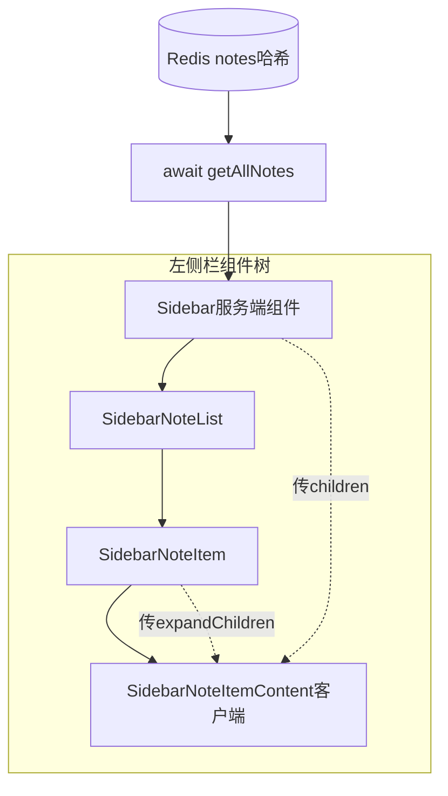
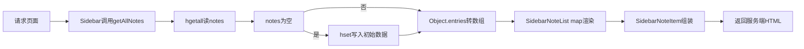

> **标题**：Next.js 博客左侧笔记列表是怎么从 Redis 渲染出来的？从组件、children 到动态路由一次讲清
> **标签**：Next.js、React、服务端组件、Redis、前端全栈
> **摘要**：以一个笔记应用为例，讲清 React 组件如何渲染、children/expandChildren 双槽、数据从 Redis 经 props 流到列表，以及 layout 与动态路由 [id] 的 SSR/SEO 原理。

# Next.js 博客左侧笔记列表是怎么从 Redis 渲染出来的？从组件、children 到动态路由一次讲清

我第一次打开这个 `next-blog` 项目时，屏幕左侧是一列笔记、右侧是空状态提示。我最想知道的不是"React 是什么"，而是**那一列笔记到底是怎么从 Redis 数据库跑到我屏幕上的**。这篇文章就沿着这条线，把 React 组件渲染、数据流转、Next.js 的 layout 和动态路由串起来讲。读完你应该能自己说清：刷新一次页面，左侧列表是怎么一层层渲染出来的。

先交个底：这个项目是 `npx create-next-app` 起的 Next.js 全栈脚手架（package.json 里 next 16.3.1）。它用的是 App Router，页面默认是 **React Server Component（RSC）**——能在服务端用 `async` 函数直接 `await` 拿数据，再返回 HTML；浏览器拿到 HTML 后再"接管"的过程叫 **hydration**。这两个词后面会反复出现。

## 整体架构一览（先看清全貌）

先把组件树和数据来源摆出来，后面每节都是在放大其中一个节点：



> readme 里还强调**规范驱动编程**：动手前先规划好需要哪些组件（Sidebar / SidebarNoteList / NoteItem / NoteEditor / NotePreview 等），再按规划写代码。上面这棵树就是这种规划落地的样子——左侧栏这条链已经实现，右侧 Note 详情/编辑那半边还在后面"待补充"里。

## 一、一个标签怎么变成屏幕上的组件

**你可能会问**：`<Sidebar />` 是不是就在渲染 Sidebar.js？

**结论**：是的。在 JSX 里写 `<SidebarNoteList />` 这样的标签，本质就是"调用 SidebarNoteList 这个函数组件，把它的返回值（JSX）放到这里渲染"。

看 `components/Sidebar.js`：顶部 `import SidebarNoteList from "./SidebarNoteList";` 引入组件，然后在返回的 JSX 里用了它：

```js
export default async function Sidebar() {
  const notes = await getAllNotes();
  console.log(notes);
  return (
    <section className='col sidebar'>
      <nav>
        <SidebarNoteList notes={notes} />
      </nav>
    </section>
  )
}
```

再看 `components/SidebarNoteItem.js` 里也有 `<SidebarNoteItemContent ...>...</SidebarNoteItemContent>`。每一处标签，背后都是一次函数调用。所以项目里没有一个"手动把组件拼起来"的步骤——你 import 了谁、在 JSX 里写了谁的标签，谁就被渲染。

**常见的误解**：别把组件文件当成"页面"。`Sidebar.js` 本身也是被别处当作标签用、被渲染出来的返回值，它不是入口。

## 二、children 与 expandChildren：标签中间的内容去哪了

**你可能会问**：children 是什么？为什么标签中间夹的东西会自动变成 children？expandChildren 又是什么？

**结论**：children 是 React 给组件的一个"特殊 prop"——你在 `<X> ... </X>` 两个标签之间写的内容，会自动作为 children 传进去。但 children 只有一个槽；要同时传两样东西，就用一个自定义 prop（这里叫 expandChildren）再塞一份 JSX。

看 `components/SidebarNoteItem.js` 怎么传：

```js
export default function SidebarNoteItem({ noteId, note }) {
  const { title, content = '', updateTime } = note;
  return (
    <SidebarNoteItemContent
      id={noteId}
      title={title}
      expandChildren={
        <p className="sidebar-note-excerpt">
          {content.substring(0, 20) || <i>No Content</i>}
        </p>
      }
    >
      <header className="sidebar-note-header">
        <strong>{title}</strong>
        <small>{dayjs(updateTime).format('YYYY-MM-DD HH:mm:ss')}</small>
      </header>
    </SidebarNoteItemContent>
  );
}
```

接收方 `components/SidebarNoteItemContent.js`：

```js
'use client';
export default function SidebarNoteItemContent({ id, title, children, expandChildren }) {
  return (<>{children}</>)
}
```

**为什么标签中间会自动变成 children**（核心原理）：上面那段 JSX 在构建时被编译成 `React.createElement(SidebarNoteItemContent, { id, title, expandChildren }, <header>...</header>)`。`createElement` 的第三个及之后的参数就是 **children**——也就是开闭标签之间夹的内容。所以 `function SidebarNoteItemContent({ children })` 拿到的正是那段 header。这不是魔法，只是函数调用的第三个参数。

**expandChildren 的意义**：children 只能装"标签中间"那一处；`SidebarNoteItem` 想同时给子组件两样东西（标题头 + 摘要段落），一个槽不够，于是用 `expandChildren={<p>...</p>}` 这种自定义 prop 再传一份 JSX。

> 顺带一提：代码里的 `sidebar-note-header`、`sidebar-note-excerpt` 这类类名，遵循了 readme 里提到的 **BEM** 命名规范（Block-Element__Modifier），`sidebar` 是块、`note-header` 是元素。

**我踩过的坑**：第一次看 `SidebarNoteItemContent`，发现它只 `return <>{children}</>`，expandChildren 接了却没渲染。这其实是个诚实的**已预留**信号——展开交互还没做，参数先留着。别以为"传了就一定显示"。

## 三、数据源头：getAllNotes 与 Redis 哈希表

**你可能会问**：getAllNotes() 那段代码在干嘛？

**结论**：它用一个 Redis 哈希表（hash）保存所有笔记，`hgetall` 读出全部，第一次为空时用 `hset` 写入初始数据（懒初始化），再返回。

`lib/redis.js`：

```js
import Redis from 'ioredis';
const redis = new Redis();// 默认 NOSQL
const initialData = {
  "1702459181837": '{"title":"sunt aut","content":"quia et suscipit","updateTime":"2023-12-13T09:19:48.837Z"}',
  "1702459182837": '{"title":"qui est","content":"est rerum tempore vitae sequi sint","updateTime":"2023-12-13T09:19:48.837Z"}',
  "1702459188837": '{"title":"ea molestias","content":"et iusto sed quo iure","updateTime":"2023-12-13T09:19:48.837Z"}'
}
export async function getAllNotes() {
  const data = await redis.hgetall('notes');
  if (Object.keys(data).length === 0) {
    await redis.hset('notes', initialData);
  }
  return await redis.hgetall('notes');
}
```

**核心概念**：Redis 是内存里的 key-value 数据库，对"哈希"类型有专门方法。这里 key 叫 `notes`，value 不是普通字符串，而是一个哈希——每个 field 是笔记 ID（如 `"1702459181837"`），field 的值是那条笔记序列化后的 JSON 字符串。`hgetall` 一次性拿整个哈希；`hset` 写入（这里把 `initialData` 这个对象整体写进去）。

**懒初始化**：如果 `notes` 哈希还不存在（`Object.keys(data).length === 0`），就先 `hset` 写入 3 条示例笔记，保证后面永远有数据可读，再 return 一次 `hgetall`。

**运行时流程：一次刷新发生了什么**



**连接**：这个函数返回的对象，就是整条数据流的开头。注意 hash 的值是"字符串"不是对象——所以后面拿到 `note` 要 `JSON.parse(note)` 才能用，这正是下一节的重点。

## 四、父传子：notes 怎么从 Sidebar 流到 SidebarNoteList

**你可能会问**：notes 怎么传到 SidebarNoteList？

**结论**：父组件 Sidebar 拿到数据后，用 `<SidebarNoteList notes={notes} />` 通过 props 传下去；子组件在函数参数里 `{ notes }` 解构接收。

`Sidebar.js` 里 `const notes = await getAllNotes();` 然后 `<SidebarNoteList notes={notes} />`；`SidebarNoteList.js` 里 `export default function SidebarNoteList({ notes }) { ... }`。

这里也用到了 readme 里说的 **alias**：`import { getAllNotes } from "@/lib/redis";` 的 `@/lib` 就是 `jsconfig.json` 配的别名，指向 lib 目录，省去 `../../../lib/redis.js` 这种相对路径。

**连接**：数据现在到了 `SidebarNoteList` 手里，下一步要遍历它。

**常见的误解**：props 是单向的——Sidebar 把 notes 给子组件，子组件不能直接改父组件的 notes。React 的数据流是"自上而下"。

## 五、遍历与解构：Object.entries + map([noteId, note])

**你可能会问**：`map(([noteId, note]) => {...})` 这一长串在干嘛？

**结论**：它把 Redis 返回的哈希对象转成 `[id, 字符串]` 数组后逐项遍历，把字符串 `JSON.parse` 成对象，再交给 SidebarNoteItem。

`components/SidebarNoteList.js`：

```js
export default function SidebarNoteList({ notes }) {
  const arr = Object.entries(notes);// hash转二维数组 方便map 遍历
  if (arr.length === 0) {
    return <div className="notes-empty">No Notes Created yet</div>
  }
  return (
    <ul className="notes-list">
      {arr.map(([noteId, note]) => {
        return (
          <li key={noteId}>
            <SidebarNoteItem noteId={noteId} note={JSON.parse(note)} />
          </li>
        );
      })}
    </ul>
  )
}
```

拆开看：

- `Object.entries(notes)`：把 `{ "1702459181837": "...", ... }` 变成 `[["1702459181837", "..."], ...]`，因为 map 遍历数组比遍历对象方便。
- `arr.map(([noteId, note]) => ...)`：map 回调的参数直接用了**数组解构**——`[noteId, note]` 分别对应每一项的第一个、第二个元素。
- `note={JSON.parse(note)}`：note 此时还是字符串，JSON.parse 还原成 `{ title, content, updateTime }` 对象再传下去。
- `key={noteId}`：React 列表要求每项有稳定 key，用笔记 ID 正合适。

**连接**：`SidebarNoteItem` 收到的 `note` 已经是对象了，于是它能在自己内部再解构。

**常见的误解**：忘写 key 会在控制台报警；用数组下标当 key 在列表会重排时出错，用稳定 ID 才稳。

## 六、SidebarNoteItem：服务端组件如何拼出两个内容槽

**你可能会问**：SidebarNoteItem.js 在干嘛？

**结论**：它是服务端组件（RSC，没有 `'use client'`），负责把笔记的 title/content/updateTime 组装好，分别塞进 children（标题头）和 expandChildren（摘要）两个槽，传给下一层客户端组件。

```js
export default function SidebarNoteItem({ noteId, note }) {
  const { title, content = '', updateTime } = note;
  return (
    <SidebarNoteItemContent
      id={noteId} title={title}
      expandChildren={<p className="sidebar-note-excerpt">{content.substring(0, 20) || <i>No Content</i>}</p>}
    >
      <header className="sidebar-note-header">
        <strong>{title}</strong>
        <small>{dayjs(updateTime).format('YYYY-MM-DD HH:mm:ss')}</small>
      </header>
    </SidebarNoteItemContent>
  );
}
```

关键点：`const { title, content = '', updateTime } = note;` 用**对象解构**从 note 里取出字段，content 默认空字符串（笔记没内容时不报错）。标题头放在 children，前 20 字摘要放在 expandChildren。

**为什么它是服务端组件**：文件里没有 `'use client'`。它只在服务端把数据拼好，把 JSX 作为 props 传给下一层。真正接收这两个槽、并标记 `'use client'` 的是 `SidebarNoteItemContent`——这层才可能在浏览器里做交互（目前只渲染了 children）。

**常见的误解**：RSC 不等于"不能写 JSX"。RSC 也能写 JSX、也能把 JSX 当 props 传；区别在于它不跑在浏览器、不能用 `useState`/`onClick` 这类客户端特性。

## 七、layout 的 children：为什么侧边栏常驻、右侧随路由变

**你可能会问**：layout 的 children 是什么？

**结论**：`RootLayout` 里的 `{children}` 就是"当前 URL 对应的那个 page.js"；它随路由变化，而 Sidebar 写在 children 外面，所以每个页面都带着同一个侧边栏。

`app/layout.js`：

```js
export default async function RootLayout({ children }) {
  return (
    <html>
      <title>谢哥暴力炸博客</title>
      <meta name="description" content="..." />
      <meta name="keywords" content="llm,claude,deepseek,rag,langchain,nextjs" />
      <head></head>
      <body>
        <div className="container">
          <div className="main">
            <Sidebar />
            <section className="col note-viewer">{children}</section>
          </div>
        </div>
      </body>
    </html>
  )
}
```

关键点：`<Sidebar />` 在 `{children}` 之外 → 任何路由都渲染它（常驻）。`{children}` 所在的那块，在 `/` 时是 `app/page.js`（空状态提示），在 `/note/123` 时变成 `app/note/[id]/page.js`。

**连接**：这就是"layout 包裹 page"的本质——layout 提供外壳，children 是会被替换的内容。下一节看 children 具体怎么被动态路由替换。

## 八、动态路由 [id] 与 SEO：文件夹即路由

**你可能会问**：`[id]` 文件夹是什么意思？params 会自动识别 id 吗？为什么 SEO 友好？

**结论**：App Router 里，`app/note/[id]/page.js` 的 `[id]` 文件夹就是"动态路由段"——URL 里那一段会作为 params 传进 page，key 名由文件夹定（这里叫 id）、值永远是字符串。而 layout 里写在服务端的 `<title>`/`<meta>` 会进 HTML，爬虫能直接读到，所以 SEO 友好。

**动态路由**：`[id]` 是约定写法。访问 `/note/1702459181837` 时，Next.js 把 `1702459181837` 作为 `params.id` 交给 page。在 Next.js 15+（本项目 next 16）里，page 收到的 params 是 **Promise**，要 `const { id } = await params;` 才能拿到值；key 名 `id` 由文件夹名决定，值永远是字符串。

**SEO 友好**：`layout.js` 的 `<title>` 和 `<meta name="description">`、`<meta name="keywords">` 都在服务端渲染进 HTML——爬虫拿到的是现成页面，不用等 JS 执行。这是 RSC/SSR 的好处，和纯客户端渲染（CSR）不同。

**已预留 / 待补充（诚实边界）**：本项目 `app/note/[id]/page.js` 目前只有一行 `import { getAllNote } from "@/lib/redis";`——详情页逻辑还没写，连导入的函数名（`getAllNote`）都和 lib 里导出的（`getAllNotes`）对不上。所以"await params 拿 id → 查单条笔记 → 渲染"这一串，代码里**还没实现**，是后续要补的。这里只讲清约定，不替它脑补实现。

## 小结

| 概念 | 一句话定义 | 关键代码位置 |
|---|---|---|
| 组件渲染 | JSX 标签 = 调用组件函数，渲染其返回值 | components/Sidebar.js |
| children | 标签中间的内容，自动成为组件的特殊 prop | components/SidebarNoteItemContent.js |
| expandChildren | 自定义 prop，弥补 children 单槽 | components/SidebarNoteItem.js |
| 数据流 | getAllNotes → props → Object.entries → map → Item | lib/redis.js / components/SidebarNoteList.js |
| Redis 哈希 | hgetall 读、hset 写、空时懒初始化 | lib/redis.js |
| layout children | 随路由替换的 page，外壳常驻 | app/layout.js |
| 动态路由 [id] | 文件夹即段，params 为 Promise 需 await | app/note/[id]/page.js |
| SEO | title/meta 服务端渲染进 HTML | app/layout.js |

## 易错点与待补充学习

**容易踩的坑（来自本项目）**：

- `note` 从 Redis 出来是**字符串**，必须 `JSON.parse` 才能当对象用。
- 列表渲染每一项都要有稳定 `key`，优先用 ID 而非数组下标。
- children 只有一个槽；要传两样东西用自定义 prop（如 expandChildren）。
- 本项目 next 16 里动态路由的 `params` 是 **Promise**，要 `await`。
- RSC 没有 `'use client'`，不能用 `useState`/`onClick` 等客户端特性。

**本项目已预留 / 未实现（诚实标注，不脑补）**：

- `expandChildren` 传了但 `SidebarNoteItemContent` 还没渲染——展开交互未做。
- `app/note/[id]/page.js` 仅一行 stub import，且函数名拼写不一致，详情页逻辑未实现。
- `app/note/edit/`、`edit/[id]/` 编辑页为空，编辑/删除/新建/搜索等 CRUD 在 readme 需求里但代码未见。
- `Sidebar.js` 里搜索框位置写着 `{/* SideSearchField 未来干的 */}`——搜索框（SidebarSearchField）是 readme 规划过、代码里标了"未来干的"的**已预留**项，尚未实现。
- `components/SidebarNoteList2.js` 是另一种列表写法（无 expandChildren 双槽），本文未展开讲，留作对照学习。

## 自测清单

1. 能说清 `<SidebarNoteList />` 为什么就渲染了 SidebarNoteList.js 的返回值。
2. 能解释 children 是怎么从"标签中间的内容"来的（createElement 第三参数）。
3. 能画出 getAllNotes 的"读 → 空则写 → 再读"流程。
4. 能说出 `Object.entries` + `map([noteId, note])` + `JSON.parse` 各自解决什么。
5. 能讲清 layout 的 children 为何随路由变、Sidebar 为何常驻。
6. 能说明 `[id]` 动态路由与 params 是 Promise 要 await，以及本项目详情页为何还待实现。

## 总结：这次到底学到了什么

**理解了什么**：左侧那条笔记列表，是一串"服务端拿数据 → 一层层传下去渲染"的链路——`Sidebar`（RSC）`await getAllNotes` 从 Redis 哈希读出全部笔记，用 `notes={notes}` 传给 `SidebarNoteList`；后者 `Object.entries` + `map([noteId, note])` 遍历、每项 `JSON.parse` 后交给 `SidebarNoteItem`；`SidebarNoteItem` 解构出字段，把标题头塞进 children、摘要塞进 expandChildren 两个槽，传给 `'use client'` 的 `SidebarNoteItemContent` 渲染。

**连通到哪**：组件渲染（标签=函数调用、children 单槽）、数据流（props 自上而下、entries+map 遍历）、Next.js 收口（layout 的 children 随路由替换、RSC 在服务端渲染 title/meta 让 SEO 友好）被串成一条"刷新即出列表"的链路。

**下一步补哪个缺口**：把 `app/note/[id]/page.js` 真正写出来——`await params` 拿 id、查单条笔记、渲染详情；再让 `SidebarNoteItemContent` 真正渲染 `expandChildren`；最后补齐 edit/CRUD。项目没做完的部分，边界已经清楚，不必靠猜。
