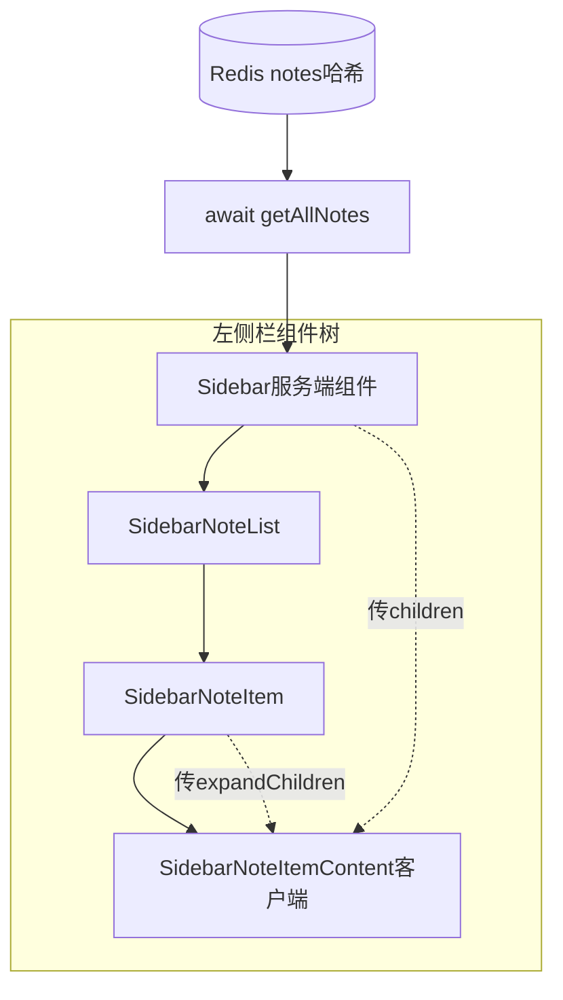
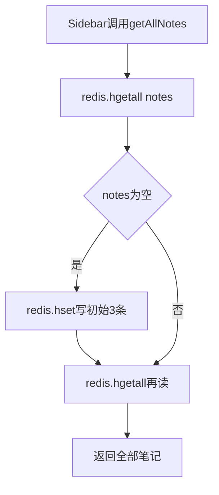

> 发布信息（填完掘金表单后可整段删除）
> 标题：Next.js 博客左侧笔记列表是怎么从 Redis 渲染出来的？从组件、children 到动态路由一次讲清
> 备选：一条笔记从 Redis 到屏幕：React 组件渲染、props 数据流与 Next.js 动态路由串讲
> 标签：Next.js、React、服务端组件、Redis、前端全栈
> 摘要：以一个笔记应用为例，讲清 React 组件如何渲染、children/expandChildren 双槽、数据从 Redis 经 props 流到列表，以及 layout 与动态路由 [id] 的 SSR/SEO 原理。

# Next.js 博客左侧笔记列表是怎么从 Redis 渲染出来的？从组件、children 到动态路由一次讲清

我第一次打开这个 `next-blog` 项目，最想知道的不是"React 是什么"，而是**左侧那一列笔记到底怎么从 Redis 跑到屏幕上**。这篇文章就沿这条线，把组件渲染、children、数据流、Next.js 的 layout 和动态路由串起来。先交个底：它是 `npx create-next-app` 起的 Next.js 全栈脚手架（next 16.3.1），用 App Router，页面默认是 **React Server Component（RSC）**——能在服务端 `async` 里直接 `await` 取数再返 HTML；浏览器拿到 HTML 后"接管"的过程叫 **hydration**。这几个词后面会反复出现。

## 整体架构（先看清全貌）



下面每节都是放大这棵树上的一个节点。readme 里强调的**规范驱动编程**（先规划组件再写）在这棵树上落地：左侧栏这条链已实现，右侧 Note 详情/编辑还在"待补充"。

## 一、组件是怎么渲染出来的（React 基础）

你打开 `Sidebar.js`，会在 JSX 里看到 `<SidebarNoteList />`、`<SidebarNoteItem />` 这样的标签。从这里最容易冒出四个问题，我们顺着答。

**`<Sidebar />` 写在页面里，它真的去渲染了 Sidebar.js 吗？** 是的。JSX 里写某个组件标签，本质就是"调用那个函数组件、把它 return 的 JSX 放到这里"——你 `import` 了谁、写了谁的标签，谁就被渲染。组件文件本身不是页面，它也是被别处当标签调用才出现的返回值。别把组件文件当成独立页面。

**那 children 到底是什么？** 它是 React 的一个特殊 prop：`<X> ... </X>` 两个标签之间夹的内容，会自动成为组件 `X` 收到的 `children`。

**为什么标签中间的内容会自动变成 children？** 因为 JSX 不是直接上屏的，它会被编译成 `React.createElement`。那段"标签中间的内容"正是作为 `createElement` 的**第三参数**传进去的——所以 children 不是魔法，只是函数调用的第三个参数。

**既然有 children，项目里还写了一个 `expandChildren={...}` 又是什么？** children 这个槽只有一个，只能装"标签中间"那一处东西。想同时给子组件两样内容（比如标题头 + 摘要），一个槽装不下，就用一个**自定义 prop** 再塞一份 JSX——这里叫 `expandChildren`。代码里的 `sidebar-note-header`、`sidebar-note-excerpt` 类名遵循了 readme 的 **BEM** 规范（`sidebar` 是块、`note-header` / `note-excerpt` 是元素）。

记住这一节：标签 = 调用组件函数、children = 标签中间内容（createElement 第三参数）、expandChildren = 补 children 单槽的自定义 prop。后面数据流一节会把这些一次用全。

## 二、数据从哪来、怎么流到列表（数据流）

组件会渲染了，但渲染的东西从哪来？答案是 Redis，再靠 props 一层层往下传。

### getAllNotes：笔记存在 Redis 哈希里

`getAllNotes`（`lib/redis.js`）用 Redis 哈希表存所有笔记：`hgetall` 读出全部，首次为空时用 `hset` 写入初始数据（懒初始化），再 `return` 一次。

```js
import Redis from 'ioredis';
const redis = new Redis();
const initialData = {
  "1702459181837": '{"title":"sunt aut","content":"quia et suscipit","updateTime":"2023-12-13T09:19:48.837Z"}',
  "1702459182837": '{"title":"qui est","content":"est rerum tempore vitae sequi sint","updateTime":"2023-12-13T09:19:48.837Z"}',
  "1702459188837": '{"title":"ea molestias","content":"et iusto sed quo iure","updateTime":"2023-12-13T09:19:48.837Z"}'
}
export async function getAllNotes() {
  const data = await redis.hgetall('notes');
  if (Object.keys(data).length === 0) {
    await redis.hset('notes', initialData);
  }
  return await redis.hgetall('notes');
}
```

运行时的"读 → 空则写 → 再读"是这样走的：



三点要记住：key 叫 `notes`，value 是哈希（每个 field 是笔记 ID，field 的值是那条笔记序列化后的 **JSON 字符串**）；**懒初始化**保证 `notes` 不存在时先写 3 条示例，后面永远有数据；hash 的值是**字符串**不是对象——后面拿到 `note` 要 `JSON.parse` 才能用。

### notes 怎么传到 SidebarNoteList：props 父传子

`Sidebar`（`components/Sidebar.js`）`await getAllNotes()` 拿到数据后，用 `<SidebarNoteList notes={notes} />` 通过 props 传下去；子组件在函数参数里 `{ notes }` 解构接收。

```js
export default async function Sidebar() {
  const notes = await getAllNotes();
  return (
    <section className='col sidebar'>
      <nav><SidebarNoteList notes={notes} /></nav>
    </section>
  )
}
```

这里用了 readme 说的 **alias**：`import { getAllNotes } from "@/lib/redis";` 的 `@/lib` 是 `jsconfig.json` 配的别名，指向 lib 目录。props 是单向的——数据"自上而下"流，子组件不能直接改父组件的 `notes`。

### 怎么遍历每条笔记：Object.entries + map + JSON.parse

`SidebarNoteList`（`components/SidebarNoteList.js`）把哈希转成数组遍历，每项 `JSON.parse` 后交给 `SidebarNoteItem`：

```js
export default function SidebarNoteList({ notes }) {
  const arr = Object.entries(notes);
  if (arr.length === 0) return <div className="notes-empty">No Notes Created yet</div>;
  return (
    <ul className="notes-list">
      {arr.map(([noteId, note]) => (
        <li key={noteId}>
          <SidebarNoteItem noteId={noteId} note={JSON.parse(note)} />
        </li>
      ))}
    </ul>
  )
}
```

- `Object.entries(notes)`：把 `{id: "..."}` 变成 `[["id","..."]]`，方便 `map` 遍历。
- `map(([noteId, note]) => ...)`：回调参数用**数组解构**，分别对应每项的第一个、第二个元素。
- `note={JSON.parse(note)}`：note 还是字符串，解析成 `{ title, content, updateTime }` 对象再传。
- `key={noteId}`：列表每项要有稳定 key，用 ID 而非数组下标。

### SidebarNoteItem：服务端组件如何拼两个槽

`SidebarNoteItem`（`components/SidebarNoteItem.js`）把前面几节的概念一次用全：它是**服务端组件**（无 `'use client'`），解构出字段，把标题头塞进 children、前 20 字摘要塞进 expandChildren，再传给下一层客户端组件。

```js
export default function SidebarNoteItem({ noteId, note }) {
  const { title, content = '', updateTime } = note;
  return (
    <SidebarNoteItemContent
      id={noteId} title={title}
      expandChildren={<p className="sidebar-note-excerpt">{content.substring(0, 20) || <i>No Content</i>}</p>}
    >
      <header className="sidebar-note-header">
        <strong>{title}</strong>
        <small>{dayjs(updateTime).format('YYYY-MM-DD HH:mm:ss')}</small>
      </header>
    </SidebarNoteItemContent>
  );
}
```

- `const { title, content = '', updateTime } = note;`：**对象解构**取字段，content 默认空串（无内容不报错）。
- 标题头 → children，摘要 → expandChildren（呼应第一节的"children 单槽、expandChildren 补槽"）。
- **为什么它是服务端组件**：没有 `'use client'`，只在服务端拼数据、把 JSX 当 props 传；真正接收并标记 `'use client'` 的是 `SidebarNoteItemContent`——这层才可能在浏览器做交互。
- **我踩过的坑**：`SidebarNoteItemContent` 现在只 `return <>{children}</>`，`expandChildren` 接了却没渲染——"传了不一定显示"，展开交互还没做。

## 三、Next.js 核心概念收口

数据链路讲完了，最后看 Next.js 怎么把这条链"装进"一个可访问的站点。

**先复习 readme**：脚手架 `npx create-next-app`、App Router 默认 RSC（服务端 `async` 取数再返 HTML，浏览器接管叫 hydration）、SSR 让 `title`/`meta` 进 HTML 利 SEO、规范驱动编程（先规划组件）、alias（`jsconfig` 的 `@/`）、BEM 类名——这些前面都已逐一落地。

**layout 的 children：随路由变、外壳常驻。** `app/layout.js` 的 `{children}` 就是"当前 URL 对应的 page.js"；它随路由变化，而 `<Sidebar />` 写在 children 外面，所以每个页面都带同一个侧边栏。

```js
export default async function RootLayout({ children }) {
  return (
    <html>
      <title>谢哥暴力炸博客</title>
      <meta name="description" content="..." />
      <meta name="keywords" content="llm,claude,deepseek,rag,langchain,nextjs" />
      <body>
        <div className="container"><div className="main">
          <Sidebar />
          <section className="col note-viewer">{children}</section>
        </div></div>
      </body>
    </html>
  )
}
```

`/` 时 children 是 `app/page.js`（空状态提示），`/note/123` 时变成 `app/note/[id]/page.js`——这就是"layout 提供外壳、children 是被替换的内容"。`Sidebar.js` 顶部还写着 `{/* SideSearchField 未来干的 */}`——搜索框是 readme 规划过、代码标了"未来干的"的**已预留**项。

**动态路由 `[id]`：文件夹即路由段。** `app/note/[id]/page.js` 的 `[id]` 是"动态路由段"：URL 那段会作为 params 传进 page，key 名由文件夹定（这里叫 id）、值永远是字符串。本项目 next 16 里 params 是 **Promise**，要 `const { id } = await params;` 才能取值。

- 你可能会想"params 是不是自动识别 id 传给 page"——是的，但关键在于 **key 名由文件夹定**（文件夹叫 `[id]` 所以参数才叫 `id`），值永远是字符串；改文件夹名参数名就跟着变。

**SEO 友好：服务端渲染的功劳。** layout 的 `<title>`/`<meta>` 在服务端渲染进 HTML，爬虫拿到现成页面、不用等 JS——这是 RSC/SSR 相对纯客户端渲染（CSR）的好处。

- **边界**：本项目 `app/note/[id]/page.js` 目前只有一行 `import { getAllNote } from "@/lib/redis";`——详情页逻辑还没写，连导入函数名（`getAllNote`）都和 lib 导出的（`getAllNotes`）对不上。"await params 拿 id → 查单条 → 渲染"这一串代码里**未实现**，本文只讲约定。

## 小结

| 概念 | 一句话定义 | 关键位置 |
| --- | --- | --- |
| 组件渲染 | JSX 标签 = 调用组件函数，渲染其返回值 | Sidebar.js |
| children | 标签中间内容，自动成特殊 prop（createElement 第三参数） | SidebarNoteItemContent.js |
| expandChildren | 自定义 prop，补 children 单槽 | SidebarNoteItem.js |
| 数据流 | getAllNotes → props → Object.entries → map → Item | redis.js / SidebarNoteList.js |
| Redis 哈希 | hgetall 读、hset 写、空时懒初始化 | redis.js |
| layout children | 随路由替换的 page，外壳常驻 | layout.js |
| 动态路由 [id] | 文件夹即段，params 为 Promise 需 await | note/[id]/page.js |
| SEO | title/meta 服务端渲染进 HTML | layout.js |

## 易错点与待补充学习

**通用坑**：note 从 Redis 出来是字符串，必须 `JSON.parse`；列表每项要有稳定 `key`（用 ID 不用下标）；children 单槽、要传两样用自定义 prop；next 16 动态路由 `params` 是 Promise 要 `await`；RSC 无 `'use client'` 不能用 `useState`/`onClick`。

**本项目已预留 / 未实现**：
- `expandChildren` 传了但 `SidebarNoteItemContent` 没渲染——展开交互未做。
- `app/note/[id]/page.js` 仅 stub import 且函数名拼错，详情页未实现。
- `app/note/edit/`、`edit/[id]/` 为空，CRUD/搜索在 readme 需求里但代码未见。
- `SidebarNoteList2.js` 是另一种列表写法（无双槽），留作对照。

## 自测清单

1. 能说清 `<SidebarNoteList />` 为何渲染了 SidebarNoteList.js 的返回值。
2. 能解释 children 来自"标签中间内容"（createElement 第三参数），以及 expandChildren 为何存在。
3. 能画出 getAllNotes"读 → 空则写 → 再读"流程。
4. 能说出 `Object.entries` + `map([noteId, note])` + `JSON.parse` 各自解决什么。
5. 能讲清 layout 的 children 随路由变、Sidebar 常驻。
6. 能说明 `[id]` 与 params 是 Promise 要 await，以及详情页为何还待实现。

## 总结：这次学到了什么

**理解**：左侧列表是一串"服务端取数 → 逐层传下渲染"的链路。先懂组件渲染——`<SidebarNoteList />` 这种标签就是调用组件、渲染它的返回值；标签中间内容自动变成 `children`（createElement 第三参数），单槽不够时用 `expandChildren` 补。再看数据：`Sidebar`(RSC) `await getAllNotes` 从 Redis 哈希读出全部笔记（空则 `hset` 懒初始化），用 `notes={notes}` 传给 `SidebarNoteList`；后者 `Object.entries`+`map([noteId,note])` 遍历、每项 `JSON.parse` 后交 `SidebarNoteItem`；它解构字段，把标题头塞 children、摘要塞 expandChildren 两个槽，传给 `'use client'` 的 `SidebarNoteItemContent` 渲染。最后 Next.js 收口：`layout` 让 `Sidebar` 常驻、children 随路由替换，动态路由 `[id]` 把 URL 段作为 Promise 的 params 传入，RSC 服务端渲染 `title`/`meta` 利 SEO。

**连通**：组件渲染（标签=函数调用、children 单槽）、数据流（props 自上而下、entries+map 遍历）、Next.js 收口（layout children 随路由替换、RSC 服务端渲染 title/meta）被串成"刷新即出列表"一条线。

**下一步缺口**：把 `app/note/[id]/page.js` 真正写出来（`await params` 拿 id、查单条、渲染），让 `SidebarNoteItemContent` 渲染 `expandChildren`，再补 edit/CRUD。未做部分边界已清，不必靠猜。
