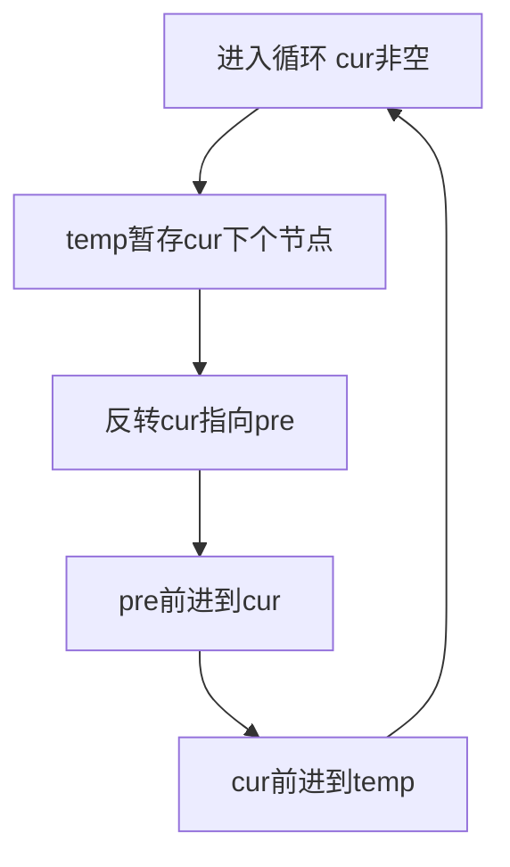
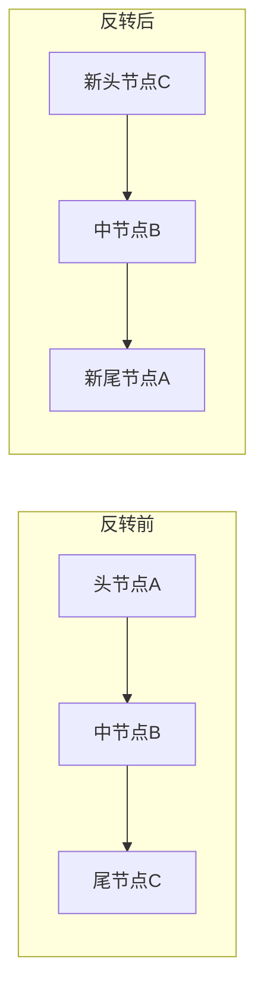

> 发布信息（填完掘金表单后可整段删除）
> 标题：用三个指针原地反转单链表：逐行读懂 while 循环里的指针交替
> 备选：单链表反转核心逻辑拆解：temp、pre、cur 各自扮演什么角色
> 标签：链表, JavaScript, 数据结构, 算法
> 摘要：逐行拆解经典反转单链表函数，讲清为何先用 temp 暂存 next、cur.next 怎样指回 pre、循环结束为何返回 pre，并配指针变化图。

# 用三个指针原地反转单链表：逐行读懂 while 循环里的指针交替

给你一个单链表头节点 `head`，要求把它整条反转过来——这是一道几乎每个前端/算法初学者都绕不开的题。本文会把下面这个函数逐行拆开，带你确认每一行在"反转"这场指针游戏里到底干了什么，以及为什么顺序不能乱。读完后你能独立写出、也能讲清楚这个 O(n) 时间、O(1) 额外空间的解法。

## 开场：为什么链表反转比数组难

我在刷这道题时卡了挺久。数组反转很简单，首尾两两交换就行，因为数组能按下标随机访问。但链表只有 `next` 指针，不能从中间跳着取节点：你一旦把某个节点的 `next` 改成指向前一个节点，"箭头"方向反了，原本通往后面节点的路就断了。这道题真正的难点不是"怎么反"，而是**如何在改指针的同时，不把后面还没处理的节点弄丢**。

所以这整个函数要回答的中心问题只有一个：给定 `head`，如何只用常数个额外指针、不新建任何数组，把链表原地反转？它属于数据结构里"指针操作"最基础也最典型的一课，吃透了它，后面很多链表题（反转部分区间、判断回文、环检测）的指针手感就都有了。阅读本文只需要 JavaScript 基础（函数、while 循环、对象引用）和对链表的基本认识——每个节点至少带一个指向下一个节点的 `next` 后继引用。节点本身的结构由调用方保证，不在本函数范围内，本文只聚焦"反转"这一层逻辑。

## 三个指针各自干什么

函数一上来声明了三个变量，先把它们的"人设"定下来，后面才读得懂循环：

```js
var reverseList = function(head) {
    let temp = null, pre = null, cur = head;
    while(cur) {
        temp = cur.next;
        cur.next = pre;
        pre = cur;
        cur = temp;
    }
    return pre;
};
```

- `cur`（current）：当前正在"动手反转"的那个节点，从 `head` 出发，沿着链表往后走。
- `pre`（previous）：已经反转好的那段链表的头节点。初始是 `null`，因为一开始一个节点都还没反。
- `temp`（temporary）：临时工，唯一作用是**在改 `cur.next` 之前，把 `cur` 的下一个节点存起来**，防止后面断链找不到。

这三个指针把"当前节点 / 已反转段头 / 逃生备份"三件事分得清清楚楚。注意 `temp` 和 `pre` 一开始都是 `null`——它们是"还没有"的状态，不是"已经指向某个真实节点"。

下面这张图是循环体的四步固定流程，后面每一步都对照它看：



读这张图时抓住一件事：每一次循环都在做同一件事——把 `cur` 这个节点的箭头翻过来指向 `pre`，然后三个指针整体往右挪一位。

## 逐行读 reverseList

现在按固定解释循环，把四行核心代码逐个讲透。

**它解决什么问题**：遍历链表时，必须把"当前节点的后继"先保住，才能安全地把它指向前驱，否则链表断裂、后续节点丢失。

**核心概念**：链表的"反转"本质上不是改节点里的值，而是改每个节点 `next` 指针的指向方向——从"指向后一个"变成"指向前一个"。

**关键代码逐行解释**（以 `cur` 指向节点 A 时为例）：

1. `temp = cur.next;` —— 先把 A 的下一个节点（假设是 B）记到 `temp`。这是整段代码里最关键的一行：它是在"拆桥之前先拍下对岸的照片"。
2. `cur.next = pre;` —— 把 A 的 `next` 指向 `pre`（也就是已经反转好的那段头）。到这里，A 的箭头方向已经反了。
3. `pre = cur;` —— `pre` 前进：现在 A 成了"已反转段"的新头。
4. `cur = temp;` —— `cur` 前进：去处理刚才存好的 B。

**它与上下环的连接**：这四行是一个闭环——第 4 行把 `cur` 推到下一个节点，下一轮循环又从 `temp = cur.next` 开始，直到 `cur` 变成 `null`（走到了原链表的尾 null）才停下。

**常见误解**：有人以为 `cur.next = pre` 可以直接写、前面的 `temp` 是多余的。这是错误的——一旦执行了第 2 行，A 原本指向 B 的链接就断了，若没提前存 `temp`，B 及之后的节点将永远无法再被访问，循环也会因 `cur` 拿不到下一个节点而出错。

## 走一遍：1→2→3 是怎么被翻过来的

光看代码不够，我把 `1 -> 2 -> 3 -> null` 丢进去，一步步看指针怎么变。配合下面这张"反转前后整体对比图"一起看：



- **初始**：`cur=1, pre=null, temp=null`。
- **第 1 轮**（`cur=1`）：`temp=2`；`1.next=null`（pre）；`pre=1`；`cur=2`。此时 `1 -> null` 已成独立小链。
- **第 2 轮**（`cur=2`）：`temp=3`；`2.next=1`；`pre=2`；`cur=3`。此时 `2 -> 1 -> null`。
- **第 3 轮**（`cur=3`）：`temp=null`；`3.next=2`；`pre=3`；`cur=null`。此时 `3 -> 2 -> 1 -> null`，循环因 `cur` 为 `null` 结束。
- **结束**：`pre=3`，正是新链表的头。

图里左边是输入、右边是输出：原头 A 变成了新尾（它最后指向 `null`），原尾 C 变成了新头。反转的"对称感"一目了然。

## 关键设计：为什么一定要先存 temp

这是我第一次自己写时踩的坑。我当时的直觉是"反转让 `cur.next` 指向前一个不就完了吗"，于是漏掉了 `temp = cur.next`，直接写 `cur.next = pre`。结果一运行，后面的节点全丢了——因为我改完 `cur.next`，就再也没有任何引用能走到原来的下一个节点，循环要么卡死要么早退。

对照这段正确代码才明白：`temp` 不是可有可无的临时变量，它是"断链前的逃生门"。`cur.next` 一旦被改写，原本的通路就没了，所以**必须在改写之前**把 `cur.next` 备份到 `temp`，第 4 行 `cur = temp` 才能接着往下走。顺序错了，整条链就废了。这也是为什么这四行的顺序（先存、再反、再双指针前进）不能任意调换。

## 循环结束后为什么返回 pre

很多人会下意识写 `return head`，这是错的。回想一下：`head` 在第三轮里被改成了 `head.next = null`，它已经是新链表的**尾节点**了，返回它只能拿到一个孤零零的尾。

真正的新头是 `pre`：每轮第 3 行 `pre = cur` 都把"已反转段头"往前推，循环结束时 `cur` 已为 `null`，而 `pre` 正好停在最后一个被处理、也就是原链表的尾节点上——它现在指向整条已反转的链。所以 `return pre` 返回的才是反转后的头。`head` 在循环里被不断改写，早已不再是"头"的语义。

## 边界情况：空链表与单节点

这两类不用特殊处理，函数在现有逻辑下天然成立，但值得确认一遍，避免心里没底：

- **空链表** `head = null`：进入 `while(cur)` 时 `cur` 就是 `null`，循环体一次都不执行，直接 `return pre`，而 `pre` 初始化为 `null`——返回 `null`，正确。
- **单节点** `1 -> null`：循环只跑一轮，`temp=null; 1.next=null(即 pre); pre=1; cur=null`，返回 `pre=1`，链表只有一个节点，反转后还是它自己，正确。

这说明函数的边界判断完全内嵌在 `while(cur)` 和 `return pre` 里，没有额外的 `if` 分支——这也是它简洁的地方。

## 小结

| 概念 | 一句话解释 | 关键代码 |
|---|---|---|
| 原地反转 | 改每个节点的 next 指向，不新建数组 | `cur.next = pre` |
| temp 备份 | 改指针前先存下个节点，防断链 | `temp = cur.next` |
| pre | 已反转段的头，每轮前移 | `pre = cur` |
| cur | 当前处理的节点，沿表前进 | `cur = temp` |
| 返回值 | 循环结束 pre 为新头，非 head | `return pre` |
| 复杂度 | 一次遍历、三指针常数空间 | O(n) 时间 / O(1) 空间 |

## 易错点与待补充学习

- **漏写 `temp = cur.next`**：这是最典型的手误，后果是断链丢节点、循环异常。写的时候把它当成"第 1 步、不可省略"来记。
- **返回 `head` 而非 `pre`**：`head` 在循环中被改写成了尾节点，返回它只能拿到尾。
- **误以为需要先特判空链表/单节点**：其实 `while(cur)` + `return pre` 已天然覆盖，无需额外分支。
- **待补充（不在本函数范围）**：递归写法（同样 O(n) 但占用调用栈空间）、反转链表的部分区间 `[m,n]`、以及节点 `val/next` 的具体定义由调用方保证，本文未展开。这些都可留作下一步练习，不在当前代码展示之内，故不作主体讲解。

## 总结

本次学习目标达成：我们弄清楚了"如何只用三个指针原地反转单链表"这一个中心问题。

已经形成的调用链（已实现）：初始化 `cur=head, pre=null, temp=null` → 循环体内 `temp` 备份 → `cur.next` 指回 `pre` 完成反转 → `pre`、`cur` 双指针前进 → 循环至 `cur` 为 `null` → `return pre` 得到新头。整条链已闭环，且空链表、单节点边界天然正确。

当前断在哪一环（未实现）：本函数只负责"反转"，不负责节点的创建、输入来源与测试验证，这些不在给出的代码之内。

下一步应理解什么：把这套三指针手感迁移到"反转部分区间"和"递归反转"，体会栈空间与常数空间两种思路的取舍。

## 自测清单
- 能说出链表反转比数组反转难在哪（断链风险）
- 能解释 temp、pre、cur 三个指针各自的角色
- 能讲清为什么必须先 `temp = cur.next` 再改 `cur.next`
- 能说明循环结束为何返回 pre 而不是 head
- 能推演 1→2→3→null 反转后的指针最终状态
- 能判断空链表和单节点在本函数中是否被正确处理
