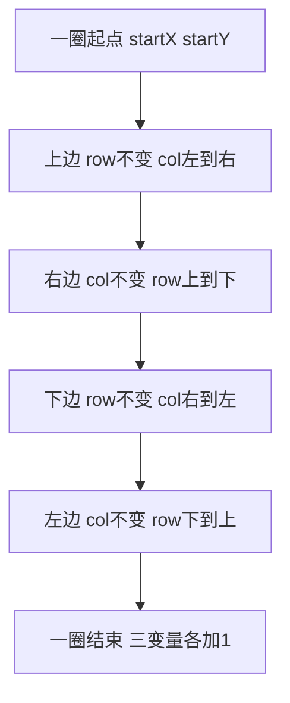
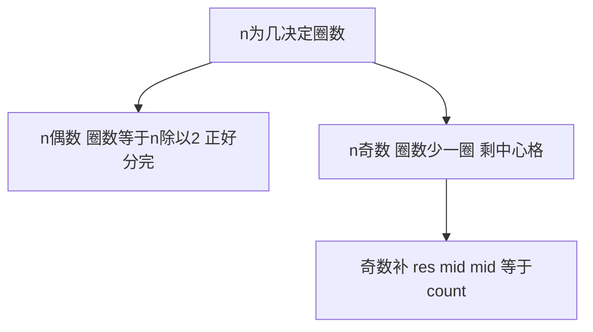

> 发布信息（填完掘金表单后可整段删除）
> 标题：顺时针螺旋填充 n×n 矩阵：手撕 generateMatrix 的四个 for 循环
> 备选：螺旋矩阵生成题解：startX、offset、loop 各自扮演什么角色
> 标签：螺旋矩阵, 算法, JavaScript, 数组, LeetCode
> 摘要：逐行拆解经典螺旋矩阵生成函数，讲清 startX/offset/loop 各自作用、单圈四边为何左闭右开、圈数为何取 n/2，并走查 n=3 与 n=4 验证。

# 顺时针螺旋填充 n×n 矩阵：手撕 generateMatrix 的四个 for 循环

你刷题时常遇到这样一道题：给定正整数 `n`，把 `1` 到 `n²` 按顺时针方向、从矩阵左上角出发，一层层填进 `n×n` 的矩阵。本题要回答的正是——怎么只用几个变量模拟"转圈"，还保证每条边不重不漏。本文逐行讲透 `generateMatrix` 这个标准实现，读完你能独立写出并说清每一步指针的变化。它考的是二维数组、循环边界控制和变量协作，是数组章节里最磨边界感的题之一；读它需要 JavaScript 基础（`while`/`for`、二维数组）和对"顺时针螺旋"的直观认识。

## 一、整体思路：用几个变量模拟转圈

核心套路一句话：从最外圈开始，每圈顺时针填四条边（上、右、下、左），填完把"起始点"往里挪一格、"边界"往里缩一格；圈数走完，若 `n` 是奇数再把最中心一个格子补上。下面这整段就是全部逻辑，后面每一节都在放大其中一个变量。

```js
var generateMatrix = function (n) {
  let startX = 0, startY = 0;
  let loop = Math.floor(n / 2);
  let mid = Math.floor(n / 2);
  let offset = 1;
  let count = 1;
  let res = new Array(n).fill(0).map(() => new Array(n).fill(0));

  while (loop--) {
    let row = startX, col = startY;
    for (; col < n - offset; col++) {
      res[row][col] = count++;
    }
    for (; row < n - offset; row++) {
      res[row][col] = count++;
    }
    for (; col > startY; col--) {
      res[row][col] = count++;
    }
    for (; row > startX; row--) {
      res[row][col] = count++;
    }
    startX++;
    startY++;
    offset += 1;
  }
  if (n % 2 === 1) {
    res[mid][mid] = count;
  }
  return res;
};
```

六个变量的职责先列清楚，后面都会用到：

- `startX` / `startY`：当前这一圈左上角的坐标，初始在 `(0,0)`。
- `loop`：要转几圈，等于 `Math.floor(n / 2)`。
- `mid`：中心格的行/列下标，等于 `Math.floor(n / 2)`，奇数时才用得上。
- `offset`：控制每条边"终止在哪"的偏移量，初始为 `1`，每圈加 `1`。
- `count`：下一个要填进矩阵的数字，从 `1` 一直增到 `n²`。
- `res`：结果矩阵，先建成 `n×n` 全 `0`，再逐步覆盖。

## 二、单圈四步：顺时针填四条边

`while` 里那四个 `for` 就是一圈的四条边，顺序固定为上 → 右 → 下 → 左，和我们肉眼走螺旋的方向一致。看一眼它们的衔接：上边结束时 `col` 停在最右列，右边就接着用这个 `col` 往下走；右边结束 `row` 停最底行，下边接着用它往左走——四个 `for` 是首尾相接的，前一个的终点是后一个的起点。



记住这张图的顺序就不会乱：`T→R→B→L` 是顺时针，四个 `for` 严格按这个写。我第一次写时把下边和左边写反，结果填出来是镜像的——顺序错了方向就全反。

## 三、边界为什么是 n-offset，而不是 n-1

这是本题最容易晕的点。四条边都用 `n - offset` 当终止边界（上/右是 `< n - offset`，下/左是 `> startY` / `> startX`），本质是"左闭右开"：每条边都只填到"下一个角的前一个"，把那个角留给下一条边去填。

举例，第一圈 `offset = 1`、上边条件是 `col < n - 1`。它填 `col = 0, 1, …, n-2`，停在 `col = n-1`（右上角）之前——这个右上角由右边的 `for` 来填。若不收缩（写成 `col < n`），上边会把右上角也填了，右边又填一次，同一个格子被写了两遍，而左下角却漏了。所以用 `offset` 把每条边的右端/下端"让"出来，四条边恰好首尾相接、四个角各归一边，不重不漏。

## 四、一圈结束：起点内移、边界内缩

四个 `for` 跑完后，这三行是收圈的关键：

```js
startX++;
startY++;
offset += 1;
```

`startX++` / `startY++` 让下一圈的左上角向内挪一格（从 `(0,0)` 到 `(1,1)` 再到 `(2,2)`…）；`offset += 1` 让下一圈的终止边界再往里缩一格（`n-1` → `n-2` → …）。两者配合，下一圈处理的就是更小的一圈环，而外圈已经填好、不会被动到。我把这理解成"剥洋葱"：每次剥掉最外层，刀口自然往里收。

## 五、圈数为何取 floor(n/2)，奇数中心怎么补

`loop = Math.floor(n / 2)` 决定转几圈。原因很直观：`n×n` 的矩阵每转一圈消掉最外一层，最多消 `n/2` 层。

- `n` 为偶数（如 4）：正好 `2` 圈把矩阵分完，没有剩余格子，`while` 结束后无需补。
- `n` 为奇数（如 3）：`Math.floor(3/2) = 1` 圈，外圈填完还剩最中心一个格子——它成不了"环"，所以单独用 `if (n % 2 === 1) res[mid][mid] = count` 补上。此时 `count` 已经递增到 `n²`，正好填中心。

`mid = Math.floor(n / 2)` 就是那个中心格的下标，和圈数用同一个整除，不是巧合。

## 六、走查 n=3 与 n=4

把代码在脑子里跑一遍，比背公式牢。下面用一张图区分奇偶两种收尾，再给出两个 `console.log` 的实际输出。



**n = 3**：`loop = 1`、`mid = 1`。一圈填外圈 1–8，循环结束 `n % 2 === 1` 成立，`res[1][1] = 9`：

```
1 2 3
8 9 4
7 6 5
```

**n = 4**：`loop = 2`、`mid = 2`。两圈分别填外环 1–12 和内环 13–16，偶数不补中心：

```
 1  2  3  4
12 13 14  5
11 16 15  6
10  9  8  7
```

我手动走查时确认过：内圈 `offset = 2`，上边只填 `res[1][1]`、右边只填 `res[1][2]`、下边只填 `res[2][2]`、左边只填 `res[2][1]`，四个角各归一边，正好 13–16 不重不漏。你也可以用代码里的 `console.log(generateMatrix(3))` 直接验证。

## 小结

| 概念 | 一句话 | 关键代码 |
| --- | --- | --- |
| 起始点 | 当前圈左上角，逐圈内移 | `startX++` / `startY++` |
| 圈数 | 最多剥 n/2 层 | `loop = Math.floor(n / 2)` |
| 边界偏移 | 每条边让出角点，左闭右开 | 终止于 `n - offset` |
| 边界内缩 | 每圈终止线往里收一格 | `offset += 1` |
| 填值 | 从 1 递增到 n² | `res[row][col] = count++` |
| 奇数中心 | 剩一个格子单独补 | `res[mid][mid] = count` |

## 易错点与待补充学习

- **count 必须后置 `++`**：`res[row][col] = count++` 是先填值再自增。若写成 `++count`，第一个数会变成 `2`，整盘错开——这是我自己写时翻过车的点。
- **四条边顺序不能乱**：上→右→下→左才是顺时针，颠倒任一条边方向就反。
- **`n - offset` 不是 `n - 1`**：边界收缩靠 `offset`，忘加 `offset` 递增会重复填充或越界。
- **本项目只支持正方形 `n×n`**：`res` 固定建成 `n×n`，长方形矩阵（m×n）以及逆时针、从其他角起点的填充方式代码里未实现，留作你下一步练习。

## 自测清单

读完应能独立回答：

- 能说清：给一个 `n`，`startX`/`offset`/`loop` 各自控制什么，四个 `for` 为什么是上→右→下→左？
- 能定位：哪一行保证"不重复填角点"（终止条件 `n - offset` 的左闭右开）、哪一行收圈（`startX++` 等三行）？
- 能判断：`n` 为奇数时为什么中心要单独补、`count` 此时正好等于多少？

代码层面已形成的链路：初始化变量 → `while` 转圈（四边左闭右开）→ 收圈内移 → 奇数补中心 → `return res`；未实现部分是长方形矩阵与逆时针填充，下一步可自己改写 `offset` 与边界条件去扩展。
