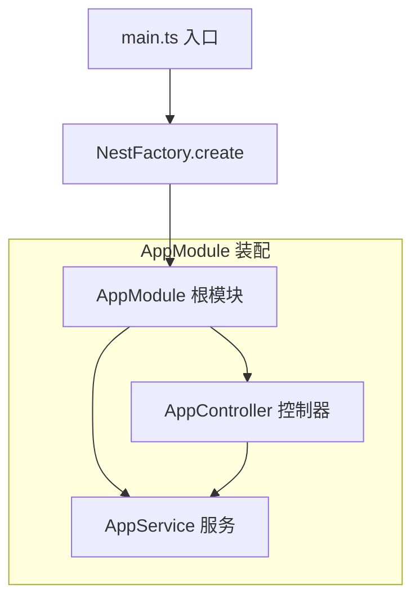
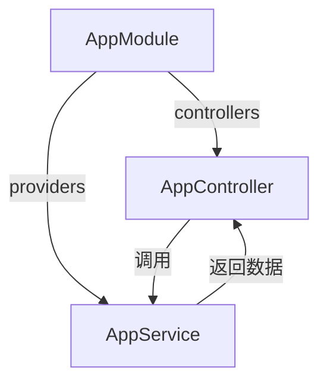
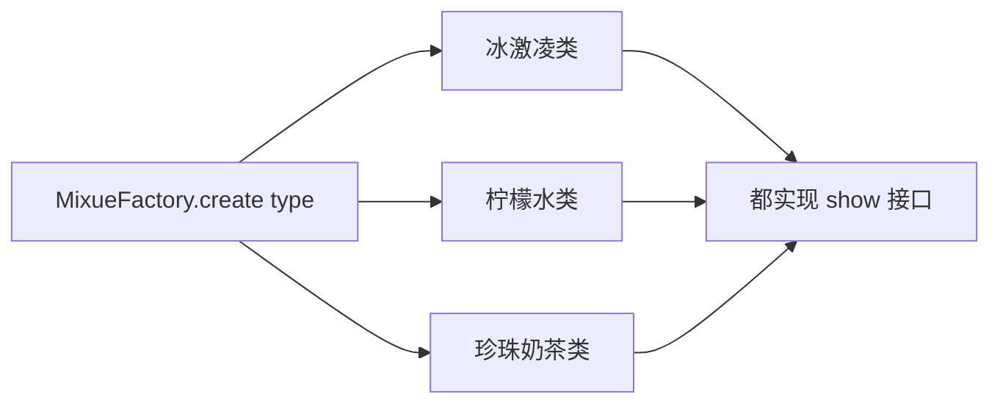
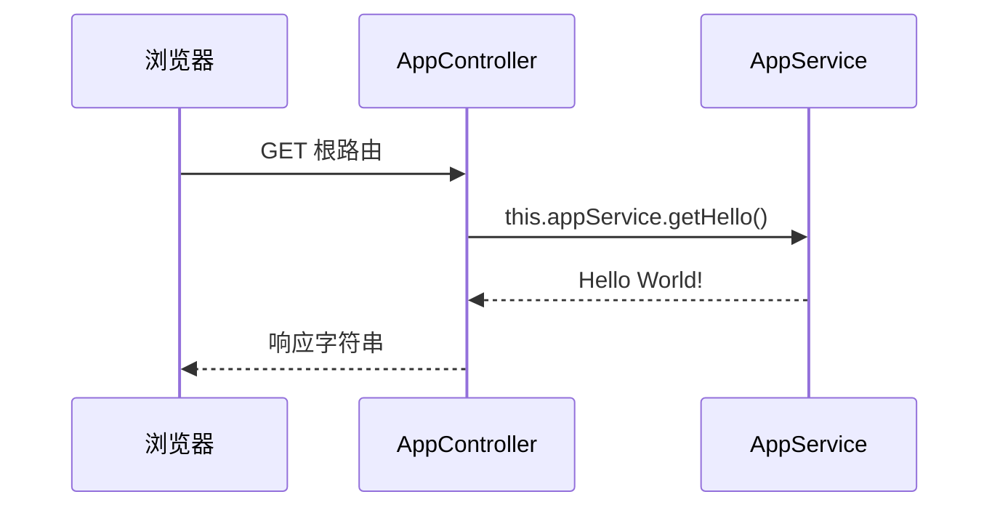

> 发布信息（填完掘金表单后可整段删除）
> 标题：NestJS 入门：从 NestFactory 入口到 Module/Controller/Service 模块化结构一次讲清
> 备选：用蜜雪冰城看懂 NestJS 的工厂模式与装饰器驱动的模块化
> 标签：NestJS, 后端, Node.js, 设计模式, TypeScript
> 摘要：NestJS 入门：NestFactory 入口创建应用，AppModule 用装饰器装配 Controller/Service 模块化结构，蜜雪冰城 demo 讲清工厂模式。

# NestJS 入门：从 NestFactory 入口到 Module/Controller/Service 模块化结构一次讲清

你之前用 Next.js 写全栈（前端后端一体）。如果只做纯后端——提供 API、系统集成、微服务——Node 生态里有个更"企业级"的选择：NestJS。它默认 TypeScript、全面模块化，适合构建大型服务。今天我们从两个问题切入：NestJS 的应用是怎么"启动"的？它凭什么能把一个庞大后端组织得清清楚楚？顺着脚手架代码和一个蜜雪冰城 demo，把入口（工厂模式）、模块化结构（Module/Controller/Service）、装饰器装配这三条线串起来。需要一点 TypeScript 类与装饰器基础。

## 一、为什么是 NestJS：Node 的纯后端企业级框架

后端开发具体做什么？一般分三块：提供 web API 接口、系统集成（并发、底层服务、AI Infra）、微服务。Next.js 是"全栈"（前后端一起），而 NestJS 专注其中"纯后端"那一侧——它是 Node 上的企业级框架，默认 TypeScript，核心思想是全面模块化。换句话说，当项目不再是一个页面，而是几十个接口、多种业务时，NestJS 用模块把复杂度切小，而不是把所有逻辑堆在一个几千行的文件里。

## 二、脚手架与入口：main.ts 里的 NestFactory

安装与起项目（学习笔记）：

```bash
npm i -g @nestjs/cli   # 全局装命令行
nest new hello         # 生成脚手架
nest run start         # 启动（笔记里的写法，等价 npm run start）
```

生成后 `src/` 里最该先看两个文件：`main.ts` 是入口，`app.module.ts` 是根模块。入口代码很短，但三句话就点破了 NestJS 的启动方式：

```ts
// nestjs 按需加载 大型框架的性能优化、模块化的思考
import { NestFactory } from '@nestjs/core';
import { AppModule } from './app.module';

async function bootstrap() {
  const app = await NestFactory.create(AppModule); // 工厂模式，实例化后端应用
  await app.listen(process.env.PORT ?? 3000);       // 启动 http 服务 3000
}
bootstrap();
```

我第一次读这里没反应过来：`NestFactory.create(AppModule)` 不就是字面意义上的"工厂"吗？你不用自己 `new` 出一整套应用细节，而是交给框架的工厂方法去创建。这一步先埋个伏笔——工厂模式我们在第五节用蜜雪冰城 demo 单独讲，再回来印证它。

`NestFactory.create(AppModule)` 之后 `listen(3000)` 启动 HTTP 服务。main.ts 的注释还点了一句：`localhost:3000/` 这个后端路由会"送到 AppModule"。也就是 AppModule 是整个应用的总装配点。结构长这样：



图1 只讲一件事：应用由 `NestFactory` 创建，根模块 `AppModule` 内部装了控制器和服务两层。

## 三、高度模块化：AppModule 把 Controller 和 Service 装起来

`AppModule` 怎么"装"？看 `app.module.ts`，核心就是一个 `@Module` 装饰器：

```ts
import { Module } from '@nestjs/common';
import { AppController } from './app.controller';
import { AppService } from './app.service';

// 装饰器模式：快速给类添加一些行为或方法
@Module({
  imports: [],                  // 依赖外界模块？
  controllers: [AppController], // 控制器：校验、简单逻辑
  providers: [AppService],      // 数据 service：复杂业务
})
export class AppModule {}
```

这里的分工很清晰，也是后端最常见的 MVC 思路（main.ts 注释原话）：

- **Controller（控制器）**：检测前端用户输入、做参数校验和简单逻辑，最后 `return response`。对应 MVC 的 C。
- **Service（服务/数据层）**：放复杂业务、CRUD、SQL，向 controller 层"给个交代"（app.service.ts 注释）。对应 MVC 的 M（数据/模型）。
- **View（视图层 html）**：MVC 的 V，在这个 hello 脚手架里没有——它是纯后端，不渲染页面。

所以"模块化"落实为：一个 Module 用 `controllers` 和 `providers` 两个数组，声明自己由哪些控制器、哪些服务组成。框架启动时按这个清单装配。



图2 讲清 Module 的装配关系：控制器被声明进 `controllers`，服务被声明进 `providers`，控制器再调用服务。

## 四、装饰器模式：@ 怎么把普通类变成"框架部件"

为什么一个空类加了 `@Module({...})` 就被框架认出来了？这就是装饰器模式：不修改原对象，动态给它叠加额外功能。NestJS 大量用 `@` 装饰器给类"打元数据标签"，框架靠这些标签识别谁是模块、谁是控制器、谁能被注入。脚手架里出现了四种：

- `@Module({...})`（app.module.ts）：标记这是一个模块，并声明它包含哪些 controller/service。
- `@Controller()`（app.controller.ts）：标记这是一个控制器，能接收请求。
- `@Get()`（app.controller.ts）：标记下面的方法处理 GET 请求（这里是根路径 `/`）。
- `@Injectable()`（app.service.ts）：标记这个类"可注入"，能被别的类通过构造函数拿到。

最关键的是依赖注入那行：

```ts
@Controller()
export class AppController {
  constructor(private readonly appService: AppService) { } // 框架把 AppService 注入进来

  @Get()
  getHello(): string {
    console.log('/ 的控制器');
    return this.appService.getHello(); // 响应什么内容，交给 service 层
  }
}
```

`constructor(private readonly appService: AppService)` 不是你手动 `new`，而是框架看到 `@Injectable()` 后自动把 `AppService` 实例塞进来。这就是为什么 app.module.ts 要把 `AppService` 放进 `providers`——只有声明为 provider，它才能被注入到 controller。我当初卡过一下：以为 `this.appService` 凭空出现，其实是 `providers` + `@Injectable` + 构造函数三处合力完成的依赖注入。

## 五、工厂模式：用蜜雪冰城 demo 看懂 NestFactory

设计模式是面向接口的抽象编程，共 23 种，工厂模式是第一种也是最重要的一种。用一个蜜雪冰城类比就能讲透它：想喝奶茶你不用自己动手做（那等于把流程代码写死），而是找"工厂"蜜雪冰城。企业的产品很多，开发者记不住也不该去了解每个类的细节，只要和工厂类打交道：`MixueFactory.create(type)` 即可。因为每个产品都实现了相同的 `show` 接口，工厂产出的对象可以放心直接调用。

demo 代码（factory-demo/1.mjs）：

```js
class IceCream {
  constructor() { this.name = '冰激凌'; this.price = 3; }
  show() { console.log(`${this.name} ${this.price}元`); }
}
class LemonTea {
  constructor() { this.name = '柠檬水'; this.price = 4; }
  show() { console.log(`${this.name}, ${this.price}元`); }
}
class MilkTea {
  constructor() { this.name = '珍珠奶茶'; this.price = 8; }
  show() { console.log(`${this.name}, ${this.price}元`); }
}

// 工厂类
class MixueFactory {
  static create(type) {
    switch (type) {
      case 'ice':   return new IceCream();
      case 'lemon': return new LemonTea();
      case 'milk':  return new MilkTea();
    }
  }
}
const drink1 = MixueFactory.create('ice');   drink1.show();
const drink2 = MixueFactory.create('lemon'); drink2.show();
```

结构上一目了然：工厂用 `switch` 按 `type` 决定 `new` 哪个产品，每个产品各自实现 `show()`。



图3 讲清工厂模式：调用方只认 `MixueFactory.create`，不必知道内部三类怎么造。

现在回扣入口——笔记原话 "NestFactory 蜜雪冰城 满足做 App 的需要"。`NestFactory.create(AppModule)` 和 `MixueFactory.create(type)` 是同一个思想：你不必亲手 `new` 出应用/模块的复杂内部，交给框架工厂方法，它按你给的"类型"（这里是 `AppModule` 类）产出可用的应用实例。工厂模式让"调用方"和"工厂里五花八门的类"解耦。

一个易错点：demo 的 `switch` 没有 `default`，当 `type` 不匹配任何 case 时 `create` 返回 `undefined`，再调 `.show()` 会报错。真实项目里工厂通常要兜底（返回默认产品或抛错），这里 demo 没做，属于待补充。

## 六、串一次请求：localhost:3000/ 发生了什么

把前面几节连起来，访问首页时完整链路是：

1. 浏览器请求 `localhost:3000/`（根路由）；
2. main.ts 里 `listen(3000)` 的 HTTP 服务收到，按 main.ts 注释"送到 AppModule"；
3. AppModule 的 `controllers` 里有 `AppController`，其 `@Get()` 方法 `getHello()` 匹配根路径 GET；
4. `getHello()` 不自己拼数据，而是 `return this.appService.getHello()`——交给 service 层；
5. `AppService.getHello()` 返回字符串 `'Hello World!'`；
6. 字符串沿原路返回，成为 HTTP 响应正文。



图4 是请求时序：控制器只做"接请求、转交"，真正的返回内容由服务层提供——这正是第三节 MVC 分工在运行时的体现。

## 小结

| 概念 | 定义 | 关键代码 |
| --- | --- | --- |
| NestJS | Node 纯后端企业级框架，默认 TS，全面模块化 | `nest new hello` 脚手架 |
| 入口 | `NestFactory.create(AppModule)` 创建应用并 `listen` | main.ts |
| Module | 用 `@Module({controllers, providers})` 声明包含的控制器与服务 | app.module.ts |
| Controller | 接收请求、参数校验、简单逻辑，return 响应 | `@Controller()` + `@Get()` |
| Service | 复杂业务/数据，被 controller 调用 | `@Injectable()` + `getHello()` |
| 装饰器 | `@` 给类打元数据，框架据此识别与装配 | `@Module/@Controller/@Get/@Injectable` |
| 工厂模式 | 调用方只认工厂方法，与具体产品类解耦 | `MixueFactory.create(type)` |

## 易错点与待补充学习

- **依赖注入三件套**：`providers` 里声明 + `@Injectable()` + 构造函数参数，缺一不可，否则 `this.appService` 为 `undefined`。
- **工厂模式无兜底**：`MixueFactory.create` 的 `switch` 没有 `default`，未知 `type` 返回 `undefined`。
- **MVC 在脚手架里只实现了 C 和 M(部分)**：源码注释提到 V（视图层 html）和完整 Model（数据库），但 hello 脚手架没有真实数据库和视图，仅 Controller + Service 可见——属于未实现，待补充。
- **参数校验未演示**：学习笔记说 controller 负责"参数校验"，但 `@Get()` 无参数、无 Pipe/DTO，校验写法待补充。
- **模块化进阶**：`imports` 数组（模块依赖其它模块）、中间件、Guard、微服务、并发/AI Infra 等业务范畴，资料列了方向但代码未涉及，待补充。

## 自测清单

- 能说清 `NestFactory.create(AppModule)` 在整个启动流程里的位置，并把它和工厂模式对应起来。
- 打开 `app.module.ts` 能立刻指出 `controllers` 和 `providers` 分别在装什么。
- 不查源码能讲出一次 `GET /` 请求从浏览器到 `'Hello World!` 返回的完整链路。
- 能解释 `@Injectable()` + `providers` + 构造函数三者如何合力完成依赖注入。
- 能用自己的话复述蜜雪冰城 demo 里"调用方与产品类解耦"是什么意思。

## 结尾：今天串起的三条线

今天我们顺着 NestJS 脚手架，把三条原本分散的线收拢了：入口上，`NestFactory.create(AppModule)` 用工厂模式把"造应用"这件复杂事封装起来；结构上，`AppModule` 用装饰器把 `Controller` 和 `Service` 装配成模块化整体，MVC 分工让"接请求"和"出数据"各司其职；机制上，`@` 装饰器给普通类打上框架能识别的元数据，配合依赖注入让各层自动连起来。下一步可以挑一个真实业务（带数据库的 Model + 带参数校验的 Controller），把"未实现"的部分补全，就能从脚手架走到一个可用的后端服务。
