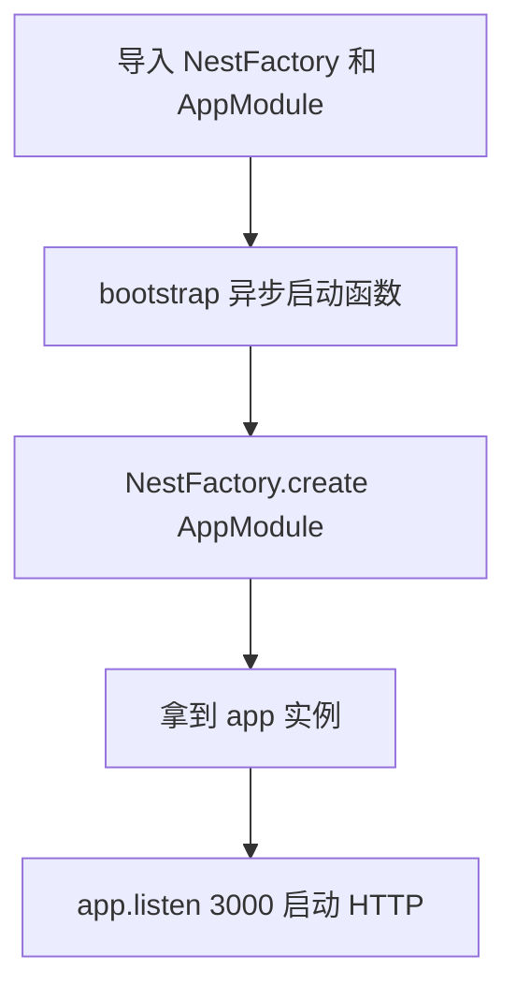
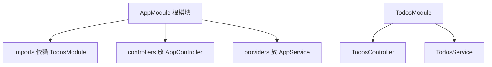
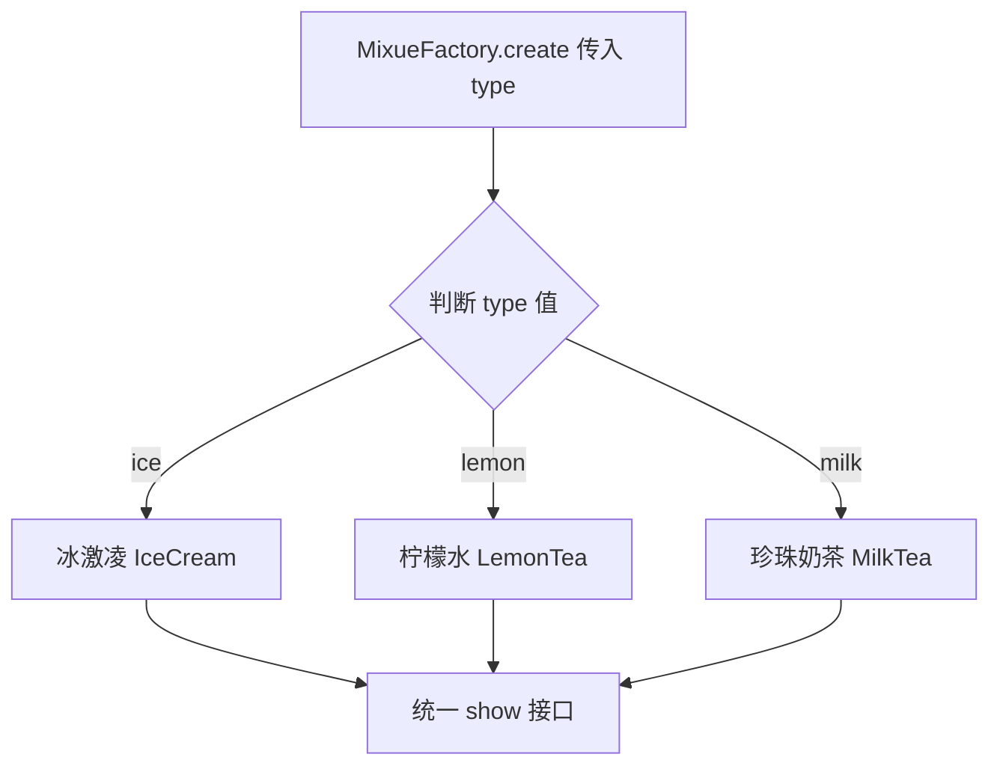
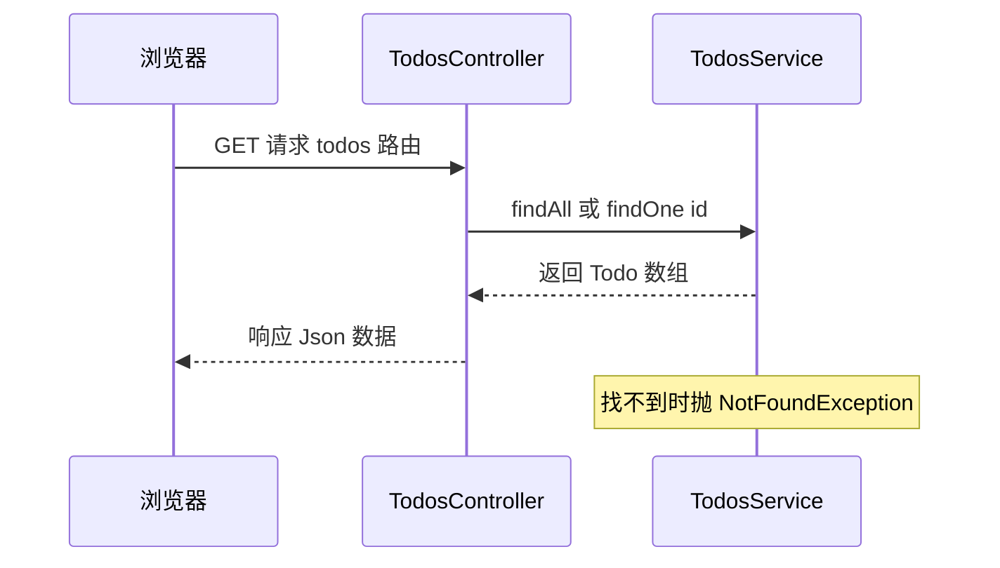

> 发布信息（填完掘金表单后可整段删除）
> 标题：从入口到 CRUD：用 NestJS 的模块化与装饰器思想读懂一个后端应用
> 备选：NestJS 入门核心：Module 装配、Controller 与 Service 分工、依赖注入一次讲透
> 标签：NestJS, Node.js, 后端开发, TypeScript, 设计模式
> 摘要：以 hello 脚手架和蜜雪冰城工厂 demo 为材料，讲清 NestFactory 入口、@Module 模块化装配、Controller 与 Service 分工、装饰器与依赖注入，再用 todos 模块串联完整 CRUD 与 NotFoundException 错误处理。

# 从入口到 CRUD：用 NestJS 的模块化与装饰器思想读懂一个后端应用

你之前用 Next.js 做全栈，前端后端一把梭；但如果只想写纯后端服务，Node 生态里有一个企业级框架叫 **NestJS**——它默认用 TypeScript，并把"全面模块化"当作核心思想。本文顺着一段学习材料（脚手架 `hello/` + 一个蜜雪冰城工厂 demo `factory-demo/`）把这层思想拆透：一个应用从 `NestFactory.create` 入口开始，怎么靠 `@Module` 把控制器和服务装配起来、怎么用装饰器和依赖注入把代码组织得清清楚楚，最后用一个 `todos` 模块把完整 CRUD 串联起来。阅读只需 JavaScript/TypeScript 基础和对"后端提供接口"的粗浅认识。读完你应该能说清：一次 `GET /todos` 请求，是怎么从路由一路走到业务数据的。

## 一、NestJS 是什么：Node 的纯后端企业级框架

先定位它。Next.js 是"前端为主、能写后端"的全栈框架；NestJS 反过来，是 **Node 上的纯后端企业级开发框架**，默认 TypeScript，强调全面模块化，适合构建稳定的企业服务。

那"后端"到底做哪些事？材料里列了三块，正好框定它的用途：

- **提供 Web API 接口**：这是最核心的，前端或别的系统来调你的接口拿数据。
- **系统集成**：并发、底层服务、AI Infra 这类偏基础设施的活。
- **微服务**：把大系统拆成多个小服务协作。

记住这个边界就够了：NestJS 不负责页面渲染，它产出的是"接口"和"服务"。

## 二、安装与启动项目

脚手架由官方 CLI 提供：

```bash
npm i -g @nestjs/cli   # 全局装 CLI
nest new hello         # 新建一个名为 hello 的项目
nest run start         # 启动（等价于 nest start，会跑 src/main.ts）
```

`nest new hello` 生成的就是 `hello/` 目录。它里面 `src/main.ts` 是入口、`src/app.module.ts` 是根模块，这俩是理解整个框架的抓手。

## 三、入口：main.ts 的启动逻辑

`src/main.ts` 是整个应用的起点，只有二十来行，但注释里把框架的几条核心思想都点到了：

```ts
// nestjs 按需加载 大型框架的性能优化、模块化的思考
import { NestFactory } from '@nestjs/core';
import { AppModule } from './app.module';

async function bootstrap() {
  // 实例化一个 后端nestjs 应用
  // 面向对象思想
  // 工厂模式
  // nest 可以开发的后端服务太多了，
  // / 首页 由 AppModule 来服务
  // Module是一个整体  后端最常见的MVC 模式
  // M Model 数据库抽象
  // C Controller 控制器
  // V View 视图层  html
  // 一个文件 几千行代码，
  // localhost:3000/   / 后端路由  -> 送到 AppModule
  // 组织控制器 controller , service 层 CRUD sql
  const app = await NestFactory.create(AppModule);
  // 启动web http 服务 3000
  await app.listen(process.env.PORT ?? 3000);
}
bootstrap();
```

三步读懂它：

1. `NestFactory.create(AppModule)` —— 用工厂的方式把**根模块 `AppModule`** 实例化成应用。`AppModule` 就是整个应用的"总装配中心"，首页请求也由它来服务。注释还特意点出：这是面向对象 + 工厂模式的体现，也是"模块化"的入口。
2. `app.listen(3000)` —— 在 3000 端口启动 HTTP 服务。`process.env.PORT ?? 3000` 表示有环境变量就用它、否则默认 3000。
3. 注释把 MVC 三字母摊开了：**M**odel（数据库抽象）、**C**ontroller（控制器）、**V**iew（视图层 html）。这是后端最常见的组织模式，后面会反复看到。

下面这张图把"入口做了什么"单独拎出来，避免和后面的模块结构混在一起：



## 四、高度模块化：@Module 把一切组装起来

NestJS 的"模块化"不是口头说说，而是由 `@Module` 装饰器落地的。看根模块 `src/app.module.ts`：

```ts
import { Module } from '@nestjs/common';
// 控制器 检测前端用户输入，一些控制逻辑
import { AppController } from './app.controller';
// 数据库业务， 一些复杂业务  CRUD service 层
import { AppService } from './app.service';
import { TodosModule } from './todos/todos.module';
// 复杂， 说明书 照着做
// 装饰器模式
// 快速的给类添加一些行为或方法，
// ts 支持
@Module({
  imports: [TodosModule], // 依赖外界？
  controllers: [AppController], // 控制器 校验，简单逻辑，
  providers: [AppService], // data service 复杂业务
})
export class AppModule { }
```

`@Module({ ... })` 是一个装饰器（详见第六节），它给空的 `AppModule` 类"贴上"了装配信息。三个数组是骨架：

- **imports**：本模块依赖的其他模块。这里引入了 `TodosModule`，表示应用要用到 todos 这个功能模块。
- **controllers**：本模块的控制器（负责接收请求、做校验和简单逻辑）。
- **providers**：本模块的"数据/业务"提供者（Service 层，负责复杂业务和返回数据）。

注释里还有一句关键的话——"控制器 检测前端用户输入，一些控制逻辑""数据库业务，一些复杂业务 CRUD service 层"。这正是一个模块的分工约定：**控制器管"入口和校验"，服务管"数据和业务"**。



这张图只回答一件事：根模块把哪些零件装进来了。注意 `TodosModule` 自己又带 `TodosController` 和 `TodosService`，模块是可以层层嵌套、各自封装的。

## 五、Controller 与 Service 分工 + MVC

光看装配还不够，得看控制器和服务各自长什么样。最小示例在 `app.controller.ts` 和 `app.service.ts`：

```ts
// app.controller.ts
import { Controller, Get } from '@nestjs/common';
import { AppService } from './app.service';

@Controller()
export class AppController {
  constructor(private readonly appService: AppService) { }

  @Get()
  getHello(): string {
    console.log('/ 的控制器');
    // 响应什么内容？交给service 层
    return this.appService.getHello();
  }
}
```

```ts
// app.service.ts
import { Injectable } from '@nestjs/common';

@Injectable()
export class AppService {
  // 给controller 层一个交代的
  getHello(): string {
    return 'Hello World!';
  }
}
```

这条调用链很典型：

1. 浏览器请求首页 `/`，NestJS 根据路由找到 `AppController`。
2. `@Get()` 装饰的方法 `getHello()` 被触发，它**不直接拼数据**，而是 `return this.appService.getHello()` —— 把"取数据"这件事交给 Service。
3. `AppService.getHello()` 返回字符串 `'Hello World!'`，再原路返回给浏览器。

这就是第四节说的分工：**Controller 只做"接收请求 + 简单校验 + 返回"，真正的数据/业务在 Service**。对应回 MVC：Controller = C（控制器），Service 提供的数据 = M（Model，这里的模型是简单的字符串，真实项目里是数据库记录），而 V（View，html 视图）在纯接口项目里通常不出现——NestJS 默认返回的是 JSON，不是页面。

## 六、装饰器模式：给类动态叠加行为

NestJS 把"装饰器模式"用到了极致。装饰器模式的核心是：**在不修改原有对象的前提下，动态给对象叠加额外功能**。语法上就是 `@` 加在某个类、方法或属性上方。

本文已经见过的装饰器：

- `@Module({...})` —— 给类贴上"我是一个模块，装配信息如下"。
- `@Controller()` / `@Controller('todos')` —— 标记"这是一个控制器"，括号里可写路由前缀。
- `@Get()` —— 标记"这个方法响应 GET 请求"。
- `@Injectable()` —— 标记"这个类可以被依赖注入"（下一节展开）。

`app.module.ts` 的注释原话点得很好——装饰器能"快速的给类添加一些行为或方法"，而且这是 TypeScript 支持的语法。换句话说，你写的类本身很朴素，装饰器像"说明书"一样告诉框架：你该被怎么对待、挂到哪条路由、能不能被注入。框架照着这份说明书把零件组装起来。

## 七、依赖注入：@Injectable + 构造函数

"控制器怎么拿到 Service？"答案不是手动 `new`，而是**依赖注入（DI）**。看 `AppController` 的构造函数：

```ts
constructor(private readonly appService: AppService) { }
```

就这么一行，`appService` 就被自动赋值好了，控制器里能直接用 `this.appService`。背后靠三件事配合：

1. Service 类上标了 `@Injectable()`（见第五节 `AppService`），声明"我可以被注入"。
2. 模块 `providers: [AppService]` 里把 `AppService` 注册成了提供者。
3. 框架在实例化 `AppController` 时，发现构造函数要一个 `AppService`，就自动把注册好的那个实例塞进来。

所以材料里那句"自动注入 controller 或任何用它的地方"就是这个意思——你只声明"我需要它"，框架负责把实例递给你，不用自己管理创建和传递。这既解耦又省心。

## 八、开发流程串起来：AppModule import 植入 Module

把上面几点拼成一条开发流程：

1. 写一个业务功能，就新建一个 Module 三件套：`xx.module.ts`（用 `@Module` 定义和组装）、`xx.controller.ts`（控制器）、`xx.service.ts`（带 `@Injectable` 的 provider）。
2. 在根模块 `AppModule` 的 `imports` 里植入这个 Module，框架就认识它了。
3. 控制器里用 `@Get()` 等装饰器挂路由，方法里把活儿交给 Service；Service 里写业务逻辑。
4. 全程靠装饰器把"类 → 模块 → 路由 → 可注入"串起来，这也是材料里说的"装饰器模式用到极致"。

`todos/` 模块就是这条流程的范本，下一节直接拿它当实战。

## 九、工厂模式：蜜雪冰城 demo

设计模式是面向接口的抽象编程，公认有 23 种，工厂模式是第一种也是最重要的一种。材料用一个蜜雪冰城类比讲透它：你想喝奶茶，不用自己动手做（那等于把"做奶茶"的流程代码写死在某处），而是找"工厂"——蜜雪冰城。

`factory-demo/1.mjs` 完整实现了这个思想：

```js
// 蜜雪冰城产品之一  冰激凌
// 企业， 很多的产品， 每一种产品都实现了想同的接口（方法），
// 一个企业这么多产品， 开发这怎么记得住？ 还有那么多工厂呢？
// 工厂模式来搞， 你不需要了解工厂里面那么多类的实现细节，
// 只要直接和工厂类打交道就好了
class IceCream {
  constructor() {
    this.name = '冰激凌'
    this.price = 3;
  }
  show() {
    console.log(`${this.name} ${this.price}元`)
  }
}

class LemonTea {
  constructor() {
    this.name = '柠檬水'
    this.price = 4
  }
  show() {
    console.log(`${this.name}, ${this.price}元`)
  }
}

class MilkTea {
  constructor() {
    this.name = '珍珠奶茶';
    this.price = 8;
  }
  show() {
    console.log(`${this.name}, ${this.price}元`)
  }
}

// 工厂类
class MixueFactory {
  static create(type) {
    switch (type) {
      case 'ice':
        return new IceCream()
      case 'lemon':
        return new LemonTea()
      case 'milk':
        return new MilkTea()
    }
  }
}
// 管理并返回冰激凌这个类
const drink1 = MixueFactory.create('ice');
drink1.show();
const drink2 = MixueFactory.create('lemon');
drink2.show();
```

关键点拆解：

- **每种产品都实现相同的 `show` 接口**：`IceCream`、`LemonTea`、`MilkTea` 各有 `show()`，调用方式一致。
- **工厂类 `MixueFactory` 用 `static create(type)` + `switch` 分发**：你只传一个类型字符串，工厂内部决定 `new` 哪个具体类。
- **调用方完全不关心内部细节**：注释说得很直白——"你不需要了解工厂里面那么多类的实现细节，只要直接和工厂类打交道就好了"。开发者只写 `MixueFactory.create('ice')` 就能拿到一个能 `.show()` 的对象，产品和工厂之间解耦。



图里要表达的就是：一个 `create` 入口，按类型分发到不同产品，但**出来的东西都长着同一张 `show` 脸**，所以可以放心统一调用。

现在回扣入口——材料原话 "NestFactory 蜜雪冰城 满足做 App 的需要"。`NestFactory.create(AppModule)` 和 `MixueFactory.create(type)` 是同一套思想：**你告诉工厂"我要什么样的应用/产品"，工厂内部负责把复杂对象的组装细节藏起来，返回一个可以直接用的实例**。理解了蜜雪冰城，就看懂了 `NestFactory`。

## 十、异常处理与标准化错误：NotFoundException

后端业务讲究严谨和稳定，出错不能裸奔。NestJS 内置了一批错误类，用来**标准化错误输出**——统一带 `statusCode`（状态码）和 `message`（消息），而不是随便抛个字符串。

最常见的就是 `NotFoundException`（404 找不到）。它真正用在 `todos` 模块的 Service 里（见下一节），当按 id 查不到数据时抛出：

```ts
throw new NotFoundException(`Todo ${id} 不存在`)
```

框架会把它转成一个规范的 HTTP 404 响应。学习材料里也专门留了一道思考题：后端怎么处理报错？答案的方向就是——用框架提供的错误类（如 `NotFoundException`）+ 标准化的状态码和消息，配合 `try/catch` 做容错，而不是让线程直接挂掉。

## 十一、实战：todos 模块的完整 CRUD

`todos/` 模块把前面所有概念（Module 装配、Controller/Service 分工、装饰器、依赖注入、异常处理）真正落了地，还是一个能跑的迷你 CRUD。先看模块装配和服务：

```ts
// todos/Todos.module.ts
import { Module } from '@nestjs/common';
import { TodosController } from './Todos.controller';
import { TodosService } from './Todos.service';

@Module({
  controllers: [TodosController],
  providers: [TodosService],
})
export class TodosModule {}
```

```ts
// todos/Todos.service.ts
import { Injectable, NotFoundException } from '@nestjs/common'

export interface Todo {
  id: number;
  title: string;
  complete: boolean;
}
let todos: Todo[] = [
  { id: 1, title: '学习 NestJS', complete: false },
  { id: 2, title: '学习 CRUD', complete: true },
]

let nextId = 3;

@Injectable()
export class TodosService {
  findAll(): Todo[] {
    return todos
  }
  findOne(id: number): Todo {
    const todo = todos.find(t => t.id === id);
    // 后端业务严谨稳定  容错模块
    if (!todo) throw new NotFoundException(`Todo ${id} 不存在`)
    return todo;
  }
  create(title: string): Todo {
    const todo: Todo = { id: nextId++, title, complete: false };
    todos.push(todo);
    return todo
  }

  remove(id: number): void {
    // index
    const index = todos.findIndex(t => t.id === id);
    if (index === -1) throw new NotFoundException(`Todo ${id}不存在`)
    todos.splice(index, 1);
  }

  update(id: number, patch: Partial<Todo>): Todo {
    const todo = this.findOne(id);
    Object.assign(todo, patch);
    return todo;
  }
}
```

对照知识点读：

- **`@Injectable()`**：注释明确写了"可以被自动注入"，所以 `TodosController` 能靠构造函数拿到它。
- **`interface Todo` + 内存数组 `todos`**：用接口约束数据结构；数据先存在内存数组里（真实项目会换成数据库，见待补充）。
- **五个方法覆盖 CRUD**：
  - `findAll()` —— 查全部（Read 列表）；
  - `findOne(id)` —— 查单个（Read 详情），查不到就抛 `NotFoundException`，正是第十节的容错实战；
  - `create(title)` —— 新增（Create），用 `nextId++` 自增主键；
  - `remove(id)` —— 删除（Delete），先 `findIndex` 再 `splice`，找不到同样抛错；
  - `update(id, patch)` —— 改（Update），先 `findOne` 找到，再 `Object.assign` 局部覆盖（`Partial<Todo>` 表示只改部分字段）。

控制器 `todos/Todos.controller.ts` 负责把路由挂上来：

```ts
import { Controller, Get } from '@nestjs/common';
import { TodosService } from './Todos.service';
import { type Todo } from './Todos.service';

@Controller('todos')
export class TodosController {
  constructor(private readonly todosService: TodosService) { }
  @Get()
  findAll(): Todo[] {
    // /todos
    console.log('/todos controller');
    // 怎么找到service? import  new 实例化
    return this.todosService.findAll();
  }
}
```

`@Controller('todos')` 让这个控制器的路由前缀是 `todos`，`@Get()` 挂在 `/todos` 上；方法里同样只做"转发"，把活儿交给 `todosService.findAll()`。注意注释里那句"怎么找到 service？import new 实例化"——其实框架靠的就是第七节讲过的依赖注入，不是手写 `new`。

把一次请求完整画出来，正好串起入口、模块、控制器、服务、异常五层：



这张时序图只回答一个问题：一个请求从浏览器进来，怎么经过 Controller 再到 Service、最后带着数据或错误回去。

## 小结

| 概念 | 定义 | 关键代码 / 装饰器 |
|---|---|---|
| 框架定位 | Node 纯后端企业级框架，默认 TS，模块化 | `nest new hello` |
| 入口 | 工厂方式创建根模块并监听端口 | `NestFactory.create(AppModule)` + `listen(3000)` |
| 模块化 | `@Module` 三数组装配零件 | `imports / controllers / providers` |
| C/S 分工 | 控制器管入口校验，服务管数据业务 | `AppController` → `AppService` |
| MVC | 模型 / 控制器 / 视图 | M 数据、C 控制器、V 视图（接口项目常省 V） |
| 装饰器 | 不改类动态叠加行为 | `@Module` `@Controller` `@Get` `@Injectable` |
| 依赖注入 | 构造函数声明依赖，框架自动注入 | `constructor(private svc: XService)` |
| 工厂模式 | 统一入口按类型造对象，隐藏细节 | `MixueFactory.create(type)` + `switch` |
| 异常处理 | 内置错误类标准化输出 | `throw new NotFoundException(...)` |
| CRUD 实战 | todos 模块落地全套思想 | `findAll/findOne/create/remove/update` |

## 易错点与待补充学习

- **MVC 的 V（视图层 html）和完整 Model（数据库）未实现**：脚手架与 todos 模块都用内存数组、返回 JSON，没有真实数据库和 html 视图；接数据库（TypeORM/Prisma）属于待补充。
- **参数校验未演示**：材料说 controller 负责"参数校验"，但本例 `@Get()` 无参数、没有 Pipe/DTO，校验写法待补充。
- **工厂 `switch` 没有 `default` 分支**：传入未知 `type` 时 `MixueFactory.create` 会返回 `undefined`，真实项目应兜底或抛错。
- **错误处理只演示了 `NotFoundException`**：其他错误类、`try/catch` 全局异常过滤器、状态码自定义等未展开，待补充。
- **微服务 / 并发 / AI Infra 仅列方向**：材料把它们列为后端范畴，但代码未涉及，属于进阶待补充。
- **`nest start --watch` 开发热重载、单元测试（`*.spec.ts`）、`eslint --fix`** 等工程化能力在 `package.json` 里已配好，本文未逐一展开。

## 自测清单

读完应能独立回答：

1. 一个 NestJS 应用从 `NestFactory.create` 到 `listen`，中间"根模块"扮演了什么角色？
2. `@Module` 的 `imports / controllers / providers` 三个数组分别装什么？
3. Controller 和 Service 怎么分工？为什么 Controller 不直接返回数据？
4. 依赖注入靠哪三件事（`@Injectable` / `providers` / 构造函数）配合完成？
5. 蜜雪冰城 `MixueFactory.create` 和 `NestFactory.create` 为什么是同一思想？
6. 给 `todos` 模块加一个 `PATCH /todos/:id` 更新接口，需要改哪几个文件、各加什么？

---

**全链路回顾**：`NestFactory.create(AppModule)` 启动应用并监听 3000 → 根模块 `@Module` 把 `AppController`、`AppService`、`TodosModule` 装配进来 → 请求打到 `@Controller('todos')` 的 `@Get()` → 控制器把活儿交给被注入的 `TodosService` → Service 在内存数组上做 CRUD，查不到就抛 `NotFoundException` → 响应以 JSON 形式回到浏览器。入口、模块、装饰器、依赖注入、工厂模式、异常处理，这一圈就串完了。
