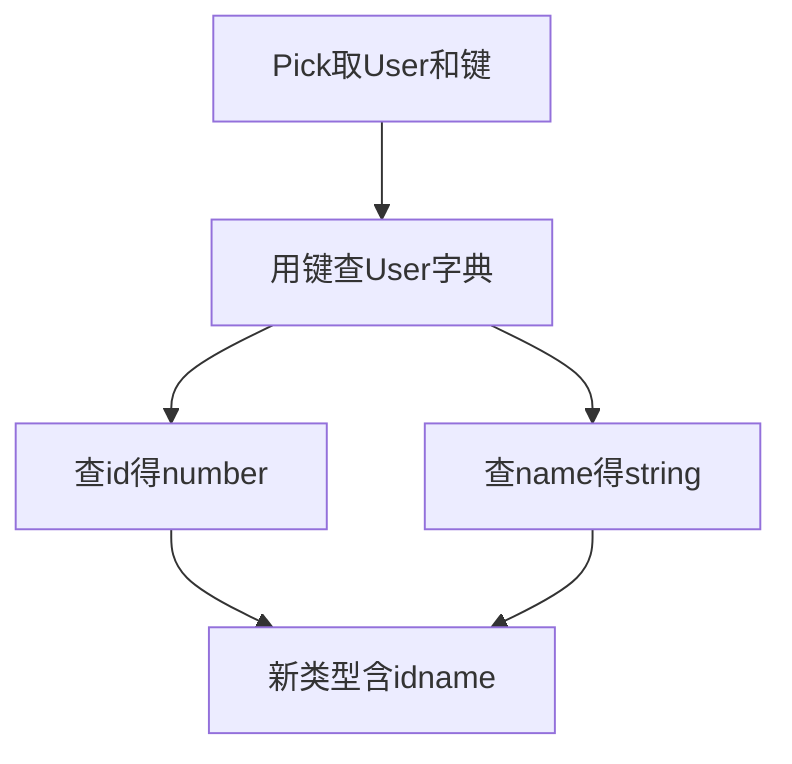
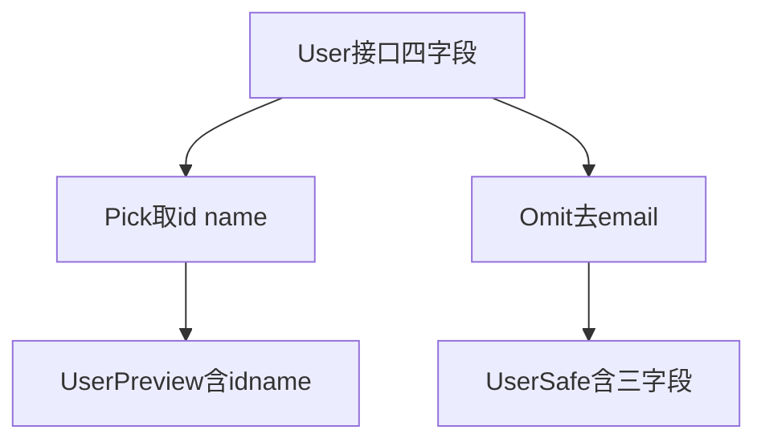
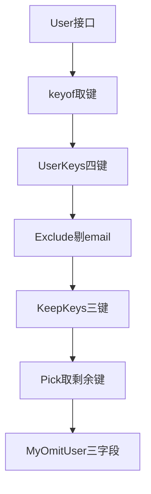
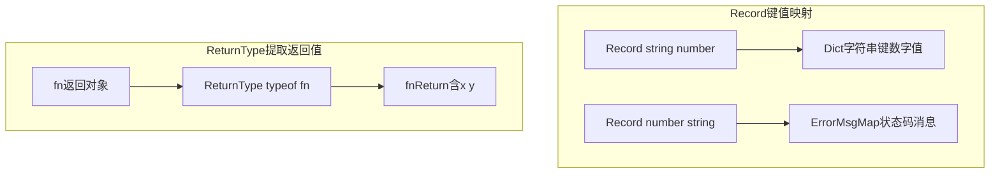

> 发布信息（填完掘金表单后可整段删除）
> 标题：TypeScript 工具类型怎么选：Pick、Omit、Partial、Record 区别与 Omit 的内部等价实现
> 标签：TypeScript, 类型系统, 前端工程化, 工具类型
> 摘要：用一个贯穿到底的 User 接口讲清 Pick/Omit/Partial/Record 区别，以及 Omit 等价于 Pick 加 Exclude 加 keyof 的内部推导链路。

# TypeScript 工具类型怎么选：Pick、Omit、Partial、Record 区别与 Omit 的内部等价实现

你写过一个 `User` 接口吧：有 `id`、`name`、`age`、`email`。但真实项目里，同一份用户数据在不同地方要的字段根本不一样——列表卡片只要 `id + name`，返回给前端得去掉敏感的 `email`，做部分更新时又只想传要改的那几个字段。难道每个场景都手写一遍类型？

我在学 TypeScript 类型系统时，也卡在这个问题上。好消息是 TS 内置了一组"工具类型"，能基于已有的 `User` 直接派生出新类型，不用重写。本文要回答的核心问题就是：**怎么用 Pick、Omit、Partial、Record、keyof、Exclude、ReturnType 这组工具，从一份 `User` 派生出刚好够用的新类型，并且真正理解它们各自在"改什么、为什么这么改"。**

我们会用一个贯穿到底的 `User` 接口，先讲清每个工具单独做什么，再重点拆开 `Omit` 背后的等价实现链路（它其实是 Pick + Exclude + keyof 拼出来的）。阅读本文需要你了解 TypeScript 里用 `interface` 定义类型的基本写法。

## 一、为什么需要工具类型：从同一个 User 说起

先定下贯穿全文的素材：

```ts
interface User {
  id: number;
  name: string;
  age: number;
  email: string;
}
```

真实项目里，同一个 `User` 数据在不同场景需要的字段并不一样：

- 用户列表项（卡片）往往只需要 `id` + `name`，不必把 `age`、`email` 全带上；
- 把用户信息返回给前端时，可能要**去掉敏感字段** `email`；
- 做**部分更新（PATCH）**时，调用方只想传要改的那几个字段，其余不动。

如果每个场景都手写一遍类型，既重复又难维护。工具类型的价值就在这里：**基于已有类型，快速派生出新类型**，不用重新声明。下面每一个工具类型，都是围绕这个 `User` 做"派生"的一种原语。

## 二、keyof：一切的起点（对象类型 → 联合类型）

```ts
type UserKeys = keyof User;  // "id" | "name" | "age" | "email"
```

`keyof T` 的作用是：**把"对象类型的所有键名"提取成一个联合类型**。

- 输入是类型 `User`，输出是联合 `"id" | "name" | "age" | "email"`。
- 这一步完成了一次"降维"：把**对象结构**变成了**键名的联合**。后面 `Pick`、`Omit`、`Exclude` 都要先拿到这个联合才能工作，所以 `keyof` 是整条工具类型链路的原料。
- 注意：`keyof` 作用在**类型**上（这里 `User` 是接口类型），结果是"键名的联合"，不是某个运行期的值。

记住这一句：`keyof` = 对象类型 ⇒ 联合类型。后面会反复用到这个转换方向。

## 三、Pick<T, K>：点名要哪几个字段，组成精简版新类型

```ts
type UserPreview = Pick<User, 'id' | 'name'>;
const u: UserPreview = {
  id: 1,
  name: '祖豪',
}
```

实际项目里，同一个 `User` 会在很多地方被"消费"：用户列表卡片往往只需要 `id + name`。与其到处手写 `{ id: number; ... }` 的精简类型，不如直接从 `User` 派生。`Pick` 就是干这个的：你点名要哪几个字段，它就把这些字段原样取出来，组成一份"精简版新类型"。

这里有个最容易被忽略、也最值得想透的点：**`Pick<User, 'id' | 'name'>` 凭什么知道 `id` 是 number、`name` 是 string？** 毕竟你只给了它键名 `'id'`、`'name'`，压根没给任何类型信息。

答案是：类型信息一直住在 `User` 里。`Pick` 同时拿到两样东西——完整的 `User` 类型，和你点名的键名。它内部干的事其实就是"查字典"：拿着键名去 `User` 里按 `User[键名]` 取值——`User["id"]` 查到 `number`，`User["name"]` 查到 `string`。**键名只是钥匙，真正的类型在 `User` 里。** 记牢这个"查字典"的模型，后面理解 `Omit` 的等价实现会非常顺。



这张图就是上面的"查字典"过程：Pick 拿着键名去 User 里查，每查一个键就得到它的类型，最后拼成新类型。

两个细节：
- `K` 必须是 `keyof User` 的子集，写个不存在的键编译器会报错。
- 被选出的字段仍然是必填的，`UserPreview` 必须同时有 `id` 和 `name`，少一个都不行。

一句话：**Pick = "只要这些字段"**，且要的字段都得给齐。

## 四、Omit<T, K>：黑名单，去掉不要的字段

```ts
type UserSafe = Omit<User, 'email'>;

const safeUser: UserSafe = {
  id: 2,
  name: '戴',
  age: 30,
}
```

`Omit<User, K>` 从 `User` 中"排除"列出的键（第二个参数 `K` 是**要删除的键的联合**），生成"剩下字段"的新类型，剩余字段**依旧是 required**。

适用场景：你几乎要全部字段，**只差一两个不要**。源码里的例子就是去掉 `email`——把用户数据对外暴露时，去掉敏感邮箱字段，得到 `UserSafe`。

注意 `UserSafe` 里 `id / name / age` 仍是必填，和手写 `{ id: number; name: string; age: number }` 等价，只是写法更短、且和 `User` 保持联动（改了 `User` 的字段，`UserSafe` 自动跟着变）。

一句话总结 `Omit`：**"除了这些，其它都要"**。

## 五、Pick 与 Omit 的核心区别（重点对比）

这是第一组最该分清的区别，也是面试高频题。

**相同点**：
- 都基于一个已有**对象类型** `T` 派生出新类型；
- 结果里**剩余的字段都是 required**（这一点两者完全一致，区别只在"选哪些"）。

**相反点（核心）**：

| 维度 | Pick<T, K> | Omit<T, K> |
| --- | --- | --- |
| 名单性质 | 白名单（列**要保留**的键） | 黑名单（列**要删除**的键） |
| 第二个参数 K 的含义 | K = 保留的键 | K = 删除的键 |
| 直觉读法 | "只要这些" | "除了这些都要" |
| 典型用法 | 保留的少（取 2/4 字段） | 删除的少（去掉 1/4 字段） |

**怎么选**：看"列出来的键"哪个更短。
- 从 4 个字段里取 `id` + `name`：`Pick<User, 'id' | 'name'>` 比 `Omit<User, 'age' | 'email'>` 更直观（白名单短）。
- 只去掉一个 `email`：`Omit<User, 'email'>` 比 `Pick<User, 'id' | 'name' | 'age'>` 更短（黑名单短）。

本质上 `Pick` 和 `Omit` 是**互补**的：对同一个 `User`，`Pick<'id' | 'name'>` 和 `Omit<'age' | 'email'>` 得到的是同一个形状，只是"描述方式"相反。用哪一个是"哪个写法更省、更贴合语义"的问题。

下面把两者的"派生方向相反"画出来：



图里能直接看到：同一个 `User`，`Pick` 从白名单方向取、`Omit` 从黑名单方向减，最终都能拿到想要的字段组合。

## 六、Partial<T>：所有字段变可选（PATCH 场景）

```ts
type PartialUser = Partial<User>;
const patchUser: PartialUser = {
  name: '明明',
  age: 18
}
const emptyObj: PartialUser = {};
```

"变成可选"具体是啥？就是给 `User` 的每一个字段都加一个 `?`。`PartialUser` 等价于你手写：

```ts
type PartialUser = {
  id?: number;
  name?: string;
  age?: number;
  email?: string;
}
```

那个 `?` 带来两层意思：这个字段**可以写，也可以不写**；而且它的类型**隐含了 `undefined`**（你不传它，它的值就是 `undefined`）。所以 `patchUser` 只传 `name` 和 `age` 合法，`emptyObj` 一个都不传也合法。源码注释点得很准——"patch 修改 对象属性很多"：做部分更新时调用方只想传要改的字段，没传的保持原值，后端 PATCH 接口就是典型场景。

**与 Pick / Omit 的关键区别（第二组重点）**：
- `Pick` / `Omit` **保留剩余字段的 required 语义**——`UserPreview` 必须同时有 `id` 和 `name`，少一个都不行。
- `Partial` **不筛选字段，只放开必填**——`PartialUser` 可以是任意字段组合，包括空对象。

所以三者的定位是分层的：`Pick`/`Omit` 决定"有哪些字段且必填"，`Partial` 决定"所有字段都可选"。当你需要"只更新部分字段"时，`Partial` 才是正确答案，而不是 `Pick`（因为 `Pick` 强制你要的字段必填，和"部分更新"语义不符）。

## 七、Partial 与 Pick / Omit 三者对比

把第三组区别一并收掉：

| 工具类型 | 字段范围 | 剩余字段必填？ | 典型场景 |
| --- | --- | --- | --- |
| `Pick<T, K>` | 固定子集（白名单） | 必填 | 列表预览（只要 id+name） |
| `Omit<T, K>` | 固定子集（排除式） | 必填 | 去敏感字段（去掉 email） |
| `Partial<T>` | 全部字段 | 全部可选（隐含 undefined） | 部分更新（PATCH，只传要改的） |

一句话记忆：**预览用 Pick，脱敏用 Omit，更新用 Partial。**

## 八、Omit 的内部等价实现：Pick + Exclude + keyof（最关键的链路）

接下来是最值钱的一条结论。源码 `2.ts` 和笔记都点出：

> `Omit<T, K>` 等价于 `Pick<T, Exclude<keyof T, K>>`

也就是说，`Omit` 并不是什么黑魔法，它只是站在另外三个原语肩膀上的封装。我们用 `2.ts` 逐行走一遍：

```ts
interface User {
  id: number;
  name: string;
  age: number;
  email: string;
}

type UserKeys = keyof User;                       // 第1步：拿到所有键
type KeepKeys = Exclude<UserKeys, 'email'>;       // 第2步：从联合里删掉 email
type MyOmitUser = Pick<User, KeepKeys>;           // 第3步：挑出剩下的键
```

**逐步拆解**：
1. `keyof User` → `"id" | "name" | "age" | "email"`（所有键的联合，见第二节）。
2. `Exclude<UserKeys, 'email'>` → `"id" | "name" | "age"`（从联合里把 `'email'` 剔除，剩下要保留的键）。
3. `Pick<User, KeepKeys>` → 一个含 `id / name / age` 的类型（用剩下的键去 `User` 里挑字段）。

注意第 3 步那个 `KeepKeys`，**它看着只是一堆键名 `"id" | "name" | "age"`，没有任何类型信息**。那 `Pick` 又凭什么知道 `id` 是 number？答案正是第三节讲的"查字典"：键名是钥匙，类型一直住在 `User` 里，`Pick` 拿着 `KeepKeys` 去 `User` 里查 `User["id"]`、`User["name"]`、`User["age"]`，类型自然就回来了。所以 `MyOmitUser` 和 `Omit<User, 'email'>` 完全等价。理解这层，你就从"会用 Omit"升级到"知道 Omit 怎么来的"。

这张图把这条内部链路单独画清楚：



图里 `KeepKeys 三键` 这一步只有键名，但箭头继续走到 `Pick` 时，类型就通过"查字典"补回来了——这正是 `Omit` 等价实现的精髓。

## 九、Exclude<U, X>：联合类型层面的"删除"（与 Omit 的区别）

```ts
type All = "id" | "name" | "age" | "email"
type AfterExclude = Exclude<All, "email">;  // "id" | "name" | "age"
```

`"id" | "name" | "age" | "email"` 这种写法叫**联合类型**——意思是"只能选这几个值之一"。`Exclude` 就是从一个联合里把某些成员剔除，返回剩下的。上面把 `"email"` 从四个字面量的联合里删掉，得到三个。

它内部是怎么删的？`Exclude` 本质是个条件类型 `T extends U ? never : T`：拿每个成员去和要删的目标比，命中的（比如 `"email"`）变成 `never`；而 `never` 在联合类型里会自动"蒸发"掉。所以 `"id" | "name" | "age" | "email"` 去掉 `"email"` 之后，剩下的就是 `"id" | "name" | "age"`。

**与 Omit 的核心区别（第三组重点，也是最容易混的）**：笔记里一句话点破——**"Exclude 处理联合类型，Omit 处理对象接口"**。它们是**不同层级**的工具：
- `Exclude` 的输入和输出都是**联合类型**（字面量联合），做的是"从联合里剔除成员"。它**不认识对象结构**，只认联合。
- `Omit` 的输入是**对象类型**、输出也是**对象类型**，它内部**借用** `Exclude` 去处理 `keyof` 产生的那个联合（见第八节链路）。

所以关系链条是：`Omit` 站在对象层，它先把对象 `keyof` 成联合，再让 `Exclude` 在联合层删键，最后 `Pick` 把联合升回对象层。`Exclude` 是更底层的"联合运算器"，`Omit` 是建立在它之上的"对象封装器"。

一句话：**Exclude 在"联合"层面工作，Omit 在"对象"层面工作，Omit 是站在 Exclude 肩膀上的封装。**

## 十、keyof 与 Exclude 的关系：对象类型 ↔ 联合类型的桥梁

把第八、九节串起来看，`keyof` 和 `Exclude` 正好构成一座桥：

- `keyof`：把**对象类型"降"成联合**（提取键名）；
- `Exclude`：在**联合上做减法**（剔除成员）；
- `Pick`：把**联合"升"回对象类型**（按剩下的键挑字段）。

三者连成一条完整的"对象 ⇒ 联合 ⇒ 对象"转换链。这正是 `Omit` 等价实现的底层逻辑——你不必死记 `Omit`，只要理解这座桥，就能现场推导出 `Omit` 长什么样。

## 十一、Record<K, V>：快速造"键值映射"类型

```ts
// json key:value Record<键类型, 值类型>
type Dict = Record<string, number>;
const obj: Dict = { a: 1, b: 2 };

type ErrorMsgMap = Record<number, string>;  // http status code
const errorMessage: ErrorMsgMap = {
  400: '请求参数错误',
  401: '未登录，请重新登录',
  403: '权限不足, 禁止访问',
  404: "资源找不到",
  500: "服务器内部错误"
}

function getErrMsg(code: number): string {
  return errorMessage[code] ?? "未知错误"
}
```

`Record<K, V>` 生成一个"键类型为 `K`、值类型为 `V`"的对象类型。
- `Record<string, number>` = `{ [key: string]: number }`（任意字符串键、数字值），即一个字典。
- `Record<number, string>` = `{ [code: number]: string }`（数字键、字符串值），源码用它映射 HTTP 状态码到提示语，再用 `?? "未知错误"` 兜底未知码。

适用场景：当你需要一个"键类型固定、值类型固定"的映射对象时，`Record` 比手写 index signature 更直观。注释里列出的 HTTP 状态码分类（1XX 执行中 / 2XX 成功 / 3XX 要跳转 / 4XX 用户错误 / 5XX 服务器端错误）正是它的典型用途——把"状态码 ⇒ 含义"登记成一张表。

**与 keyof 的区别**：`keyof` 是"从已有对象**提取**键联合"；`Record` 是"凭空**构造**一个映射对象类型"。两者方向相反：一个提取，一个制造。

## 十二、ReturnType<F>：把函数的返回值类型"抽"出来

```ts
function fn() { return { x: 1, y: 2 } };
type fnReturn = ReturnType<typeof fn>;
```

`ReturnType<typeof fn>` 是两层套起来的：
1. `typeof fn` 先把"函数 `fn`"变成"函数类型"；
2. `ReturnType<...>` 再从这个函数类型里，抽出它的"返回值类型"。

合起来，`fnReturn` 就是 `{ x: number; y: number }`。

这里有几个特别容易绕的点，我当初也是踩过才想明白的。

**第一，返回的是"类型"不是"值"。** 我第一次看到这行代码时，本能地以为 `fnReturn` 会是 `{ x: 1, y: 2 }`——毕竟 `fn` 明明返回的就是这个值。后来在编辑器里悬停一看，`fnReturn` 显示的是 `{ x: number; y: number }`。原因很简单：`{ x: 1, y: 2 }` 是**值**，而 `fnReturn` 要的是**类型**。类型描述的是"类别"，不写死具体数字，所以那个字面量 `1` 被 TypeScript 自动"放宽"成了 `number`。值 ≠ 类型，这是理解这一节的钥匙。

**第二，`typeof fn` 不是把函数"变成"专属类型。** 不是说 `typeof` 在现场施展了什么魔法。事实上，TypeScript 在你**定义 `fn` 的那一刻**，就已经自动推断出了它的类型（包括返回值类型）。`typeof fn` 只是把这个**已经推断好的类型引用出来**而已，不是它现场变出来的。

**第三，`ReturnType` 自己是个"转换器"。** 它本质是个条件类型，底层用 `infer` 关键字把函数箭头右边的返回值类型"抓"出来。你可以把它理解成一个专门的机器：输入"函数类型"，输出"返回值类型"。所以它**只能吃函数，不能吃别的**——你传个普通对象或数字进去，编译器会直接报错。

适用场景：不想重复写函数的返回结构，尤其当返回类型复杂或会变动时，用 `ReturnType` 让它自动跟随函数实现，改了 `fn` 的返回，`fnReturn` 自动同步。

**与前几个工具的区别**：前面 `keyof / Pick / Omit / Partial / Record / Exclude` 大多围绕"对象 / 联合"做变换；`ReturnType` 围绕"函数"工作，提取它的**产物（返回值）**。它操作的对象层级又不一样——是函数类型，不是对象类型也不是联合类型。

下面把 `Record` 和 `ReturnType` 各自放在自己的层级里：



## 小结

| 概念 | 一句话解释 | 关键代码 |
| --- | --- | --- |
| `keyof T` | 把对象的所有键名提取成联合类型 | `keyof User` |
| `Pick<T, K>` | 点名要的字段，从 User 查字典得到类型，组成精简新类型 | `Pick<User, 'id' \| 'name'>` |
| `Omit<T, K>` | 去掉不要的字段，其余保留且必填 | `Omit<User, 'email'>` |
| `Partial<T>` | 所有字段加 `?`（可写可不写 + 隐含 undefined） | `Partial<User>` |
| `Exclude<U, X>` | 从联合里删成员，命中的变 never 后蒸发 | `Exclude<All, 'email'>` |
| `Record<K, V>` | 构造"键类型 K、值类型 V"的映射对象 | `Record<string, number>` |
| `ReturnType<F>` | 两层套取：typeof 取函数类型，再抽返回值类型 | `ReturnType<typeof fn>` |

核心等价关系（务必记住）：`Omit<T, K> = Pick<T, Exclude<keyof T, K>>`，而 `Pick` 拿到键名后会去原类型里"查字典"补齐类型。

## 易错点与待补充学习

- **`Pick` 的第二个参数必须是 `keyof T` 的子集**：写 `User` 上不存在的键会编译报错。源码未演示错误情况，属待补充（可补：故意写错键得到的报错信息）。
- **`Partial` 的 `?` 隐含 undefined**：若你需要"部分字段可选、其余仍必填"（如 `id` 必填但 `name` 可选），`Partial` 做不到，需要更细的映射类型或 `Pick` + `Partial` 组合。映射类型（Mapped Types）手写自定义工具类型（如自己实现 `MyPick`/`MyOmit`）是理解这些内置类型的更底层能力，属待补充。
- **`Exclude` 与 `Omit` 不在同一层**：`Exclude` 处理联合、`Omit` 处理对象，别把两者混用——想删对象字段用 `Omit`，想删联合成员用 `Exclude`。
- **`ReturnType` 只能吃函数类型**：传普通值会报错；它抽的是"类型"而非"值"，结果里字面量会被放宽成对应基础类型（如 `1` 变 `number`）。
- **工具类型远不止这七个**：还有 `Readonly`、`Required`、`Extract`、`NonNullable`、`Parameters`、`InstanceType`、`Awaited` 等未覆盖，属待补充。
- **`readme0818.md` 里还有一段 Docker / mysql 笔记**（本地装 mysql、docker pull/run/exec 等），与本文 TS 工具类型主题无关，未纳入正文，属其他主题，待补充。

## 自测清单

- 不看代码，能说出 `Pick` 与 `Omit` 的核心区别（白名单 vs 黑名单，且 K 含义相反）。
- 能解释 `Pick` 怎么知道每个键的类型——键名是钥匙，去原类型 `User[键名]` 查字典。
- 能默写出 `Omit<T, K> = Pick<T, Exclude<keyof T, K>>`，并解释 `keyof` / `Exclude` / `Pick` 各做了什么。
- 能解释 `Partial` 的 `?` 带来哪两层含义（可写可不写 + 隐含 undefined）。
- 能区分 `Exclude`（联合层面）和 `Omit`（对象层面）的工作层级。
- 能解释为什么 `ReturnType<typeof fn>` 得到 `{ x: number; y: number }` 而不是 `{ x: 1, y: 2 }`（值 ≠ 类型，字面量被放宽）。
- 能说清 `ReturnType<typeof fn>` 里 `typeof` 的作用：引用已推断好的函数类型，而非现场变出类型。
- 能说清 `Record<string, number>` 与手写 `{ [k: string]: number }` 是同一回事。

## 结语：一条 User 接口串起七个工具类型

从最初的 `User` 接口出发，我们派生出了七种工具类型，但它们不是散的，而是分成三层在协作：

- **对象层**：`Pick`（挑）、`Omit`（删）、`Partial`（全可选）、`Record`（造映射）；
- **联合层**：`Exclude`（删联合成员），由 `keyof` 从对象"降"下来喂给它；
- **函数层**：`ReturnType`（取函数产物）。

而把它们真正串成一条链的，是 `keyof ⇒ Exclude ⇒ Pick` 这座桥——`Omit` 不过是把这座桥封装成了一个名字；而 `Pick` 之所以能凭一堆键名还原出完整类型，靠的是"去原类型查字典"这一个核心机制，键名是钥匙，类型一直住在原类型里。

写完这篇复习，我对工具类型的理解是：它们不是孤立的语法糖，而是"基于已有类型做派生"的一套原语。理解每个工具的**改动方向**（挑 / 删 / 放宽 / 构造 / 抽返回值）和它所在的**层级**（对象 / 联合 / 函数），你不仅会用这七个工具类型，还能在面对陌生的类型变换需求时，自己现场"拼"出需要的工具类型。这，就是类型系统复用能力的起点。
