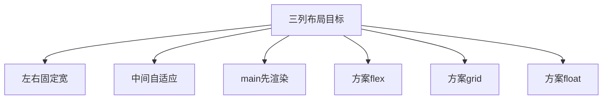
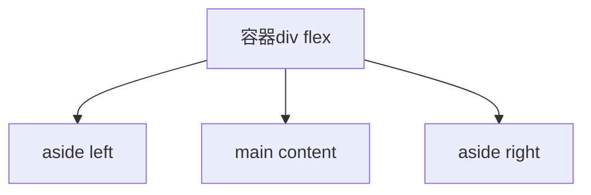
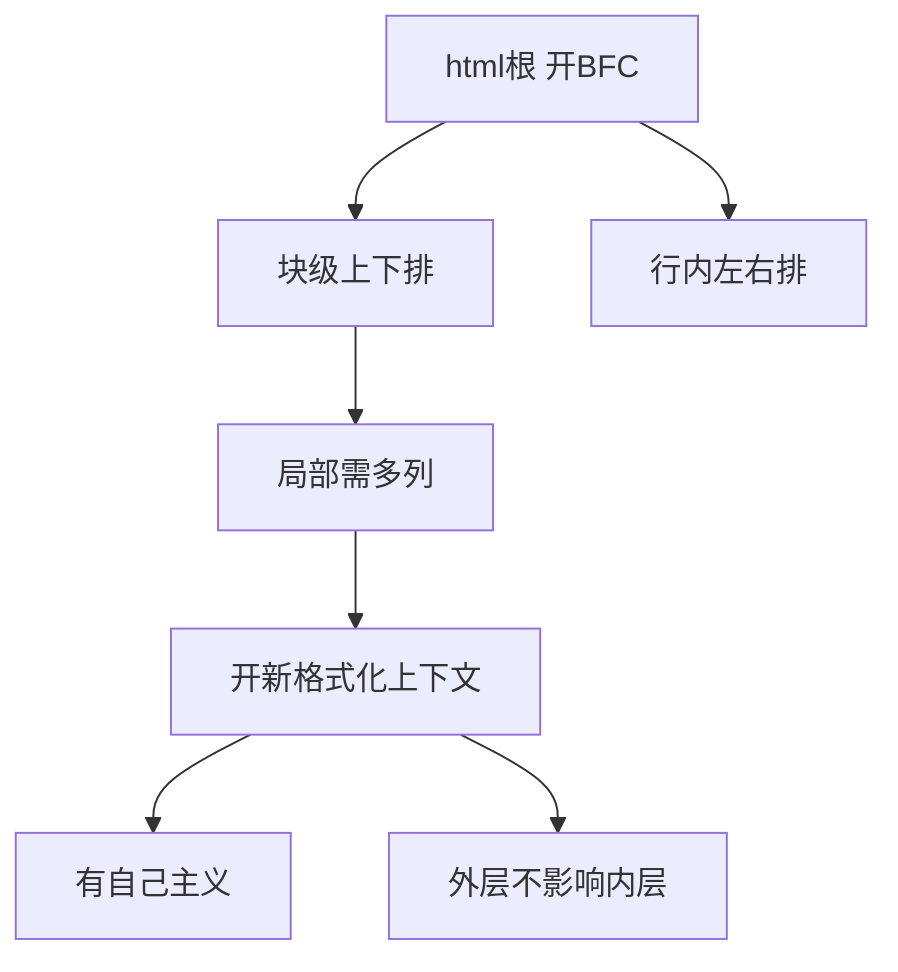

> 发布信息（填完掘金表单后可整段删除）
> 标题：三列布局与 BFC：从 main 先渲染到格式化上下文隔离
> 标签：CSS, 前端布局, BFC, 三列布局
> 摘要：以一份三列布局笔记和两个 flex 骨架 demo 为素材，讲清三列布局的目标与 main 先渲染的考量，并用"独立排版区域"的心智模型拆解 BFC 的触发与隔离价值。

# 三列布局与 BFC：从 main 先渲染到格式化上下文隔离

你打开任意一个 PC 网站，布局常常是：左边导航、右边广告、中间一大块正文。这种"三列布局"是前端最经典的布局需求之一，但很多人只会说"用 flex 呗"，却说不清两件事：为什么中间列要自适应、左右要固定？以及 `display: flex` 这行代码到底悄悄干了什么？我在整理这份笔记时，发现真正的重点在后面那个概念——BFC（格式化上下文）。本文就顺着这份笔记和两个 flex 骨架 demo，把三列布局和 BFC 一次讲透。

阅读本文需要你了解 HTML 的基本标签（`div` / `aside` / `main`）和 CSS 选择器的写法。

## 一、为什么是三列布局：左右固定、中间自适应

笔记开篇就点明，这是 **PC 端常见的布局方案**：

- **左右两列指定宽度**：左侧通常是导航、右侧通常是广告，它们的内容宽度是可控的，不需要随窗口变化。
- **中间自适应宽度**：中间放主内容，要吃掉剩下的全部空间，窗口变宽它就变宽，窗口变窄它就变窄。

为什么这么分？因为两侧（导航 / 广告）是"配角"，宽度固定最省事、最可控；中间是"主角"正文，要尽可能利用剩余宽度把阅读区域撑满。所以"左右固定 + 中间自适应"不是随便定的，而是**主角吃满、配角让位**的排版直觉。

## 二、main 为什么要先渲染

笔记里有一句很关键的话：

> main 最先加载，中间先渲染，最快看到最有效的内容；左右两侧往往广告、导航，可以晚一点。

浏览器是按 DOM 顺序去加载、绘制的。把**最有效的正文（main）放在最先生效的位置**，用户就能最快看到有价值的内容；而左右两侧是广告、导航，优先级低，晚一点到也无所谓。这是一种**内容优先（content-first）**的体验与性能考量——先给有用的，再补辅助的。

这里先埋一个伏笔：本次 demo 的 DOM 顺序是 `left → main → right`，main 并不在最前面。要让 main 真正"先渲染"，需要额外的顺序技巧（见文末易错点），这部分 demo 还没做。

## 三、三种实现思路：flex / grid / float

笔记明确列出了三列布局的三种方案：

> flex & grid & Float

需要诚实说明：**本次提供的两个 HTML 只演示了 flex**（`display: flex` 的骨架），grid 和 float 在笔记里被点名，但没有任何落地代码。所以下文以 flex 为主线讲透，grid / float 仅作方案层面的并列提及，不展开未演示的实现——把没写出来的代码当成"已实现"来教，是这份复习最忌讳的事。



图里把"目标"和"三条实现路线"一起画出来：无论走哪条路，要满足的都是同一组目标。

## 四、flex 骨架：本次真正跑起来的代码

我打开 `1.html` 和 `2.html` 发现，两份代码一模一样，核心就这么几行：

```html
<style>
  .layout {
    display: flex;
    /*开启新的格式化上下文 BFC */
  }
</style>

<div class="layout">
  <aside id="left" class="sidebar left">Left</aside>
  <main class="content">Main Content</main>
  <aside id="right" class="sidebar right">Right</aside>
</div>
```

逐行看：
- `.layout { display: flex; }`：把外层 `div` 变成 **flex 容器**，它的三个孩子（left / main / right）会按 flex 规则排布。
- DOM 结构：一个 `.layout` 容器里装了 `<aside>`（左）、`<main>`（中）、`<aside>`（右）三栏。
- 注意那行注释 `/*开启新的格式化上下文 BFC */`——这正是后面 BFC 的伏笔。`display: flex` 不只是"让子元素横排"，它同时**开启了一个全新的格式化上下文**（准确说是 FFC，见第五节）。

**事实分层**：这段代码"已实现"的是 flex 容器 + 三栏 DOM 结构；但它还**没有**写具体的宽度分配（left/right 固定宽、main 占剩余）。所以它目前是个骨架，宽度还没落下来。



## 五、BFC 到底是什么：从文档流到格式化上下文

这是全文的核心。笔记对 BFC 的讲解很有层次，我们顺着它拆。

**第一步，认识"文档流"。** 从 `html` 根元素开始，浏览器就开启了**第一个格式化上下文**；在最基础的文档流（normal flow）里，块级元素从上到下排，行内元素从左到右排。这就是我们写页面时默认的排版规则。

**第二步，发现问题。** 笔记问得好：一个块里想要多列？直接用 `inline` 不合适，因为 **inline 不适合做盒子（容器）**——盒子需要能装内容、定宽高，inline 干不了这个活。

**第三步，解法：开启一个新的格式化上下文。** 局部布局需要一块"有自己的排版主意"的独立区域。而且笔记特意强调：**它不一定要是 Block 元素**，任何元素配合特定属性都能开。

**第四步，理解"格式化上下文"这个词。** 它其实就是"一块有自己排版规则的独立区域"。BFC 是**块级**格式化上下文；flex 开启的是 **FFC（Flex 格式化上下文）**；它们都属于"格式化上下文"这个大家庭。笔记把 flex 也挂到 BFC 概念下讨论，本质是在强调同一件事：**它开启了一个独立的上下文**。



## 六、怎么开启一个新的 BFC（触发条件）

笔记给出了一份触发清单，整理如下——只要元素满足其中任意一条，就会开启一个新的格式化上下文：

- `display` 设为 `flex` / `grid` / `inline-block` / `table` 等；
- `float` 不为 `none`（如 `float: left`）；
- `position` 为 `absolute` 或 `fixed`；
- `overflow` 不为 `visible`（如 `overflow: hidden`）。

另外，**根元素（`html`）会自动开启第一个 BFC**——这就是文档流的起点。补充一点：flex / grid 实际开的是 FFC / GFC，但在"开了一个新上下文"这件事上，和 BFC 等价，所以笔记用 BFC 做了统称。

## 七、BFC 的关键价值：自己的主义 + 隔离

笔记最点睛的两句是：

> 新的格式化上下文，有自己的主义（格式化）。
> 外层 BFC 格式化上下文不会影响到内部的新的格式化上下文。

"有自己的主义"用大白话说就是：**每个格式化上下文内部按自己的规则排版，互不干扰**。外层的排版规则，渗透不进内层新开的上下文——这就是**隔离**。

我一开始以为 `display: flex` 只是让子元素横排，后来才明白它同时**开启了一个全新的格式化上下文，把这块区域从外层文档流里隔离出来**。三列之所以能并排横着摆，而不是被外层"块级上下堆叠"的规则强行竖着排，靠的就是这层隔离。

所以 BFC 的价值不是玄学，而是**给一块区域发了一张"独立排版许可证"**：里面的事里面自己定，外面管不着。

## 八、串起来：三列布局靠的就是"新上下文"隔离

把前面的线索收成一条链：

1. 目标：左右固定宽、中间自适应，且正文（main）优先；
2. 方案：选 flex（本次 demo 用的）；
3. `.layout` 设 `display: flex`，**开启了一个新上下文（FFC）**；
4. 三栏在其中按 flex 规则排布，外层文档流影响不到它；
5. 想要"中间自适应、两侧固定"，下一步就是给 `main` 设 `flex: 1` 占满剩余、给两侧设固定宽（这部分宽度 demo 还没写，属待补充）。

你看，三列布局看着是"横排三块"，底下站着的其实是 BFC/FFC 的隔离机制。理解了"格式化上下文 = 一块有自己主意的独立区域"，你就不只是会写 `display: flex`，而是真正懂了它为什么能让三列并排。

## 小结

| 概念 | 一句话 | 来源 |
| --- | --- | --- |
| 三列布局 | 左右固定宽、中间自适应，PC 常见 | 笔记 |
| main 先渲染 | 正文最有效，应最先到达绘制；侧边广告/导航可晚 | 笔记 |
| 三种方案 | flex / grid / float（本次仅演示 flex） | 笔记 |
| flex 骨架 | `.layout` 设 `display:flex` + left/main/right 三栏 DOM | 1.html / 2.html |
| 格式化上下文 | 一块有自己排版主意的独立区域；根自动开第一个 | 笔记 |
| 触发新上下文 | flex/grid/table、float≠none、position 绝对/固定、overflow≠visible | 笔记 |
| 隔离 | 外层上下文不影响内层新上下文 | 笔记 |

## 易错点与待补充学习

- **demo 只有骨架，宽度未定**：left / right 的固定宽、`main` 的 `flex: 1` 还没写，当前三栏不会真正出现"两侧固定、中间撑满"的效果，属待补充。
- **grid / float 仅被点名，无代码**：笔记列了三种方案，但 demo 只演示 flex，grid 和 float 的落地实现属待补充。
- **DOM 顺序与"main 先渲染"未对齐**：demo 顺序是 `left → main → right`，main 不在最前。要让正文先渲染，常见做法是将 `main` 写在 DOM 最前、再用 flex 的 `order` 或 float 调整视觉位置——这部分未实现，属待补充。
- **BFC 与 FFC 的区分**：flex 实际开启的是 FFC，笔记用 BFC 统称；交流时区分更准确，但"开启独立上下文"这一核心是一致的。
- **不是只有 Block 元素才能开 BFC**：笔记明确说"不是 Block 元素"也能开，只要加了触发属性（flex / float / overflow 等）即可，别被"B"字误导成"必须是块级元素"。

## 自测清单

- 能说清三列布局"左右固定、中间自适应"的含义与理由。
- 能解释 main 先渲染的考量（最有效内容优先到达与绘制）。
- 能列出三种实现方案，并说明本次只演示了 flex。
- 能默出开启新格式化上下文的几种触发条件。
- 能用自己的话解释"格式化上下文"和"隔离"（外层不影响内层）。
- 能说明 `display: flex` 除了横排，还开了新上下文（FFC），这正是三列并排的前提。

## 结语：三列布局底下站着的是"隔离"

三列布局看着简单，背后其实站着两个层次：上层是布局目标（左右固定、中间自适应、main 优先），下层是排版机制（格式化上下文的隔离）。很多人卡在只会写 `display: flex`，却说不清它为什么能让三栏并排——答案就在 BFC / FFC：它把这块区域从外层文档流里隔离成一个独立排版区。

记住那句笔记的味道——"有自己的主义"。格式化上下文，就是一块有自己主意的独立区域。理解了它，你就不只是会用 flex，而是真正懂了 flex 为什么能工作。
