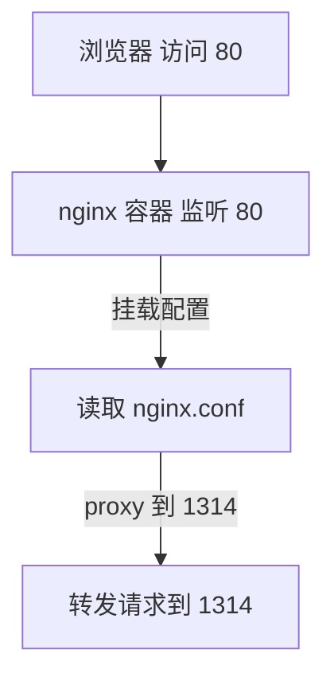
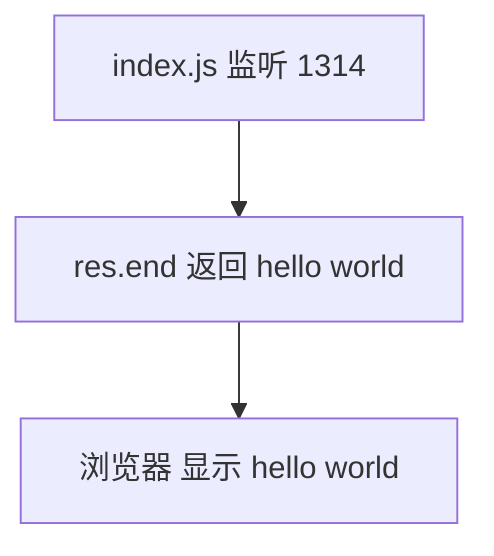
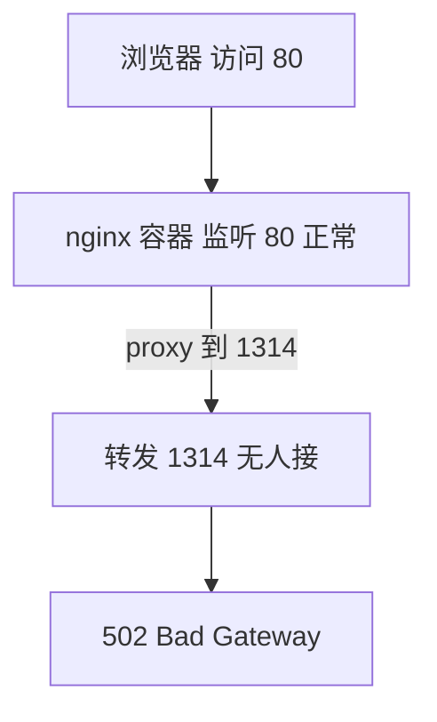

> 发布信息（填完掘金表单后可整段删除）
> 标题：从浏览器到 hello world：Docker + nginx 反向代理 + Node 最小服务器一次讲清
> 备选：502 是怎么来的？一条主线串起 Docker 容器、nginx 反向代理与 Node 后端
> 标签：Docker, nginx, 反向代理, Node.js, 容器化
> 摘要：用一个最小 Demo（nginx 容器 + Node 后端）串起完整请求链路，讲清 Docker 镜像/容器/-p/-v/-e、nginx 反向代理配置、Node 最小 HTTP 服务器、路径加引号的原因，以及 502 Bad Gateway 为什么出现又怎么修。

# 从浏览器到 hello world：Docker + nginx 反向代理 + Node 最小服务器一次讲清

你敲下 `localhost`、回车，浏览器出现 "hello world"——这行字背后其实跑过了一整条链路：浏览器请求打到 80 端口，被 nginx 容器接住并转发到 1314，再由一个 Node 写的后端真正产出字符串返回。本文用一个最小可跑的 Demo，把这条链路和沿途的 Docker 核心概念一次讲清，并回答一个最常见的问题：**为什么有时候是 502？**

## 一、Demo 全景：一条主线串起所有角色

先把全局画出来，后面每段都是放大其中一个节点。

**请求进入与转发（前半段）：**



**后端产出与返回（后半段）：**



整条主线是：

> 浏览器 → localhost:80 → nginx（容器，-v 挂载配置）→ 转发 1314 → index.js 后端 → "hello world" → 原路返回

两个角色分工明确：
- **nginx 是"搬运工"**：它自己不产数据，只负责按配置把请求转给后端；
- **index.js 是"真正产出数据"的角色**：hello world 是它返回的。

所以一句话先记牢：**后端不跑，nginx 转过去没人接，就是 502。**

## 二、index.js：真正产出数据的后端

先看后端 `demo/index.js`，这是最朴素的 Node HTTP 服务器：

```js
// node 早期的commonjs规范
const http = require('http')
const server = http.createServer((req, res) => {
  res.end('hello world')
})

server.listen(1314, '0.0.0.0', () => {
  console.log('node server run on 1314')
})
```

逐行拆解：
- `require('http')`：引入 Node 内置的 `http` 模块。这里用的是 **CommonJS 规范**（文件顶部注释原话"node 早期的 commonjs 规范"；`package.json` 里 `"type": "commonjs"` 也印证了这一点）——`require` 是 CommonJS 的模块引入方式。
- `http.createServer((req, res) => { res.end('hello world') })`：创建一个 HTTP 服务器，每收到一个请求，就通过 `res.end(...)` 把字符串返回给客户端。它不关心路径、不解析 body，来什么请求都回 "hello world"。
- `server.listen(1314, '0.0.0.0', ...)`：让服务器**监听 1314 端口**，且绑定在 `'0.0.0.0'` 上。`'0.0.0.0'` 表示"接受来自任意网卡的连接"——这点很关键，因为 nginx 在另一个容器里，需要通过宿主机地址访问到这个 1314，绑定 0.0.0.0 才能让外部连进来。

这个文件没有任何框架依赖，是"Node 写的最小 HTTP 服务器"的范例。它监听 1314，等着被 nginx 转过来的请求。

## 三、Docker 核心概念：把"应用 + 运行环境"打包

为什么要用 Docker 来跑这个 Demo？看 `readme` 里的定位：代码能跑，但代码之外还"依托一堆有版本要求的运行环境"——next、redis、react、mysql 各有版本要求。Docker 的价值就是**把这些依赖和代码一起，打包成一个整体容器，方便部署到任何设备**。

一个很形象的类比：笔记里写 **Agent = LLM + Harness（工具 + mcp + rag + skill），Docker = 应用 + 运行环境**——都是"核心 + 外围依赖"打包成一个整体。同一个道理也能解释"为什么需要容器"：你接手一个 n 年前的 Vue2 项目要求 Node16 + npm8，可你电脑是 Node22 跑不起来，容器化把各个依赖隔离安装，互不打架。

Docker 最基本的两个概念：
- **镜像 image = 光盘**：应用程序 + 运行环境，是一个**只读模板**。
- **容器 container = DVD**：镜像"运行起来"之后的实例。

对应两个动作：**pull 下载镜像，run 把镜像运行成容器**。后面启动 nginx 用的就是 `run`。

Docker 有三个最核心的能力（启动容器时最常用的三个参数）：
- `-p`：端口映射
- `-v`：挂载文件
- `-e`：环境变量

这三个会在下面的实战里逐个见到。

## 四、启动 nginx 容器：docker run 逐段拆解

`readme` 给出的完整命令（这是把 Demo 跑起来的关键一步）：

```bash
docker run --name my-nginx-demo -p 80:80 -v "C:\Users\rog\Desktop\work space\xll_ai\backend\docker\demo\nginx.conf:/etc/nginx/nginx.conf" -d nginx
```

逐段拆开：
- `--name my-nginx-demo`：给容器起个名字，方便后续 `stop` / `rm` 时引用。
- `-p 80:80`：**端口映射**，把本机（宿主机）的 80 端口映射到容器里的 80 端口。也就是说，浏览器访问本机 80，流量就进到了容器的 80（nginx 监听的端口）。
- `-v "..."`：**挂载配置文件**，下面单独讲。
- `-d nginx`：`-d` 让 nginx **后台运行**；`nginx` 是镜像名（没写 tag 默认 `latest`）。

**为什么 -v 的路径要加引号？（这里是最容易踩的坑）**

路径里包含空格（`work space` 中间有个空格），而**空格是 shell 的参数分隔符**。如果不加引号，shell 会把这条路径切成两段：`C:\Users\rog\Desktop\work` 和 `space\xll_ai\...`，Docker 拿到的是一段不完整的路径，自然找不到文件。

引号**是给 shell 看的**，作用是防止参数被空格拆开——它不是给 Docker 看的，Docker 拿到的是引号去掉之后的完整路径。所以这条命令里 `"C:\...\nginx.conf:/etc/nginx/nginx.conf"` 整段必须用双引号包住。

**-v 参数的含义**

`-v` 的完整写法是 `-v "宿主机路径:容器内路径"`，作用是**用宿主机的文件，覆盖容器内同名的文件**。

三个要点：
1. **左边是宿主机路径，右边是容器内路径，顺序不能反**；
2. **冒号是分隔符，两边都不能省**；
3. 本例把本机的 `nginx.conf` 挂进容器的 `/etc/nginx/nginx.conf`，于是 nginx 启动后读到的就是我们这份"80 代理 1314"的配置，而不是镜像自带的默认配置。

## 五、nginx.conf：反向代理配置

挂载进去的 `demo/nginx.conf` 内容：

```nginx
# nginx.conf
events {}
http {
    server {
        listen 80;
        location / {
            proxy_pass http://host.docker.internal:1314;
            proxy_set_header Host $host;
        }
    }
}
```

逐行：
- `listen 80`：nginx 在容器里**监听 80 端口**（对应前面 `-p 80:80` 映射进来的流量）。
- `location / { proxy_pass http://host.docker.internal:1314 }`：对所有路径的请求，转发到 `host.docker.internal:1314`。`host.docker.internal` 是 Docker 提供的**特殊域名**，意思是从容器内部访问"宿主机"——因为 index.js 跑在宿主机上、监听 1314，nginx 在容器里要靠这个域名才能找到它。

这一节对应的就是第一节图里的前半段：浏览器 → nginx 监听 80 → 读配置 → proxy 到 1314。

**反向代理的意义（为什么要在中间加一层 nginx）**

笔记里把反向代理总结得很到位，至少有五点价值：
- **统一入口**：用户只访问 80，不用记各种后端端口（1314、3000…）；
- **隐藏后端**：后端不直接暴露给公网，更安全；
- **负载均衡**：可以把请求分摊到多个后端，支撑高并发；
- **端口复用**：按域名或路径把请求分到不同服务；
- **统一处理**：https、压缩、缓存等通用能力都交给 nginx 做。

一句话：**反向代理 = 把"对外入口"和"对内服务"解耦。** 这也正是 nginx 作为"搬运工"的定位——它把所有对外的访问收口到 80，再按配置搬给内部真正干活的 index.js。

## 六、502 Bad Gateway：链路断在哪

现在回答开头的问题。**现象**：nginx 正常工作（80 是通的），但页面报 502 Bad Gateway。

**原因**：nginx 按配置把请求转发到 1314，可**后端 1314 根本没启动**——没人接这个请求，nginx 只能返回 502。

故障链路（断点就在"后端未启动"）：



**修复**：把后端跑起来即可——

```bash
node index.js
```

`index.js` 开始监听 1314，转发过去的请求就有人接，链路重新通，浏览器拿到 "hello world"。

这正好呼应第一节的主线：**nginx 是搬运工，index.js 是真正产出；后端不跑，就 502。**

## 七、运维补充：用 mysql 再实战一遍 Docker 能力

`readme` 里还给了 mysql 的启动命令，它把刚才的 `-p / -e / -d` 又实战了一次：

```bash
docker run -d --name mysql-demo -p 3307:3306 -e MYSQL_ROOT_PASSWORD=123456 mysql:8.0
docker exec -it mysql-demo /bin/bash   # 进入容器 linux 终端
mysql -uroot -p123456                 # 进 mysql
```

- `-p 3307:3306`：把本机 3307 映射到容器里的 3306（mysql 默认端口）；
- `-e MYSQL_ROOT_PASSWORD=123456`：**环境变量**，把 root 密码通过 `-e` 注入容器（这正是三个核心能力里的 `-e`）；
- `-d`：后台运行；
- `docker exec -it mysql-demo /bin/bash`：进入正在运行的容器，拿到它的 Linux 终端。

mysql 不是本文主线（主线是 nginx + Node），但它用同一套 Docker 能力，顺带展示了 `-e` 环境变量和 `exec` 进容器的用法，是很好的巩固。

## 小结

| 角色 / 概念 | 是什么 | 关键点 |
| --- | --- | --- |
| `index.js` | Node 最小 HTTP 服务器 | `require('http')` / `createServer` / `listen(1314, '0.0.0.0')` |
| 镜像 image | 只读模板（光盘） | 应用 + 运行环境 |
| 容器 container | 运行实例（DVD） | `run` 镜像得到 |
| `-p` | 端口映射 | 本机端口 : 容器端口 |
| `-v` | 文件挂载 | 宿主机路径 : 容器路径（左宿主右容器，顺序不能反） |
| `-e` | 环境变量 | 如 `MYSQL_ROOT_PASSWORD` |
| 反向代理 | 对外入口 ↔ 对内服务解耦 | 统一入口 / 隐藏后端 / 负载均衡 |
| 502 | 后端没人接 | 启动 `node index.js` 修复 |

## 易错点与待补充学习

- **引号是给 shell 看的，不是给 Docker 看的**：它只为了防止路径里的空格把参数切开，Docker 拿到的是去引号后的完整路径。
- **-v 左右顺序不能反、冒号两边不能省**：写成"容器:宿主机"会得到完全相反的效果。
- `proxy_pass` 里的 `host.docker.internal` 是容器访问宿主机的特殊域名；如果在宿主机原生跑 nginx（不走容器），地址写法不同（待补充：Linux 原生 docker 用 `localhost` 或自定义 network）。
- 502 不一定是"后端没启动"，后端崩了、响应超时也会 502（待补充：更多 502 成因与排查）。
- Dockerfile、docker-compose、镜像构建流程未涉及（待补充）。
- 正向代理与反向代理的完整区别未展开（笔记提到正向代理 http，待补充）。
- nginx 的负载均衡具体配置（`upstream` 多后端）未演示（待补充）。

## 自测清单

- 不看代码，能口述从浏览器到 hello world 的完整链路。
- 能解释 `require('http')`、`createServer`、`listen(1314, '0.0.0.0')` 各自的作用。
- 能说清镜像与容器的区别（光盘 vs DVD），以及 pull / run 的动作。
- 能默写 `docker run` 里 `-p` / `-v` / `-e` 的含义，尤其 `-v` 的左右顺序。
- 能解释路径为什么要加引号（空格是 shell 分隔符）。
- 能说清 502 的原因和修复方法。
- 能说出反向代理的几点意义（统一入口 / 隐藏后端 / 解耦）。

## 结语：一条链路的两种状态

回到主线。正常时：浏览器 → 80 → nginx（容器，-v 挂载配置）→ 转发 1314 → index.js → "hello world"。异常时，唯一的变化是"index.js 没跑"，于是 nginx 转过去没人接，变成 502。

把这条链路拆开看，每个节点都对应一个该掌握的概念：nginx 是反向代理（解耦入口与服务）、`-v` 把配置挂进容器、`index.js` 是真正产出的后端、`-p` 把端口暴露出来。理解了"谁在搬、谁在产、断了会怎样"，你就不再怕 502，也能自己把这样一个容器化 Web 应用跑起来了。
