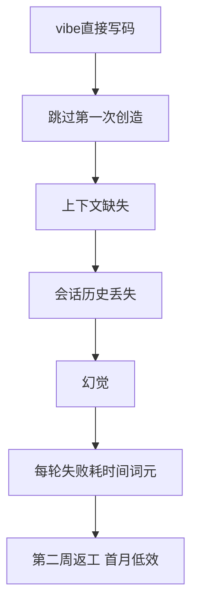
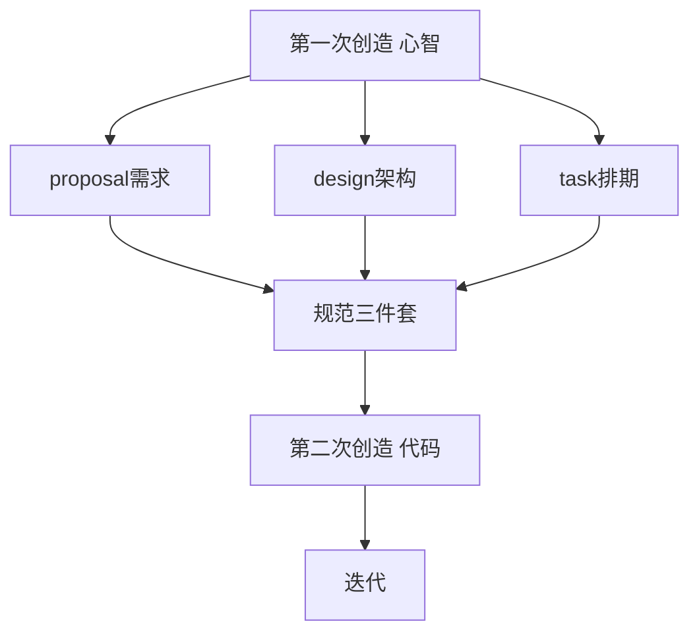
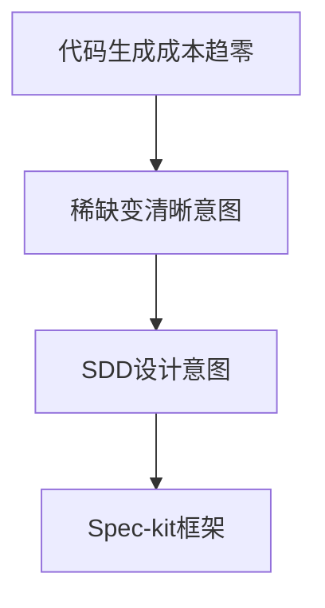

> 发布信息（填完掘金表单后可整段删除）
> 标题：SDD 规范驱动开发：从 vibe coding 崩盘到"两次创造"
> 标签：AI 开发范式, SDD, 规范驱动开发, AI 编程协作
> 摘要：以一份 SDD 概念笔记为素材，讲清规范驱动开发的来龙去脉——vibe coding 为什么会崩、SDD 用"两次创造"怎么治、三份规范（proposal/design/task）各自回答什么，以及当代码趋近免费后稀缺的到底是什么。

# SDD 规范驱动开发：从 vibe coding 崩盘到"两次创造"

你有没有过这种体验：对着 AI 编程面板（claude code / codex 这类 agent）噼里啪啦下指令，第一天效率飞起，第二周开始返工，到第一个月干脆陷入低效？这份 SDD 笔记要讲的就是——为什么"氛围编程"（vibe coding）会崩，以及一种叫 **SDD（Spec Driven Development，规范驱动开发）** 的新范式怎么治这个病。我在整理这份笔记时，最有冲击力的一句是：**"文档就是代码"**。下面把它拆开讲。

阅读本文不需要前置代码基础，它是一篇概念梳理，帮你在动手前先想清楚"为什么要用规范驱动 AI"。

## 一、SDD 是什么：规范驱动开发，文档就是代码

SDD 的全称是 **Spec Driven Development**，直译"规范驱动开发"。笔记里对它最精炼的定性是两句：

- **AI 开发新范式**：它不是某个工具，而是一种和 AI 协作开发的工作方式。
- **文档就是代码（Driven：文档驱动）**：过去我们默认"代码是主产物，文档是附属品"；SDD 反过来——**规范文档成了驱动一切的起点，代码只是被规范驱动出来的结果**。

笔记还点出一个大背景：**代码生成效率已经高到"可以忽略不计"**。当"写出代码"这件事越来越便宜，开发的瓶颈就从"能不能写出来"转移到了别的地方——这正是 SDD 登场的前提。

## 二、为什么需要 SDD：vibe coding 的崩盘时间线

要理解 SDD 的价值，得先看它要解决的那个坑：**vibe coding（氛围编程）**。

vibe coding 指的是这种状态：被 AI coding agent 的交互面板吸引，停不下来地给 AI 下达任务（"帮我做个用户认证系统"），享受那种"说一句话就刷出代码"的爽感。笔记给了一条很真实的时间线：

- **第一天**：效率肉眼可见地提升，2000 行代码刷出来了，框架？语言？好像都不用操心。
- **第二周**：开始返工。刷出来的代码"看上去跑得起来"，后面却是一堆麻烦。
- **第一个月**：直接陷入低效状态。

一个典型翻车例子：你说"帮我做一个用户认证系统"，vibe 出 2000 行代码——但**框架选了什么？语言定了什么？** 这些关键决策全程没被记录，代码看上去能跑，背后却埋了一地坑。

## 三、vibe coding 失败的根因：跳过"第一次创造" + 上下文饥饿

我回想自己 early vibe coding 的经历，和笔记里说的几乎一样：第一天确实爽，对着 agent 狂下指令；可第二周改需求时，AI 已经不记得最开始的约定，开始瞎编。笔记把这条崩盘链路讲得很清楚，它是一个**因果链**，而不是单次失误：

逐环看：

1. **跳过第一次创造**：vibe coding 上来就写代码，没有先写规范——这是最底层的病根（详见第四节）。
2. **上下文缺失**：你给大模型的上下文不够。AI 能力超强，但"它不知道你想要什么"比"它不会写"更要命。
3. **会话历史丢失**：最开始 vibe 享受，上下文缺失，会话历史一旦丢失，AI 就没有了"当初的约定"。
4. **幻觉**：失去约束后，AI 开始凭空编。
5. **消耗放大**：每一轮失败都在消耗两样东西——**等待 AI 生成的时间**，和**词元（token）成本**。失败越多，亏得越多，于是从"第一天效率提升"滑向"首月低效"。

一句话总结根因：**不是 AI 不行，是我们没把意图喂够；而没写规范，恰恰是"喂不够"的直接原因。**

## 四、SDD 的核心心法：任何事都经历两次创造

SDD 的解法，来自一个被反复验证的心法。笔记引用了史蒂芬·柯维（Stephen Covey）《高效能人士的七个习惯》里的"以终为始"——**任何一件事都会经历两次创造**：

- **第一次创造（心智创造）**：先在大脑里、在文档里把这件事设计一遍。动手之前，它得先"有个样子"。
- **第二次创造（物理创造）**：再根据规范，真正地把它做出来（在这里，就是驱动 AI 写出代码）。

笔记用了一句很形象的话点破："不画蓝图，不盖房；不写商业计划，不创业。" 做一件事前，先回答四个问题——**做什么、为什么做、怎么做、如何一步步做**——把这些用各种文档落地，就是给 coding agent 喂足上下文。

vibe coding 的问题，正是**跳过了第一次创造，直接冲进第二次创造**。SDD 的立场很硬：**所有事物都要经过两次创造，SDD 是必选项，而且是主要的工作内容。**

## 五、第一次创造落地：SDD 的三份规范

第一次创造不是写一句"我要做个系统"就完事，笔记给出了三份可以**按需加载**的规范文档：

| 文档 | 回答的问题 | 本质 |
| --- | --- | --- |
| `proposal.md` | 这个系统**应该是什么样、满足什么需求** | 需求文档（对应产品经理的 PRD），是"心智创造"的落地 |
| `design.md` | **怎么实现**，技术架构怎么定 | 架构设计 |
| `task.md` | **先干什么、再干什么，什么可以并行** | 任务拆解与排期 |

这三份规范合起来，就完成了"第一次创造"。注意笔记强调**按需加载**——不用一次性把所有文档塞给 AI，而是需要时再取，这本身就是一种上下文效率的取舍。

## 六、第二次创造：规范驱动 AI 写代码，并持续迭代

三份规范齐了，才轮到代码出场：

- 第一次创造（心智）：产出 `proposal` / `design` / `task` 三份规范，拼成"规范三件套"。
- 第二次创造（物理）：**用规范去驱动 AI 编程**——这时候 AI 拿到的不再是"帮我做个认证系统"这句空话，而是一份清晰的意图。
- 之后**不停迭代**：规范可以改，代码跟着改，形成闭环。

记住这条主线：**三份规范完成第一次创造，代码是第二次创造，二者之间靠"规范驱动"连接，而不是靠临场口述。**

## 七、SDD 改变的不仅是流程，更是工作内容

笔记有一句容易被略过但很关键的话：SDD 不是给老流程打补丁，而是**借鉴建造业、商业的成熟经验，推出的全新开发范式**；当代码生成越来越便宜，**手写 coding 本身逐渐让位于"设计清晰规范"这项工作**——SDD 变成了新的主要工作内容。

换句话说，工程师的价值重心，从"亲手把代码敲出来"移到了"把意图设计得清晰、可执行、可验证"。这是对"程序员以后干嘛"这个问题的直接回答。

## 八、Spec-kit：当代码免费，稀缺的是"清晰可验证的意图"

笔记最后点到了 SDD 的落地框架——**Spec-kit**。它没有给出具体命令或工作流（这部分本文不展开），但给了一个极具穿透力的判断：

当代码生成成本趋近于零，**真正稀缺的不是"能写代码的能力"，而是"清晰、可执行、可验证的意图"**——而这份意图，正是由 SDD 来设计、由像 Spec-kit 这样的框架来承载的。

这也是为什么 SDD 说"文档就是代码"：在未来的 AI 协作里，**你写下的规范，和你产出的代码，分量一样重，甚至更重**。

## 小结

| 概念 | 一句话 | 来源 |
| --- | --- | --- |
| SDD | 规范驱动开发，文档就是代码，AI 协作新范式 | 笔记 |
| vibe coding | 上来就给 AI 下指令写码，氛围式编程 | 笔记 |
| 崩盘时间线 | 第一天爽 → 第二周返工 → 首月低效 | 笔记 |
| 失败根因 | 跳过第一次创造 + 上下文饥饿 → 幻觉 → 消耗放大 | 笔记 |
| 两次创造 | 第一次心智创造（文档）/ 第二次物理创造（代码） | 笔记（柯维"以终为始"） |
| 三份规范 | proposal 需求 / design 架构 / task 排期，按需加载 | 笔记 |
| 意图稀缺 | 代码趋免费后，清晰可验证的意图成为稀缺品 | 笔记（Spec-kit） |

## 易错点与待补充学习

- **"文档就是代码"≠"文档替代代码"**：SDD 是"文档驱动代码"，代码仍是第二次创造的产物；二者是先后两次创造的关系，不是谁消灭谁。
- **Spec-kit 仅被点名**：笔记只提到它是 SDD 框架、承载"意图设计"，未展开具体命令与流程，属待补充（不要把它当成已演示的工具）。
- **三份规范无实例文件**：`proposal/design/task` 只给了定义与"按需加载"原则，没有真实样例内容，属概念层，待补充。
- **缺少全流程 demo**：笔记讲清了 SDD 的理念，但没有一个"从 proposal 写到代码"的真实案例，属待补充。
- **引用修正**：笔记里 "Stepen Convey / 已终为始" 是笔误，对应史蒂芬·柯维《高效能人士的七个习惯》的"以终为始"（任何事经历两次创造），本文已按原意修正。

## 自测清单

- 能说清 SDD 是什么，以及"文档就是代码"到底在说什么。
- 能讲出 vibe coding 崩盘的时间线（第一天 → 第二周 → 首月）和根因链（跳过第一次创造 → 上下文饥饿 → 幻觉 → 消耗放大）。
- 能用自己的话解释"两次创造"：第一次心智创造（文档/规范），第二次物理创造（代码）。
- 能列出 SDD 三份规范（proposal / design / task）各自回答的问题。
- 能解释：为什么代码生成变便宜后，"清晰、可执行、可验证的意图"反而成了稀缺品。
- 能区分 vibe coding（跳创造）与 SDD（两次创造、规范驱动）的本质差异。

## 结语：先写清楚，再写代码

SDD 不复杂，一句话：**先写清楚，再写代码**。它的底层逻辑是"两次创造"——动手前先用文档完成第一次创造，再用规范驱动 AI 完成第二次创造。vibe coding 的坑，本质是跳过了第一次创造，让 AI 在上下文饥饿里越跑越偏、越偏越亏。

当代码生成趋近于免费，真正值钱的，是你脑子里那点"清晰、可执行、可验证的意图"。把文档当代码写，就是 SDD。
